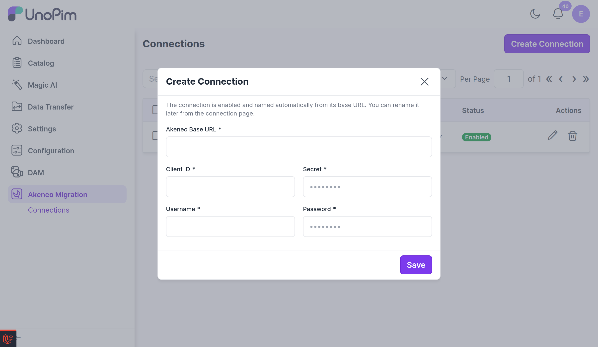
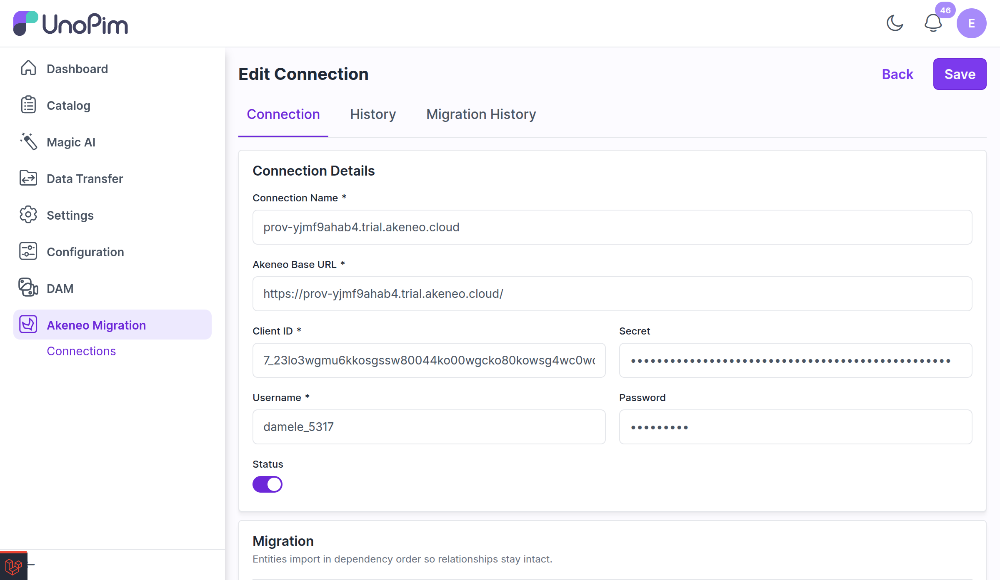

# Create & Test a Connection

A **connection** holds the Akeneo REST API credentials the plugin uses to read your catalog. Every connection is **validated live against Akeneo before it is saved**, so you never store credentials that don't work.

## Open the Connections List

In the admin sidebar, open **Akeneo Migration → Connections**. This lists every connection you have created, with its name, base URL, username, and status (**Enabled** / **Disabled**). Click **Create Connection** to add a new one.

## Enter the Connection Details

Fill in your Akeneo REST API (Connection) credentials:

| Field | Description |
|-------|-------------|
| **Akeneo Base URL** | The URL of your Akeneo instance — for example, `https://your-instance.cloud`. Must be a valid URL. |
| **Client ID** | The Client ID from your Akeneo API connection. |
| **Secret** | The Secret from your Akeneo API connection. |
| **Username** | The Akeneo API user's username. |
| **Password** | The Akeneo API user's password. |

 

  

 

> [!TIP]
> On create, the connection is **enabled** automatically and **named from its base URL**. You can rename it later from the connection's edit page.

> [!NOTE]
> You will need an Akeneo account with REST API (Connection) credentials. In Akeneo, these are created under **Connect → Connection settings**, which provides the Client ID, Secret, username, and password used here.

## Test & Save

When you save, the plugin tests the credentials against Akeneo. If they are valid, the connection is created and you land straight on its **edit page**.

If the test fails, the connection is **not** saved and a clear reason is shown so you can fix it:

| Message | What it means |
|---------|---------------|
| **The Akeneo API was not found at this Base URL** | The Base URL is wrong or does not point to your Akeneo instance. Check it (for example, `https://your-instance.cloud`). |
| **Authentication was rejected** | One or more of the Client ID, Secret, Username, or Password is incorrect. |
| **Access was denied by Akeneo** | The API user does not have permission to use the API — check its roles and permissions in Akeneo. |
| **Akeneo rejected the request** | Review the connection details and try again. |
| **Akeneo returned a server error** | A temporary problem on the Akeneo side — try again in a few moments. |
| **Could not reach the Akeneo server** | The Base URL is wrong, or the server is offline or unreachable from this network. |

## Edit a Connection

From a connection's edit page you can rename it, update its details, and enable or disable it. The edit page has three tabs:

- **Connection** — the connection details and the **Run a Migration** controls.
- **History** — field-level changes made to this connection over time.
- **Migration History** — every migration run started from this connection.

 

  

 

> [!NOTE]
> For security, the stored **Secret** and **Password** are never shown in plain text — on edit they appear as a masked length. Leave them blank to keep the stored value, or type a new value to replace it.

## Next Steps

With a working connection in place, you can now [run a migration](./run-migration).
