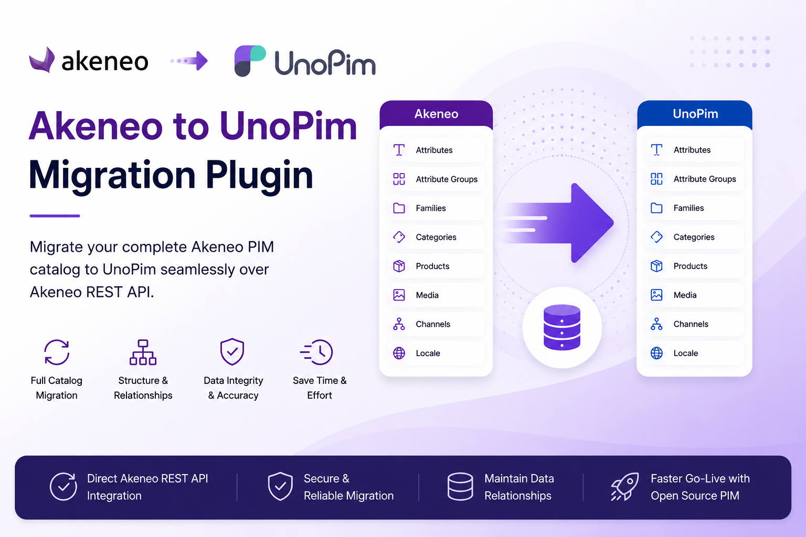

# Akeneo to UnoPim Migration

The **Akeneo to UnoPim Migration** plugin is a one-way migration tool that imports a complete **Akeneo PIM** catalog into [UnoPim](https://unopim.com) over the **Akeneo REST API** — no manual exports, spreadsheets, or custom scripts.

 

  

 

Migrating between PIM platforms is usually slow and risky — attributes, families, categories, locales, channels, and thousands of products all have to land in the right place with their relationships intact. This plugin automates the whole process and records every relationship as it goes, so you can move from Akeneo to UnoPim while keeping the data you have already invested years in building.

Because it reuses UnoPim's native **Data Transfer** import framework, every migration run appears in the **Job Tracker** with downloadable logs you can audit.

## How It Works

The plugin adds a dedicated **Akeneo Migration** section to the UnoPim admin panel. From there you manage Akeneo connections, choose what to import, and run the migration — all without leaving the interface.

A typical migration flow works as follows:

1. You add and validate an Akeneo connection using your REST API credentials.
2. You open the connection's edit page and select the entities to import.
3. UnoPim connects to Akeneo over the REST API and pulls the selected data.
4. The plugin imports each entity using UnoPim's Data Transfer framework.
5. Mappings between Akeneo and UnoPim records are recorded automatically and reused on later runs to resolve relationships (for example, linking a product to the correct family or categories).
6. The run appears in the Job Tracker, where you can follow progress and download logs.

Because the migration is one-way (**Akeneo → UnoPim**), the flow stays simple and predictable. You can run it in stages and trust that connections between entities stay consistent.

## What Gets Migrated

The plugin brings across both your **structure** and your **catalog**, imported in dependency order so relationships stay intact:

| # | Entity | Description |
|---|--------|-------------|
| 1 | **Locales** | The locales defined in Akeneo. |
| 2 | **Currencies** | The currencies defined in Akeneo. |
| 3 | **Attributes** | Attributes together with their options. |
| 4 | **Attribute Groups** | Groupings used to organise attributes. |
| 5 | **Attribute Families** | Families that define which attributes a product can hold. |
| 6 | **Categories** | The category tree. |
| 7 | **Channels** | Akeneo channels (scopes). |
| 8 | **DAM Assets** | Digital asset library entries. *Available only when the UnoPim DAM package is installed.* |
| 9 | **Configurable Products** | Akeneo product models. |
| 10 | **Products** | Products, including product media. |

> [!NOTE]
> Entities import in dependency order — structure first, then categories and channels, then the optional DAM assets, then the catalog. This ensures that, for example, a product's family and categories already exist before the product itself is imported.

## Key Features

- **Live-validated connections** — every Akeneo connection is tested against Akeneo before it is saved, so you never store credentials that don't work.
- **Pick what to import** — select individual entities or use the single **Select All / Clear All** toggle to migrate everything at once.
- **Automatic mappings** — Akeneo↔UnoPim relationships are recorded during each import and reused on later runs.
- **Full audit trail** — every run is logged in the **Migration History** tab with the entities imported, status, timing, and the user who ran it.
- **Masked credentials** — Client ID, Secret Key, and Password are masked (`*****`) throughout the interface and in the migration history.
- **Granular permissions** — each action (viewing connections, running a migration, deleting migration runs, and more) is governed by its own permission.
- **Native Job Tracker integration** — runs use UnoPim's Data Transfer framework, so the experience matches every other import in UnoPim.

## Requirements

- **UnoPim 2.1.0**
- **PHP 8.3+**
- An **Akeneo** account with REST API (Connection) credentials

## Next Steps

- [Install the plugin](./installation)
- [Create and test an Akeneo connection](./create-connection)
- [Run your first migration](./run-migration)
