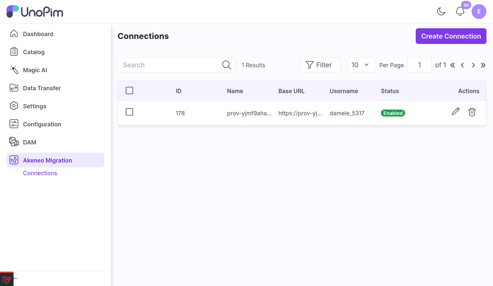

# Installation

Follow the steps below to install the **Akeneo to UnoPim Migration** plugin. You'll need terminal access to your UnoPim server before getting started.

## Requirements

- **UnoPim 2.1.0**
- **PHP 8.3+**
- An **Akeneo** account with REST API (Connection) credentials

## Step 1 — Add the Package Files

Copy the package into your UnoPim project at:

```
packages/Webkul/AkeneoMigration
```

## Step 2 — Register the Autoloading

Open the project's root `composer.json` and add the package namespace under the `autoload > psr-4` section:

```json
"autoload": {
    "psr-4": {
        "Webkul\\AkeneoMigration\\": "packages/Webkul/AkeneoMigration/src"
    }
}
```

## Step 3 — Register the Service Provider

Open `bootstrap/providers.php` and register the service provider:

```php
use Webkul\AkeneoMigration\Providers\AkeneoMigrationServiceProvider;

return [
    // ...existing providers...
    AkeneoMigrationServiceProvider::class,
];
```

## Step 4 — Register the Concord Module

Open `config/concord.php` and register the module service provider:

```php
Webkul\AkeneoMigration\Providers\ModuleServiceProvider::class,
```

## Step 5 — Install the Akeneo API Client

Install the Akeneo PHP API client and refresh the autoloader:

```bash
composer require akeneo/api-php-client
composer dump-autoload
```

## Step 6 — Run the Install Command

```bash
php artisan akeneo-migration:install
```

This command creates the package tables, publishes the sidebar-icon assets, and refreshes the config, route, view, and application caches so the menu, ACL, and routes load.

| Command | Purpose |
|---|---|
| `composer require akeneo/api-php-client` | Installs the Akeneo PHP REST API client the plugin uses to read from Akeneo. |
| `composer dump-autoload` | Regenerates Composer's autoloader mapping to include the new namespace. |
| `php artisan akeneo-migration:install` | Creates the package tables, publishes assets, and refreshes caches so the menu, ACL, and routes load. |

## Verify the Installation

Once all commands have completed, log in to your UnoPim dashboard. You should see the **Akeneo Migration** option appear in the left sidebar — this confirms the plugin is installed and ready to configure.

<br>

<div align="center">
  
</div>

<br>

If it doesn't appear, run `php artisan optimize:clear` again and refresh the page.

## Next Steps

Add a connection, test it, and run your first import:

- [Create and test an Akeneo connection](./create-connection)
- [Run a migration](./run-migration)
