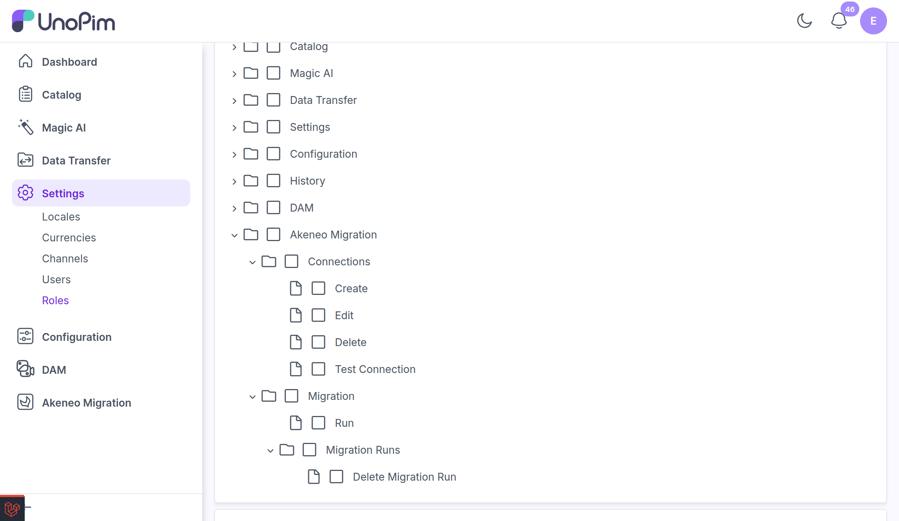

# Permissions

Every action in the Akeneo Migration plugin is governed by its own **permission (ACL)**. This means you can grant roles access to specific actions independently — for example, let one role manage connections while only senior users run or delete migrations.

Permissions are managed from UnoPim's role settings, under **Settings → Roles**, when editing a role's access.

 

  

 

## Available Permissions

| Group | Permission | Allows the user to… |
|-------|-----------|---------------------|
| **Connections** | View | Open the Akeneo Migration section and view connections. |
| | Create | Create a new connection. |
| | Edit | Edit an existing connection. |
| | Delete | Delete a connection. |
| | Test Connection | Validate a connection's credentials against Akeneo. |
| **Migration** | Run | Start a migration for a connection. |
| | Migration Runs | View the migration history. |
| | Delete Migration Run | Delete one or more migration runs. |

> [!TIP]
> Because each action has its own permission, you can keep your migration process safe across larger teams — for example, granting broad read access to connections while restricting who can actually run or delete migrations.
