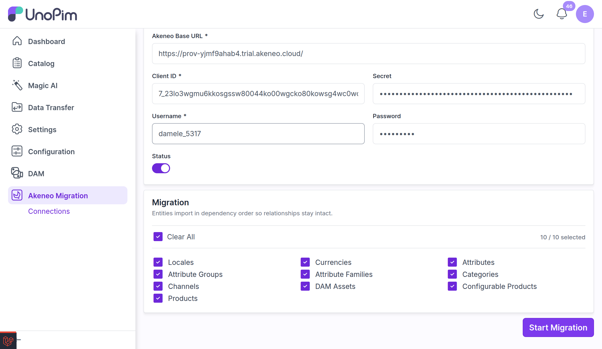
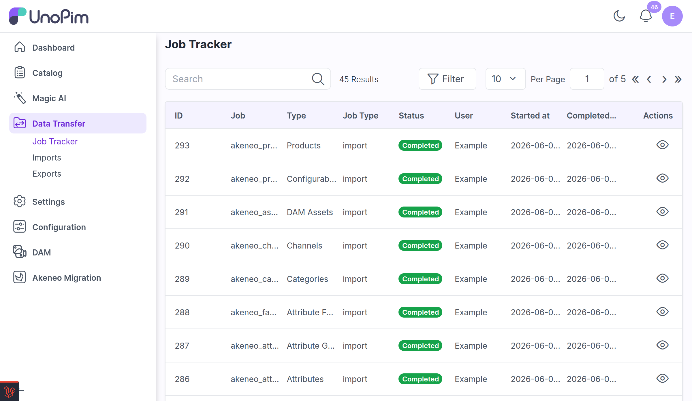

# Run a Migration

Once you have a working [connection](./create-connection), you can run a migration directly from its edit page.

## Select the Entities to Migrate

Open the connection and stay on the **Connection** tab. Under **Entities to migrate**, choose what you want to import. You can:

- Select individual entities, or
- Use the single **Select All / Clear All** toggle to migrate everything at once.

The page shows how many entities are **selected** as you choose.

 

  

 

The available entities are, in dependency order:

1. Locales
2. Currencies
3. Attributes
4. Attribute Groups
5. Attribute Families
6. Categories
7. Channels
8. DAM Assets *(only when the UnoPim DAM package is installed)*
9. Configurable Products
10. Products

> [!NOTE]
> Entities import in **dependency order** so relationships stay intact — regardless of the order in which you select them, the plugin always runs them structure-first. This guarantees that prerequisites (such as families and categories) exist before the records that depend on them (such as products).

## Start the Migration

Click **Start Migration**. The selected entities are queued and run sequentially, and you are taken to the **Job Tracker** to follow progress.

> [!IMPORTANT]
> - You must select **at least one** entity before starting.
> - A **disabled** connection cannot be migrated — enable it first from the connection page.

## Follow Progress in the Job Tracker

The migration runs on UnoPim's native **Data Transfer** framework, so each entity appears as a job in the **Job Tracker** (pre-filtered to Akeneo migration jobs). From here you can watch each job's state and **download detailed logs** for auditing or troubleshooting.

 

  

 

The logs record, per entity:

- When the migration **started** for that entity.
- When it **finished**, with its state and the number of records processed.
- A clear message if **no records** were returned by Akeneo (verify the records exist in Akeneo and that the API connection's catalog exposes them).
- A clear message if the entity **failed**, including the error (verify the connection credentials are valid and that Akeneo is reachable).

> [!TIP]
> Because mappings between Akeneo and UnoPim records are recorded automatically, you can run the migration in **stages** — for example, structure first, then products later — and the plugin will reuse those mappings to keep relationships consistent across runs.

## Next Steps

After a run completes, review what was imported in the [Migration History](./migration-history).
