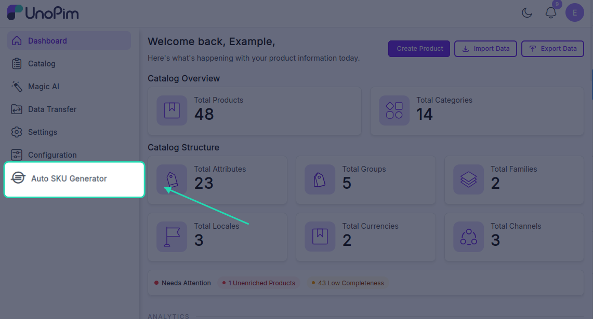

# Configuration

To set up your automatic SKU generation rules, navigate to **Admin Panel → Auto SKU Generator** in your UnoPim dashboard.



---

## 1. General Settings

These settings control the activation and restriction of the SKU generator.

* **Enable Auto SKU Generation**  
  Toggles automatic SKU generation on or off. When enabled, new products automatically receive a generated SKU.
* **Read-Only SKU**  
  Locks the generated SKU field on the product creation form. Enable this to prevent users from manually modifying auto-generated SKUs. *(Only works when Auto SKU Generation is ON)*.

---

## 2. Sequence Settings

* **Auto Start Sequence From**  
  The starting number for the auto-increment sequence (e.g., `1`, `1001`, or `2026001`). The system increments this number by 1 for each new product.
  
  > [!IMPORTANT]
  > Changing this number resets the active counter back to this starting value.

---

## 3. SKU Format Settings

Define the structure and format of your generated SKUs.

* **Prefix**  
  A fixed text added at the beginning of the SKU (e.g., `SKU` or `PRD`).
* **Suffix**  
  A fixed text added at the end of the SKU (e.g., `2026` or `NEW`).
* **SKU Separator**  
  The character separating each part of the SKU. Options include:
  * **Hyphen (`-`)** → `SKU-Red-M-1001`
  * **Underscore (`_`)** → `SKU_Red_M_1001`


---

## 4. Auto Generator Options

* **Auto Generator Options**  
  Select product attributes (e.g., **Color**, **Size**, or **Brand**) to include in the SKU structure.
  
  * **How it works:** Values of these attributes are automatically extracted and placed into the SKU.
  * **Example:** With a prefix of `PRD`, attributes `Color` (Red) and `Size` (M), and sequence `101`, the resulting SKU is:
    ```
    PRD-Red-M-101
    ```

  > [!NOTE]
  > Only attributes of type *select* or *multiselect* that have values assigned to the product are included in the SKU.