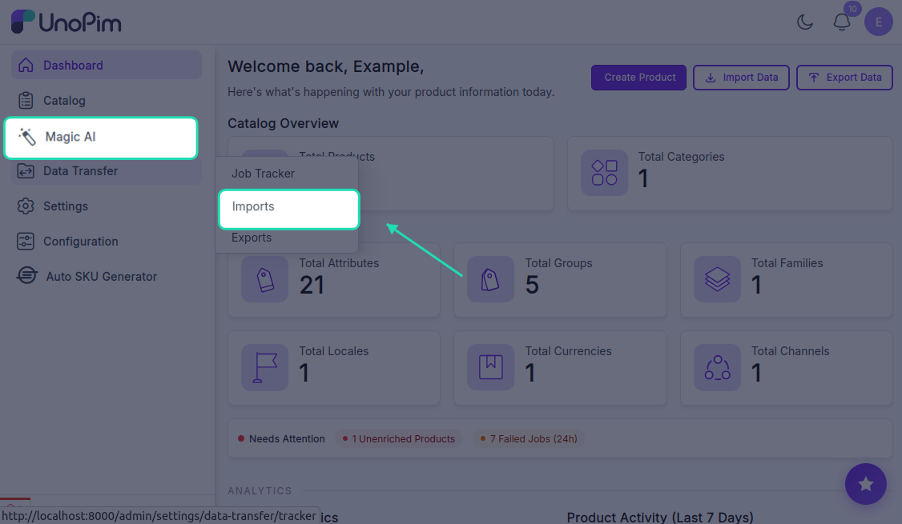
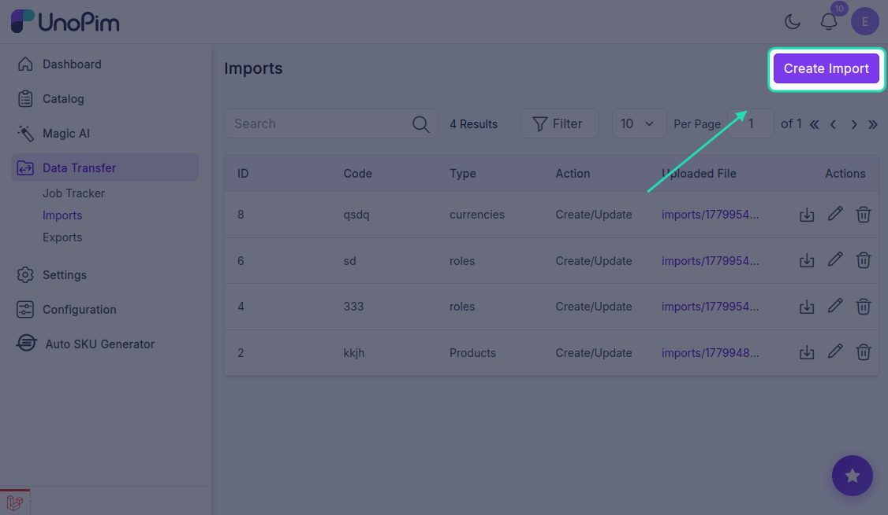
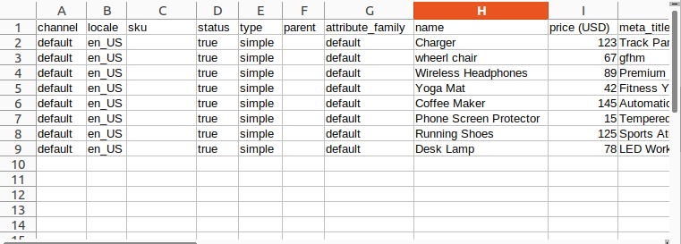
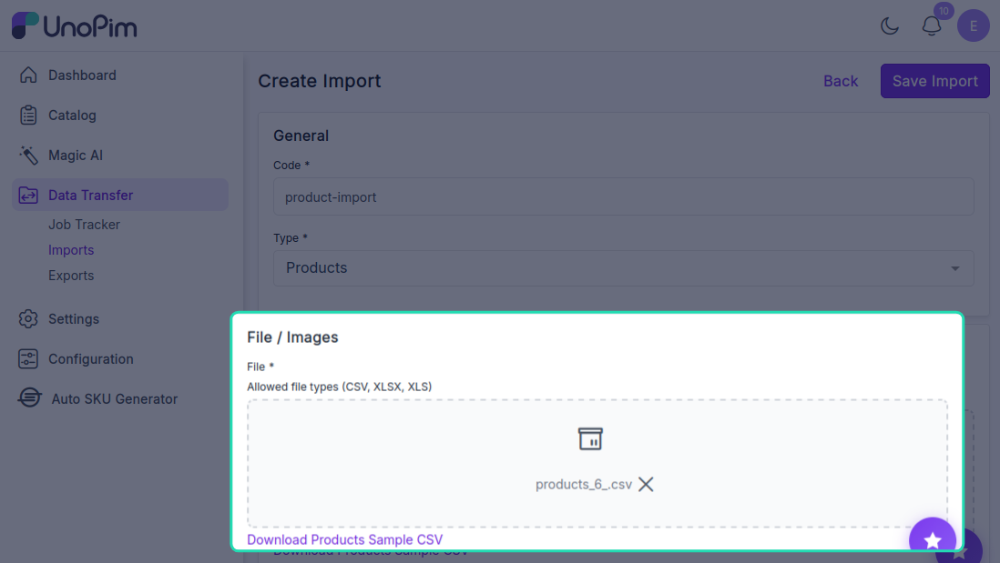
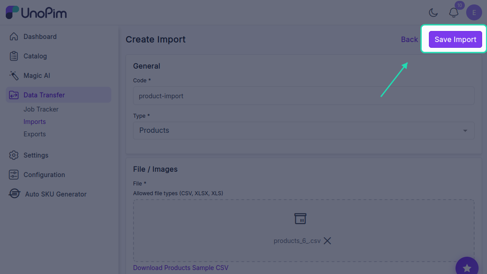
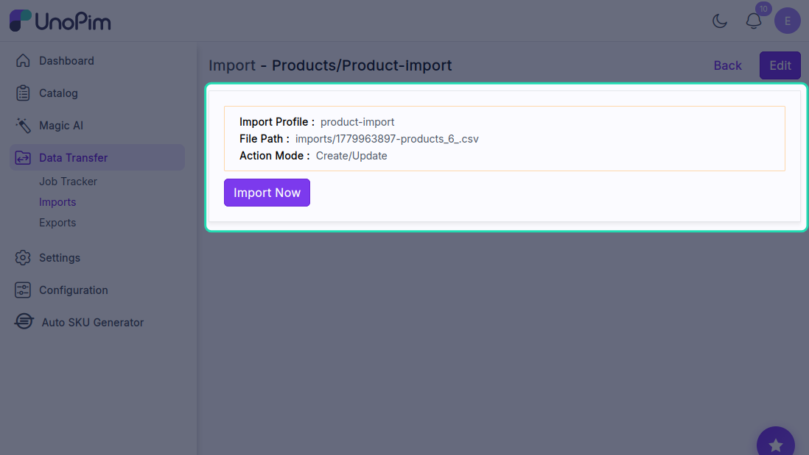
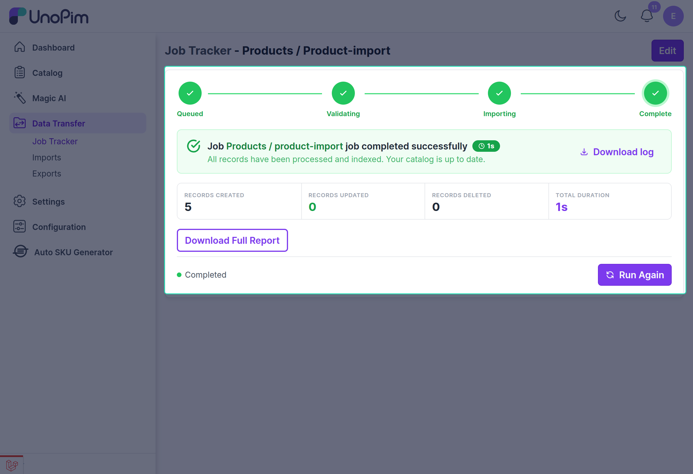
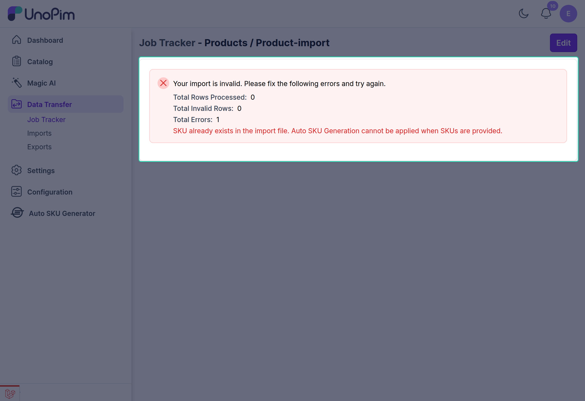

# Auto SKU Generator - Usage Guide

## Overview

The Auto SKU Generator automatically generates unique SKUs for your products based on your configured format rules. This guide covers three primary usage scenarios.

---

## 1. Simple Products

Simple products are standalone items without variants (e.g., a book, individual t-shirt, or single-color item).

### How Auto-Generation Works for Simple Products

When you create a simple product with an empty SKU field, the extension generates a SKU using your configured pattern:

```
[Prefix] + [Attribute Values] + [Sequence Number] + [Suffix]
```

**Example:**
- Prefix: `APPAREL`
- Attribute: Color = Red, Size = M
- Sequence: 1001
- Generated SKU: `APPAREL-Red-M-1001`

### Steps to Create a Simple Product

1. Navigate to **Catalog → Products**
2. Click **Create Product** and select **Simple Product**


3. Fill in product details (type and family)
4. **Leave the SKU field empty** or blank
5. The SKU is automatically generated and displayed in real-time as you complete the form
6. Click **Save Product**

**Result:** Your product is saved with the auto-generated SKU. The next simple product created will receive the next sequential number (e.g., `sku-3`).

---

## 2. Configurable Products

Configurable products are items available in multiple variations (e.g., a t-shirt in different colors and sizes). Each variant automatically receives its own unique SKU.

### How Auto-Generation Works for Variants

When you add a variant to a configurable product with an empty SKU field, the extension generates a unique SKU for that variant:

```
[Prefix] + [Color] + [Size] + [Sequence Number] + [Suffix]
```

**Example with Multiple Variants:**
- Variant 1 (Red, Small): `TSH-Red-Small-2000`
- Variant 2 (Red, Medium): `TSH-Red-Medium-2001`
- Variant 3 (Blue, Small): `TSH-Blue-Small-2002`

Each variant gets its own unique sequence number, ensuring no duplicate SKUs.

### Steps to Add Variants

1. Create a **Configurable Product** and fill in base details
2. Navigate to the **Variants** section
3. Click **Add Variant**


4. Select attribute values for the variant (e.g., Color: Red, Size: Medium)


5. **Leave the SKU field empty** for auto-generation
6. The variant SKU is automatically generated based on the selected attributes
7. Repeat to add additional variants


8. Click **Save** to save all variants

**Result:** Each variant is saved with its own unique auto-generated SKU.

### Manual SKU Entry (Optional)

If you need a custom SKU for a specific variant:
1. In the variant form, **enter a custom SKU** instead of leaving it blank
2. The auto-generator will skip this variant
3. Other variants continue to receive auto-generated SKUs normally

---

## 3. Product Imports

When importing products from external sources or bulk operations, SKU handling follows specific rules. There are three distinct import scenarios, each with different requirements and outcomes.

---

### Scenario A: Import Without SKU (Recommended)

This is the recommended approach when you want the Auto SKU Generator to automatically create SKUs for imported products.

**When to Use:** You have product data without SKU values, or you want auto-generated SKUs for consistency.

#### Step 1: Prepare Your Import File

1. Navigate to **Data Transfer → Import**



2. Click on  **Create Import**



3. Create a CSV or Excel file with the following:
   - **Required columns:** Product Name, Description, Price
   - **SKU column:** Leave empty.

**Example File Structure:**



#### Step 2: Upload Your File

1. Click **Choose File** and select your prepared file


 
3. After uploading, click on **Save Import** to proceed to the next step



#### Step 4: Start the Import

4. Click **Import Now** to begin the import process





#### Step 5: Verify Results

1. Navigate to **Catalog → Products**
2. Locate your newly imported products
3. Confirm each product has an auto-generated SKU


**What Happens:**
- All products are imported successfully
- Each product receives a unique auto-generated SKU
- SKU sequence counter increments for each product
- No products are skipped

---

### Scenario B: Import With SKU (Not Supported Directly)

When your import file contains pre-defined SKU values, the standard import process does not import those products.


**Example:**




#### Workaround: Remove SKUs and Re-Import

If you need to import products that have existing SKU data:

**Step 1: Modify Your Import File**

1. Open your import file in a spreadsheet application
2. Locate the SKU column
3. **Delete the entire data in the SKU column** or clear all values in it
4. Save the modified file

**Before:**
```
Product Name | SKU    | Price | Color
Red Shirt    | RS-001 | 29.99 | Red
Blue Shirt   | BS-001 | 29.99 | Blue
```

**After:**
```
Product Name |SKU| Price | Color
Red Shirt    |   |29.99 | Red
Blue Shirt   |   |29.99 | Blue
```

**Example:**


## Summary Table

| Scenario | SKU Field Status | Auto-Generation | Result |
|----------|------------------|-----------------|--------|
| Create Simple Product | Empty | Yes | SKU auto-generated |
| Create Simple Product | Filled | No | Custom SKU preserved |
| Add Configurable Variant | Empty | Yes | Variant SKU auto-generated |
| Import Without SKU | Empty | Yes | Product imported with auto-generated SKU |
| Import With SKU | Filled | No | Product **not imported** |