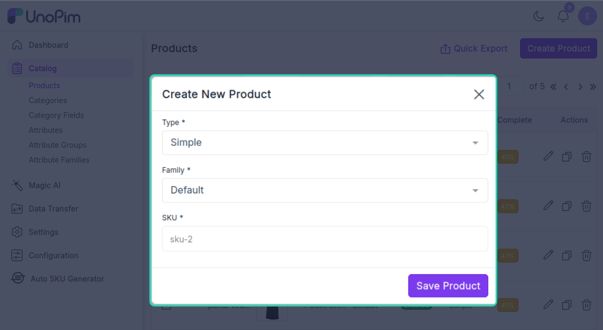
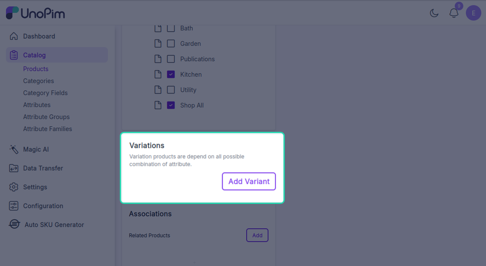
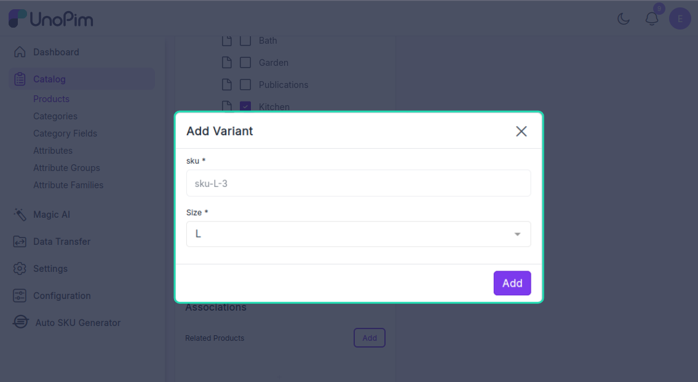
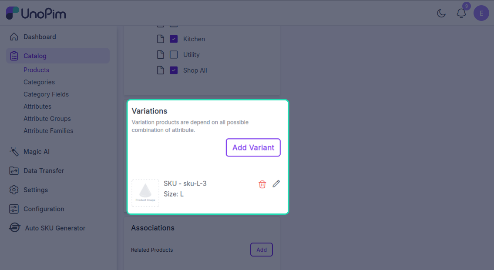

# Auto SKU Generator - User Guide

## Quick Start

The Auto SKU Generator automatically creates unique SKUs for your products. During product creation, the SKU field is populated automatically in real-time as you fill in details, showing a live preview before you save.

---

## Basic Workflow

### Creating a Simple Product with Auto SKU

1. **Go to Catalog → Products**


2. **Click "Create Product"** and select **Simple Product**



3. **Fill in product details** (name, description, etc.)
4. **The SKU is automatically generated** and displayed in the SKU field in real-time.
5. **Click Save**.
6. The product is saved with the auto-generated SKU.

**During Creation:**
```
SKU field: APPAREL-Red-M-1001 (auto-filled in real-time)
```

**After saving:**
```
SKU field: APPAREL-Red-M-1001 (saved value)
```

---


## Working with Product Variants

### Adding Variants to Configurable Products

Configurable products (like a shirt available in multiple colors and sizes) are supported.

**Steps:**

1. Create a **Configurable Product**
2. Navigate to the **Variants** section click **Add Variant**





4. Select attribute values (e.g., Color: Red, Size: M)



5. SKU will be auto generated for each variant


6. Save the product




**Result:**
- Variant 1: Red, Small → `TSH-Red-Small-2000`
- Variant 2: Red, Medium → `TSH-Red-Medium-2001`
- Variant 3: Blue, Small → `TSH-Blue-Small-2002`

Each variant gets its own unique SKU automatically.

---

## Manual SKU Override

Need a custom SKU for a special product? You can manually enter one.

**When to use:**
- Limited edition products
- Special promotions
- Products imported from other systems
- Testing products

**How:**

1. Open product creation form
2. **Enter your custom SKU** (e.g., `XMAS-SPECIAL-2024`)
3. Save the product
4. Your custom SKU is used (auto-generator is skipped)
5. The sequence counter continues normally for other products

**Result:**
```
Auto-generated SKU: SKU-1001
Your manual entry: XMAS-SPECIAL-2024
Next auto-generated: SKU-1002 (unaffected)
```

---

## Read-Only SKU Mode

### What is Read-Only?

When read-only mode is enabled:
- The SKU field is **locked and cannot be edited**
- All SKUs come from auto-generation only
- Users cannot manually override SKUs

### When to Use

- Enforce strict SKU naming rules
- Prevent accidental SKU changes
- Ensure catalog consistency

### Example

With read-only enabled:
1. Create product → SKU field is grayed out and auto-filled
2. Verify the auto-generated SKU (which cannot be edited manually)
3. Save product
4. SKU field remains locked (cannot edit)

