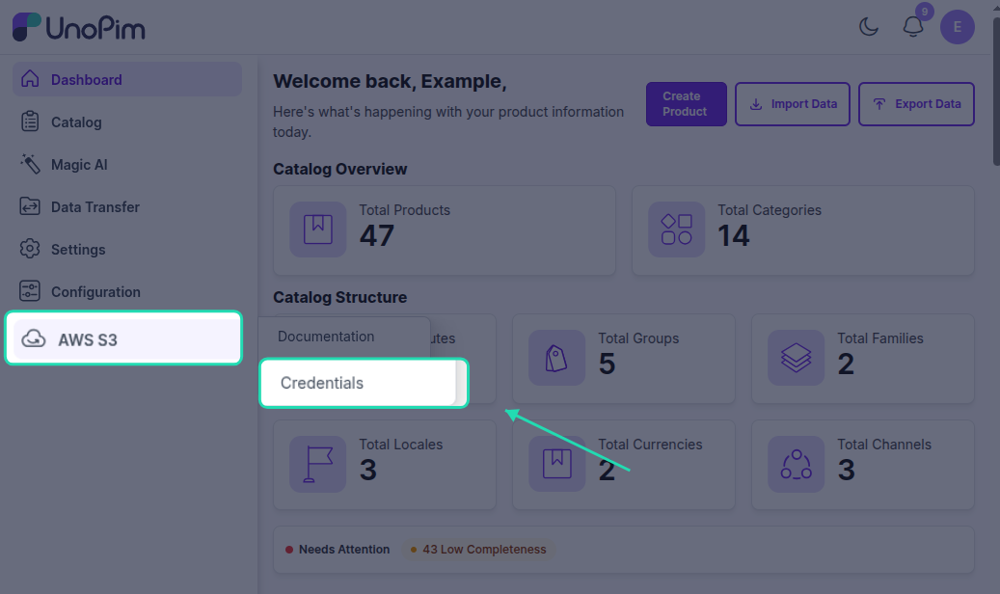
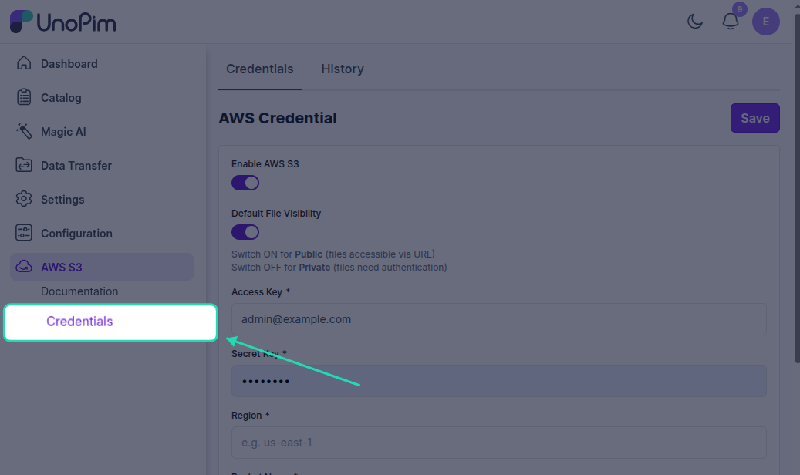
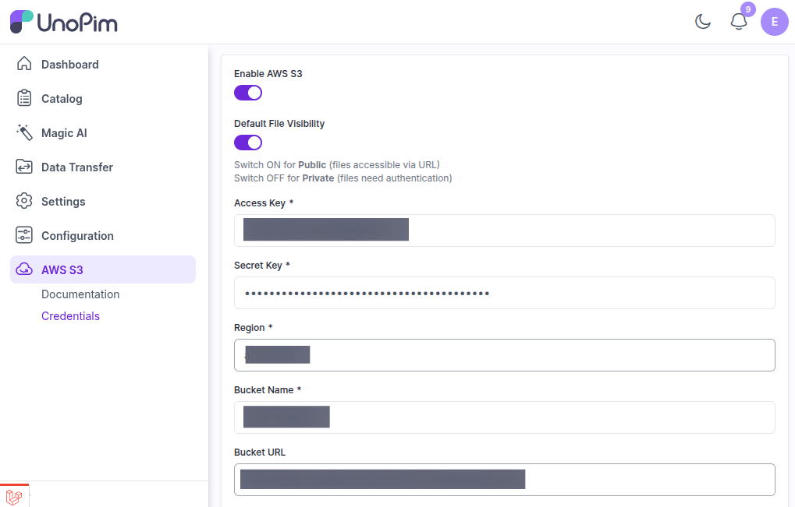
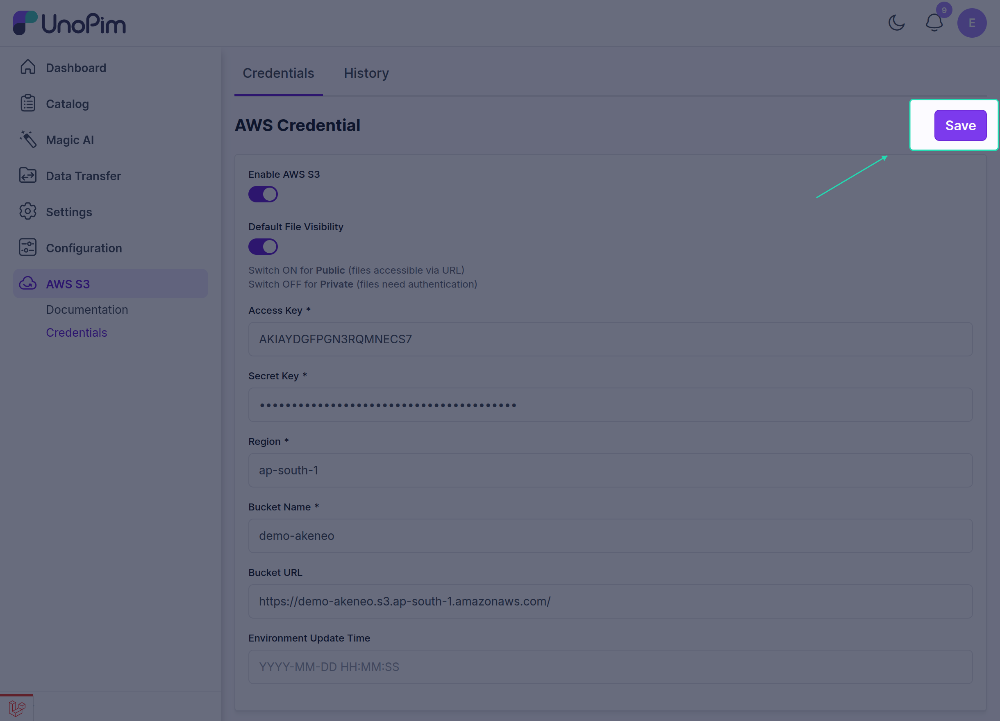

# AWS S3 Setup in UnoPim

After installing the **UnoPim AWS Integration** module, users with the required permissions can manage the AWS storage settings from the admin panel.

Go to:

**Left Menu → AWS S3 → Credentials**

From here, you can enable the module and connect UnoPim to **Amazon S3** so files are stored in your AWS bucket instead of only on the local server.

## What This Configuration Does

Once the setup is saved correctly:

- UnoPim can store supported files on **Amazon S3**.
- Your media can be served from the configured **bucket URL**.
- Cached file URLs are refreshed based on the **Environment Update Time** value.

## Fields You Need to Fill

To connect UnoPim with AWS, enter the configuration details created in your Amazon AWS account.

| Field | Description |
|---|---|
| **Access Key ID** | The public access key generated for your AWS IAM user. |
| **Secret Key** | The secret key paired with the Access Key ID. Keep this private. |
| **Bucket Name** | The exact name of the S3 bucket where UnoPim should store files. |
| **Region** | The AWS region where your bucket was created, such as `us-east-1` or `ap-south-1`. |
| **Bucket URL** | The public URL or bucket endpoint used to access files stored in the bucket. |

## How to Configure It

1. Open the **AWS S3 → Credentials** section in UnoPim.

2. Enable the module if it is currently disabled.

3. Enter the **Access Key ID** and **Secret Key** from your AWS account.
4. Add the correct **Bucket Name** and **Region**.
5. Enter the **Bucket URL** that should be used to access uploaded files.

6. Save the configuration.

After saving, UnoPim will use these details to connect with Amazon S3 for file storage.

## Understanding Environment Update Time

The **Environment Update Time** field controls how long image URLs stay cached in the browser before they are refreshed.

- The value is entered in **seconds**.
- During this time, the browser keeps using the existing cached image URL.
- A new request is made only after the configured time has passed.

If this field is left empty, UnoPim uses the default value:

`86400` seconds = `24 hours`

## Why This Setting Matters

This setting helps:

- reduce repeated file URL requests,
- avoid unnecessary fetches from AWS,
- improve loading efficiency for frequently viewed images.

## Recommended Before Saving

Before saving the configuration, make sure:

- your AWS credentials are valid,
- the S3 bucket name is correct,
- the selected region matches the bucket region,
- the bucket URL is accessible,
- the IAM user has permission to read and write files in the bucket.

If you have not prepared your AWS account yet, follow [Setup Credentials in Amazon S3](./setup-amazon.md) first.

Once your credentials are saved, continue to [Migrate Existing Files to S3](./migrate-existing-files.md) if you want to move older local media into Amazon S3.
