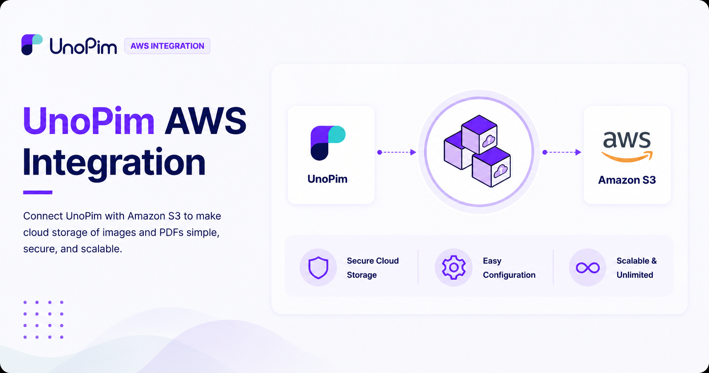

# UnoPim AWS S3 Integration

Store Link: [View on Webkul Store](https://store.webkul.com/unopim-aws-integration.html)

The **UnoPim AWS Integration** connects your UnoPim instance with **Amazon S3** - one of the world's most reliable cloud storage services - to store, manage, and serve your product images and PDFs securely in the cloud.

Instead of storing media files on your local server, everything gets uploaded to Amazon S3 automatically. This means your assets are always available, load quickly for users, and can scale without any storage limitations as your catalog grows.

 

  

  

## How It Works

Once connected, the integration handles your media in two ways:

- **New files** - any image or PDF you add to UnoPim is automatically synced to Amazon S3 without any manual action.

The integration also includes a **cache refresh mechanism** - it refreshes cached images at regular intervals so your storefront and product pages always display the latest version of any updated asset. If no custom refresh time is set, a sensible default kicks in automatically to keep everything current.

## Key Features

### Cloud Storage
- Connect UnoPim with **Amazon S3** to store images and PDFs safely and reliably in the cloud.
- Enjoy **unlimited, scalable storage** - no capacity limits, no need to manage server disk space.

### Easy Setup
- Get connected quickly by entering just four details: **Access Key ID**, **Secret Key**, **Region**, and **Bucket Name**.

### Automatic Media Sync
- All new images and PDFs added to UnoPim are **automatically uploaded to S3** - no manual uploads needed.

### Cache Management
- Set a custom **environment refresh time** to control how often cached images are updated.
- Enable **automatic cache refresh** to minimise repeated requests to AWS and ensure faster media loading.
- If no refresh time is configured, a **default interval** is applied automatically so updates still happen without any manual intervention.

### DAM Integration *(requires UnoPim DAM)*
If you have the **UnoPim Digital Asset Management (DAM)** extension installed, the AWS integration extends its capabilities further:

- **DAM asset import for products** - when importing products, the system automatically resolves DAM asset file paths to their correct asset IDs, so media links stay accurate without manual correction.
- **DAM asset import for categories** - the same automatic resolution applies to category fields of type `asset` during import.
- **Category media in export archives** - when you export a ZIP file, it now includes all files referenced by category fields of type `image`, `file`, and `asset`, alongside your product media - giving you a complete export package every time.

## Requirements

| Requirement | Details |
|---|---|
| **UnoPim** | v2.0.0 or higher |
| **PHP** | v8.2 or higher |
| **AWS S3 Bucket** | Active bucket with API credentials (Access Key ID, Secret Key, Region, and Bucket Name) |
