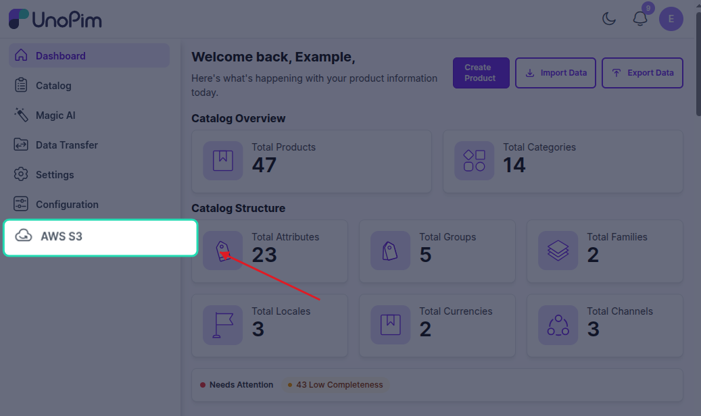

# Installation

Follow the steps below to install the UnoPim AWS Integration extension. Make sure you have terminal access to your server and know which version of Laravel your UnoPim instance is running before you begin.


## Step 1 — Add the Package Files

Download and unzip the extension. Inside, you'll find a folder called `AWSIntegration` — move it into the following directory in your UnoPim project:

```
packages/Webkul/AWSIntegration
```


## Step 2 — Register the Service Provider

This step depends on which version of Laravel your project uses.

**Laravel 10 — add to `config/app.php` under the `providers` array:**

```php
Webkul\AWSIntegration\Providers\AWSIntegrationServiceProvider::class,
```

**Laravel 11 and above — add to `bootstrap/providers.php`:**

```php
use Webkul\AWSIntegration\Providers\AWSIntegrationServiceProvider;

return [
    // ...existing providers...
    AWSIntegrationServiceProvider::class,
];
```


## Step 3 — Update Composer Autoload

Open `composer.json` and add the following line under the `autoload > psr-4` section:

```json
"Webkul\\AWSIntegration\\": "packages/Webkul/AWSIntegration/src"
```


## Step 4 — Run the Installer

Run the following commands in order. Each command handles a specific part of the setup:

```bash
composer dump-autoload
php artisan aws-s3-package:install
php artisan optimize:clear
```

Here's what each command does:

| Command | What it does |
|---|---|
| `composer dump-autoload` | Refreshes the Composer autoloader to recognise the new package |
| `php artisan aws-s3-package:install` | Installs the AWS SDK dependencies, runs database migrations, and publishes package assets |
| `php artisan optimize:clear` | Clears the application cache |

> **Note:** The installer automatically pulls in the required AWS libraries — `league/flysystem-aws-s3-v3` and `aws/aws-sdk-php` — so you don't need to install them separately.


## Step 5 — Publish Config *(Only if using a custom theme)*

If your UnoPim instance uses a custom published theme, run this additional command:

```bash
php artisan vendor:publish --tag=aws-s3-config --force
```

You can skip this step if you're using the default UnoPim theme.


## Step 6 — Build Frontend Assets *(Only if using a custom theme)*

If you ran Step 5, you also need to build the frontend assets for the extension.

Open your project's `package.json` file and add the following lines inside the `scripts` section:

```json
"aws:install": "cd packages/Webkul/AWSIntegration && npm install",
"aws:build": "cd packages/Webkul/AWSIntegration && npm run build"
```

Then run:

```bash
npm run aws:install
npm run aws:build
```


## Verify the Installation

Once all steps are complete, log in to your UnoPim dashboard. If the extension has been installed correctly, you'll be able to access the AWS S3 configuration settings from the admin panel.



If something doesn't look right, try running `php artisan optimize:clear` again and refreshing the page.

