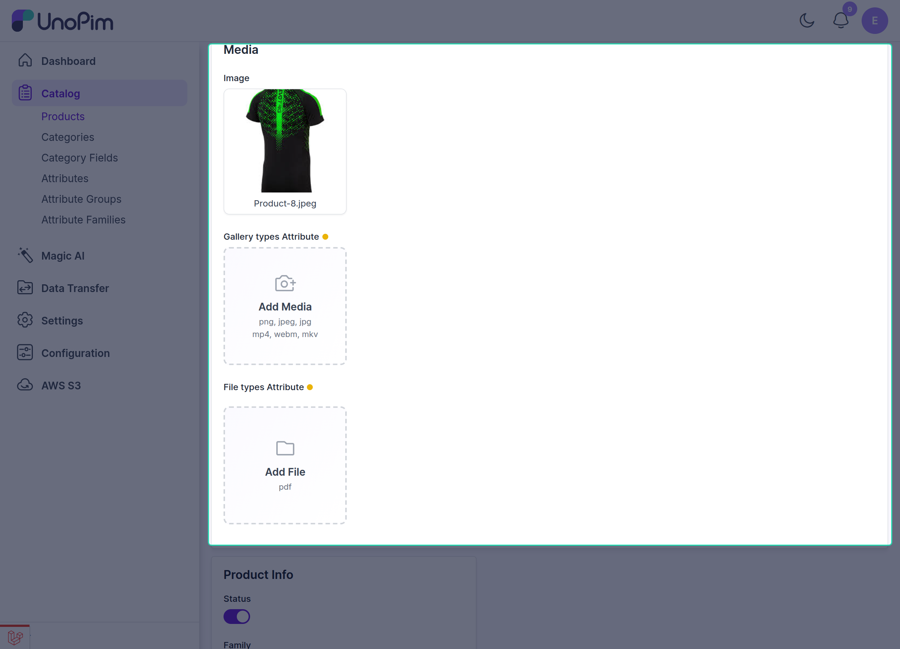
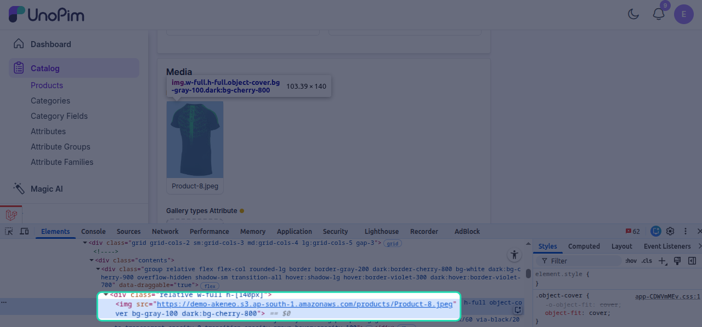

# Media Upload on Amazon S3

Once the **UnoPim AWS Integration** is configured, users can continue uploading media files in the usual way from the product section.

Go to:

**Catalog → Products**

From there, you can upload:

- product images,
- PDF documents,
- other supported product media files.

## How It Works

You do not need to follow any separate upload process for Amazon S3.

When a user uploads media in UnoPim:

1. the file is added through the normal product form,
2. UnoPim automatically transfers the file to **Amazon S3**,
3. an **S3 file link** is generated for that media.

This means users can work inside UnoPim as usual, while the storage is handled in the background through AWS.

this shows the media file stored in Amazon S3 with the correct bucket URL, confirming that the upload and storage process is working as expected.

## What Users Need to Know

- Uploading files from the product page works the same as before.
- The system automatically stores uploaded files in the configured **S3 bucket**.
- Media links are served using the AWS S3 configuration saved in UnoPim.

## Benefits of Uploading Media to S3

Using Amazon S3 for media storage provides several benefits:

- **automatic cloud storage** for newly uploaded files,
- **reliable access** to images and documents,
- **better scalability** as your media library grows,
- **reduced pressure on local server storage**.

Because Amazon S3 offers highly scalable cloud storage, you can continue adding large numbers of media files without worrying about local storage limitations.

## Before Uploading

Before uploading media, make sure:

- the AWS Integration module is enabled,
- your AWS credentials are configured correctly,
- the S3 bucket and bucket URL are valid.

If the AWS configuration is not complete, review [AWS S3 Setup in UnoPim](./aws-s3-setup-in-unopim.md).
