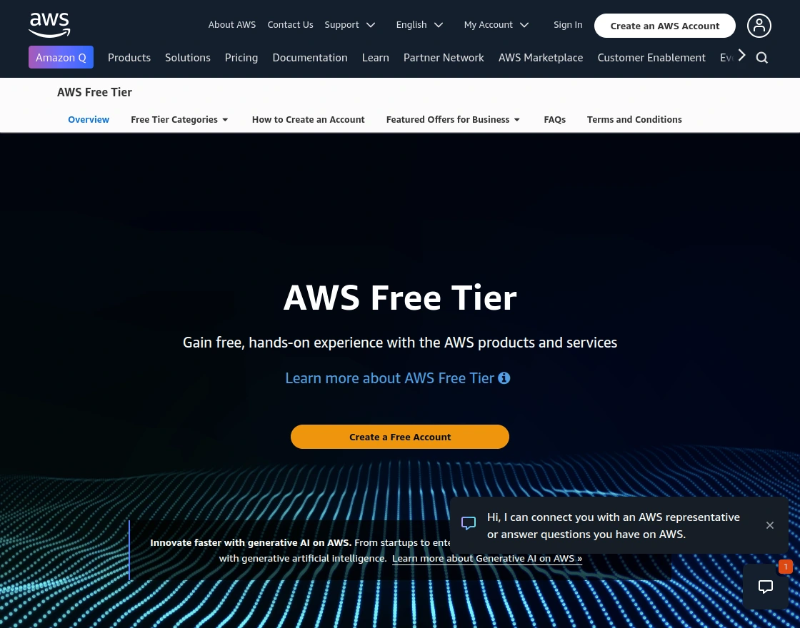
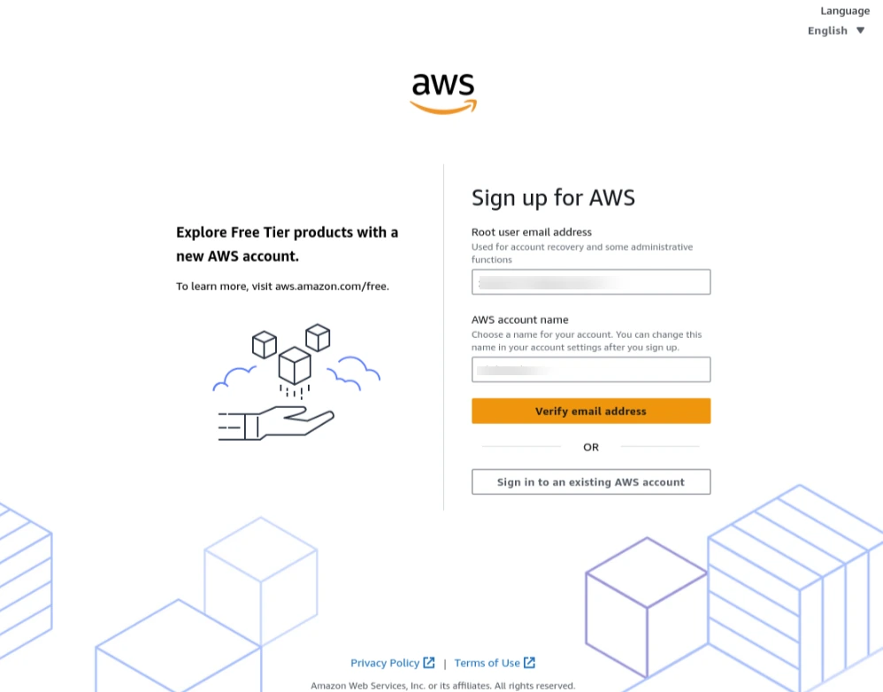
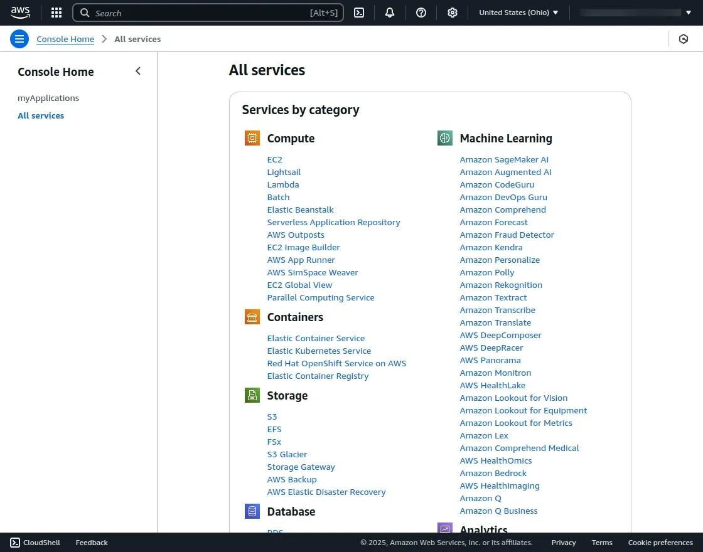
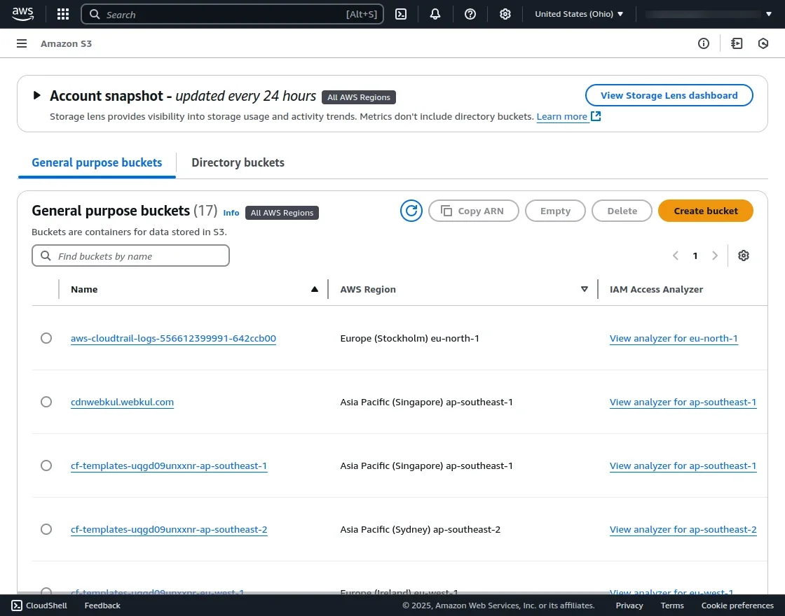
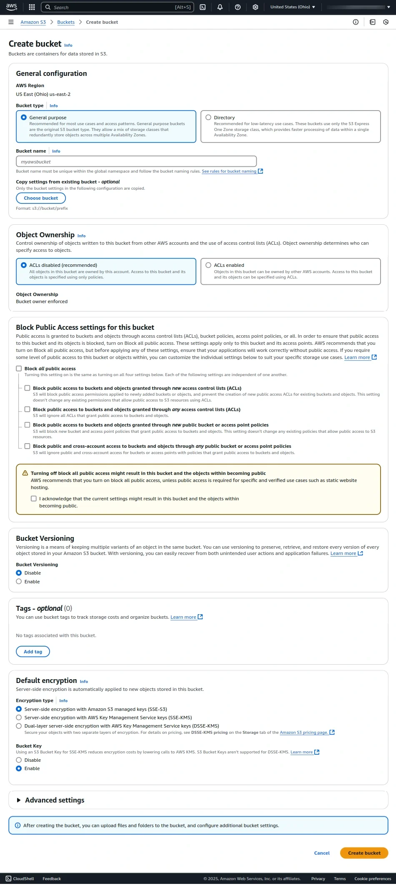
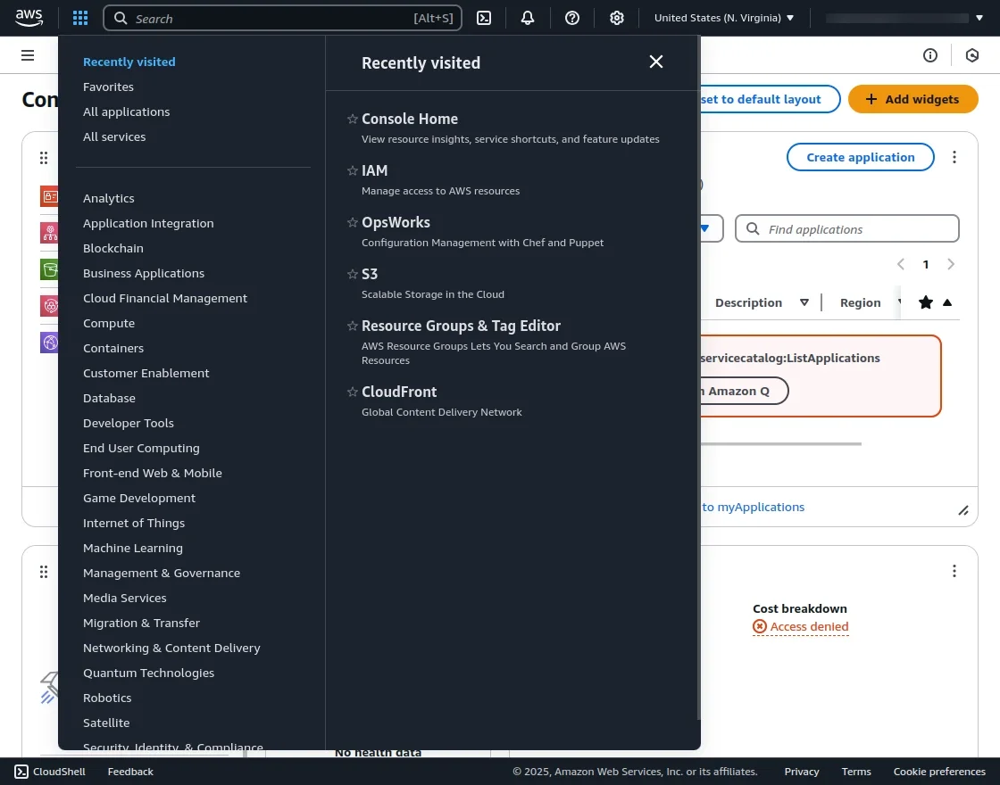
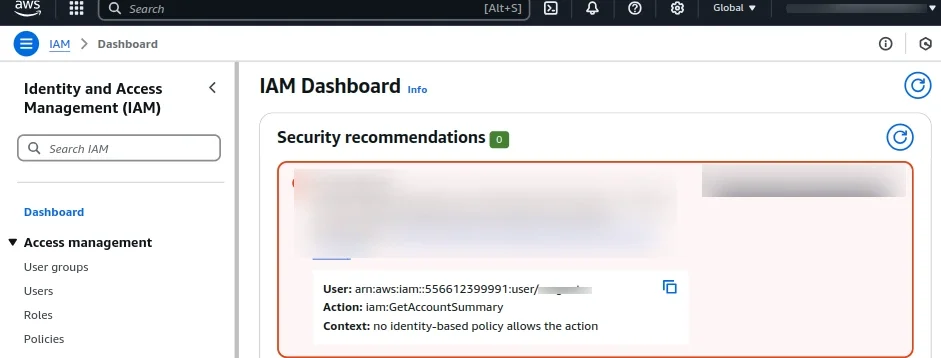
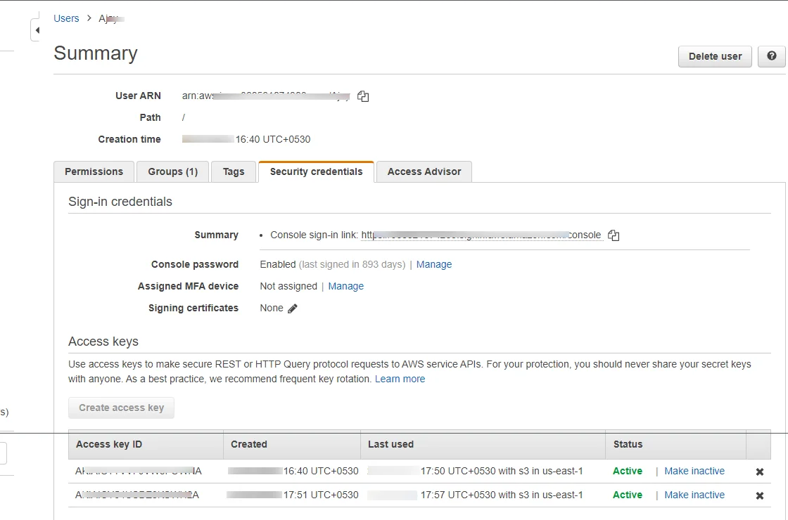

# Setting Up Your Amazon S3 Credentials

Before configuring the UnoPim AWS Integration, you need to set up an Amazon S3 bucket and generate your API credentials. Follow the steps below to get everything ready on the AWS side.

## Step 1 — Create an AWS Account

Go to [https://aws.amazon.com](https://aws.amazon.com) and click **Create an AWS Account**.

On the sign-in page, you'll see two options:

| Option | Who it's for |
|---|---|
| **Create an AWS Account** | First-time users who don't have an AWS account yet |
| **Sign in to the Console** | Existing users who already have an account |

Once signed in, you'll land on the AWS Management Console — your central dashboard for all AWS services.

## Step 2 — Open Amazon S3

From the AWS Console, click on **All Services** and select **S3** under the Storage section. Alternatively, type `S3` in the search bar at the top and click on it from the results.

This opens the S3 dashboard where you can see all your existing buckets — or create a new one.

## Step 3 — Create a New Bucket

Click the **Create bucket** button. Fill in the required details on the Create bucket page:

| Field | What to enter |
|---|---|
| **Bucket name** | A unique name for your bucket (e.g., `mystore-unopim-media`). Names are globally unique — no two buckets on all of AWS can share the same name. |
| **AWS Region** | Choose the region closest to your server for best performance (e.g., `us-east-1`, `eu-west-1`) |

> **Important:** Make sure to **uncheck "Block all public access"** so that UnoPim can read and write media files to the bucket. Without this, file uploads will fail.

Once all details are filled in, scroll to the bottom and click **Create bucket**.

## Step 4 — Manage Your Bucket

Once the bucket is created, you can:

- **Upload files** directly to the bucket
- **Create folders** to organise your assets
- **View and manage** all stored data

This is the same bucket where UnoPim will store your product images and PDFs once the integration is active.

## Step 5 — Create an IAM User

Instead of using your main AWS root account for the integration, it's strongly recommended to create a dedicated **IAM user** with limited permissions. This keeps your main account secure.

1. In the AWS Console, search for **IAM** and open it — it's listed under **Security, Identity & Compliance**.

2. In the IAM dashboard, click **Users** in the left sidebar.
3. Click **Add users** to create a new IAM user.
4. Enter a username (e.g., `unopim-s3-user`) and follow the on-screen steps to set permissions.

> Assign the `AmazonS3FullAccess` policy to give this user full access to your S3 bucket, or create a custom policy limited to your specific bucket for tighter security.

## Step 6 — Generate Your Access Key ID and Secret Access Key

Once your IAM user is created:

1. Click on the user's name to open their profile.
2. Go to the **Security credentials** tab.
3. Scroll to **Access keys** and click **Create access key**.
4. Your **Access Key ID** and **Secret Access Key** will be generated and displayed.

> **Important:** AWS will only show your Secret Access Key **once**. Copy both keys immediately and store them in a safe place. If you lose the Secret Key, you'll need to delete this key pair and generate a new one.

## What You Now Have

You should now have the four values needed to connect UnoPim to your S3 bucket:

| Credential | Where to find it |
|---|---|
| **Access Key ID** | Generated in Step 6 |
| **Secret Access Key** | Generated in Step 6 — save immediately |
| **Region** | The region selected when creating the bucket in Step 3 |
| **Bucket Name** | The name you gave your bucket in Step 3 |

## Module Configuration in UnoPim

After installing the UnoPim AWS Integration, navigate to the left sidebar in your UnoPim dashboard and go to:

**AWS S3 → Credentials**

Here, users with the required permissions can enter the credentials collected above and manage all AWS configuration settings.

Head over to [AWS S3 Setup in UnoPim](./aws-s3-setup-in-unopim.md) to complete the setup.
