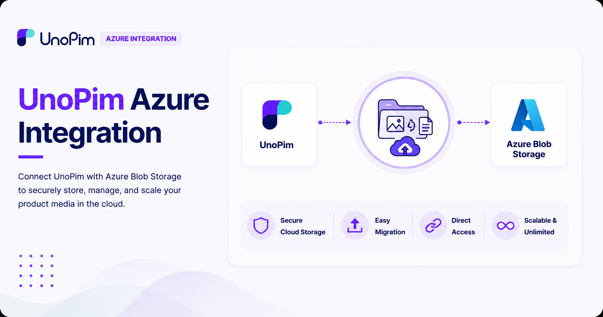

# UnoPim Azure Integration

## What Is the UnoPim Azure Integration?

The **UnoPim Azure Integration** connects your UnoPim product catalog with **Microsoft Azure Blob Storage** — Microsoft's cloud-based storage service designed to handle large volumes of media like images, videos, and documents.
 

  

 
Instead of storing your product images and PDFs on your local server, this integration lets you move everything to the cloud — keeping your assets secure, accessible, and easy to manage no matter how large your catalog grows.

## What Can It Do?

- Upload product images and PDFs **directly to Azure Blob Storage** from UnoPim.
- **Migrate existing local media files** to Azure Blob Storage in one go.
- Optionally **remove local copies** of files after a successful migration to free up server space.
- **View Azure Blob URLs** directly on the product page — no need to download assets locally to access them.
- **Export product data** with public image URLs included, in CSV, XLS, and XLSX formats.

## Features

| Feature | Description |
|---|---|
| **Azure Blob Integration** | Connects your UnoPim catalog directly to Microsoft Azure Blob Storage |
| **Secure Cloud Storage** | Store and manage all product assets safely in the cloud |
| **Direct Media Upload** | Upload product images and PDFs to Azure without leaving UnoPim |
| **Local Media Migration** | Easily migrate existing local files to Azure Blob Storage |
| **Remove Local Files** | Option to delete local media after successful migration to save server space |
| **Azure Blob URLs on Product Page** | View and access asset URLs directly from the product page |
| **Export with Public URLs** | Export product data with image URLs in CSV, XLS, or XLSX format |
| **UnoPim Compatible** | Fully compatible with the latest version of UnoPim |

## Prerequisites

Before you begin, make sure the following are in place:

| Requirement | Detail |
|---|---|
| **UnoPim** | Installed and running on your system |
| **Microsoft Azure Account** | An active Azure account with Blob Storage enabled |
| **Azure Storage Credentials** | Your Azure **Storage Account Name** and **Access Key** — available from your Azure portal |

