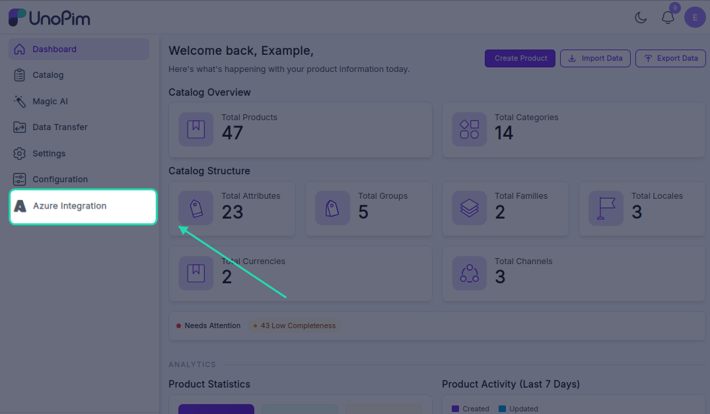
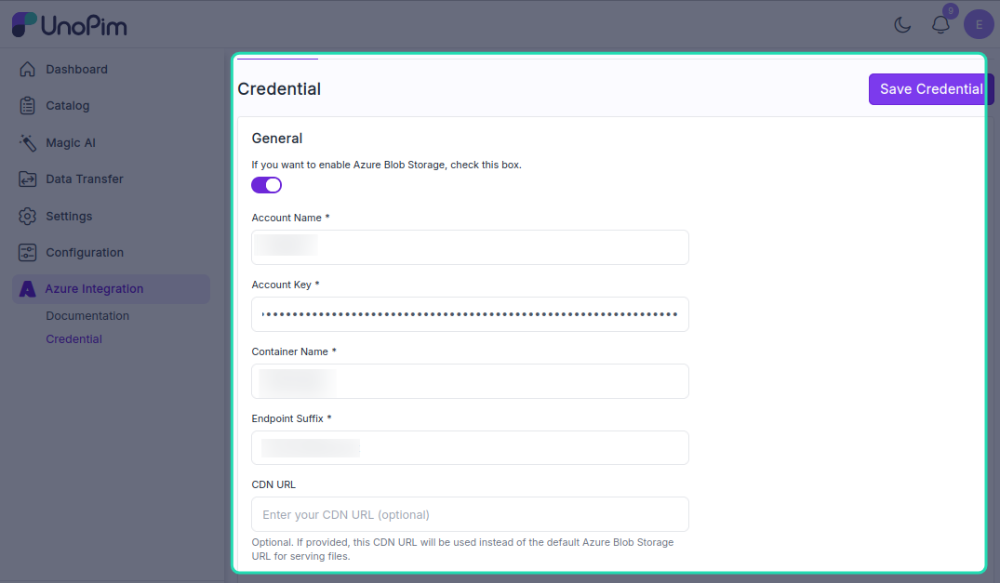

# Setting Up Azure Credentials in UnoPim

Once the module is installed, the next step is to connect your Azure Blob Storage account to UnoPim by entering your credentials.

---

## Step 1 - Open Azure Integration

Log in to your UnoPim dashboard. You'll notice a new **Azure Integration** option in the left navigation panel. Click on it to expand the menu.

---

## Step 2 - View the Documentation *(Optional)*

Go to **Azure Integration → Documentation** to access the official Azure Blob Storage documentation directly from UnoPim. This is helpful if you need to look something up while configuring the integration.

---

## Step 3 - Enter Your Credentials

Navigate to **Azure Integration → Credential**. Fill in the following fields with your Azure Blob Storage details:

| Field | What to enter |
|---|---|
| **Account Name** | The name of your Azure Storage Account |
| **Account Key** | The access key for your Azure Storage Account - found in your Azure portal under **Access keys** |
| **Container Name** | The name of the Blob container where media files will be stored |
| **Endpoint Suffix** | The endpoint suffix for your Azure storage service (e.g., `core.windows.net`) |

Once all fields are filled in, click **Save Credential**.

---

## Step 4 - Enable or Disable the Credential

After saving, you'll see a **toggle switch** next to your credential. Use this to enable or disable the Azure integration at any time.

Here's what each state means:

| State | What happens |
|---|---|
| **Enabled**  | All media files (images and PDFs) uploaded in UnoPim are stored directly in Azure Blob Storage and served via an Azure Blob URL |
| **Disabled**  | Media files are stored in your local server storage instead, and no files are sent to Azure |

> **Note:** If you switch from enabled to disabled, any files already uploaded to Azure Blob Storage will remain there - only new uploads will go to local storage going forward.

---

Once your credential is saved and enabled, your UnoPim instance is fully connected to Azure Blob Storage. Any product media you upload from this point will be stored securely in the cloud.