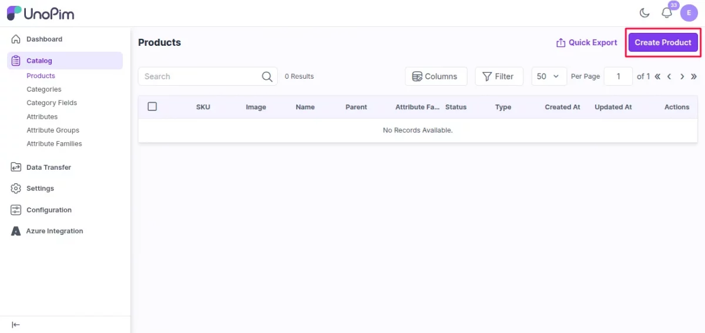
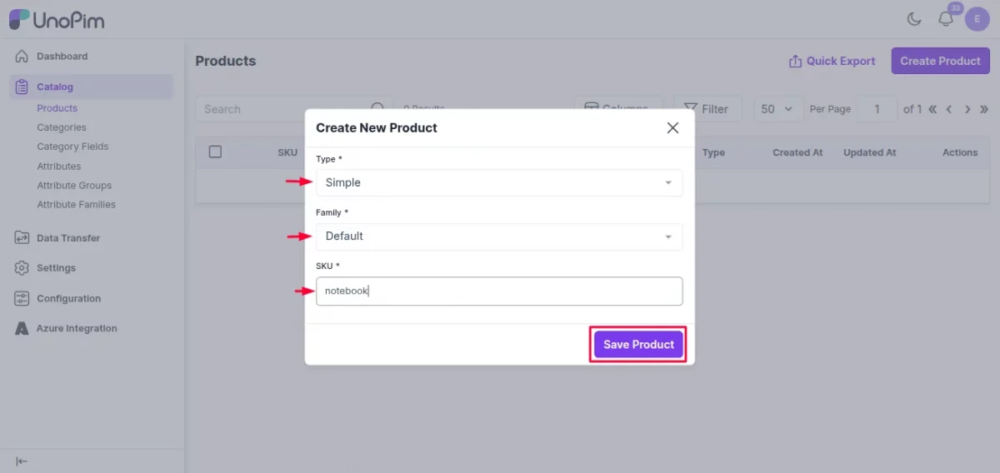
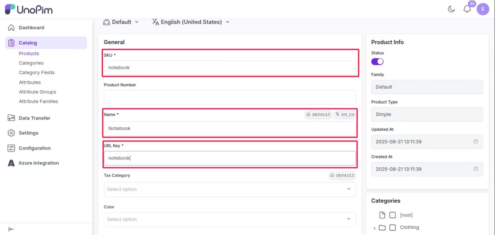
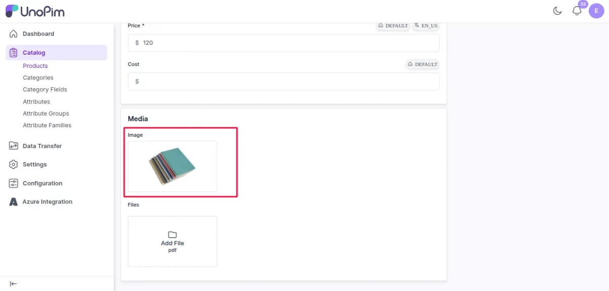
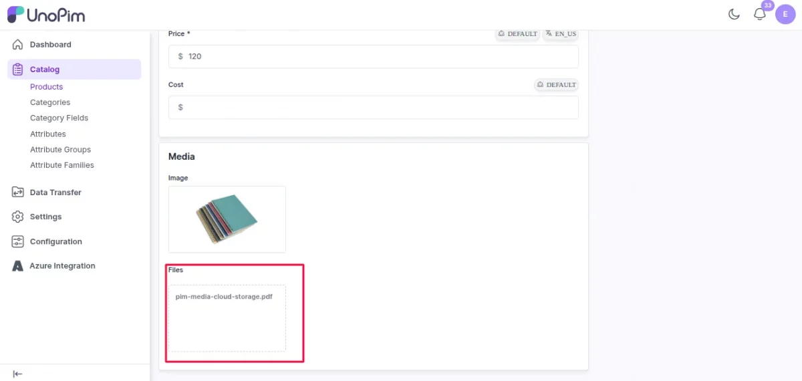
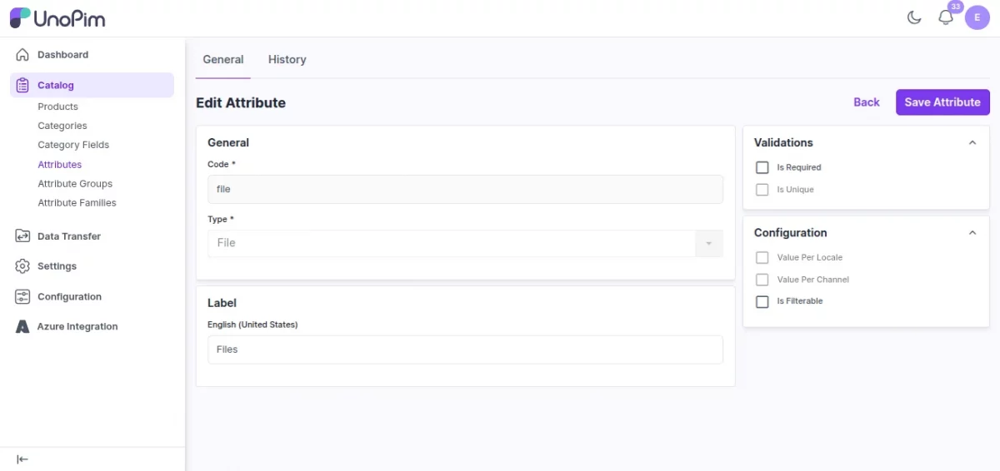
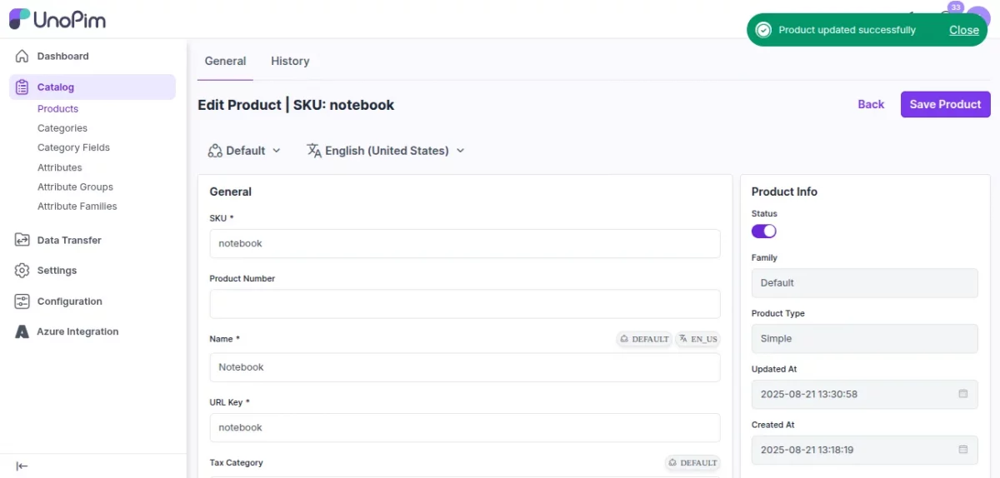
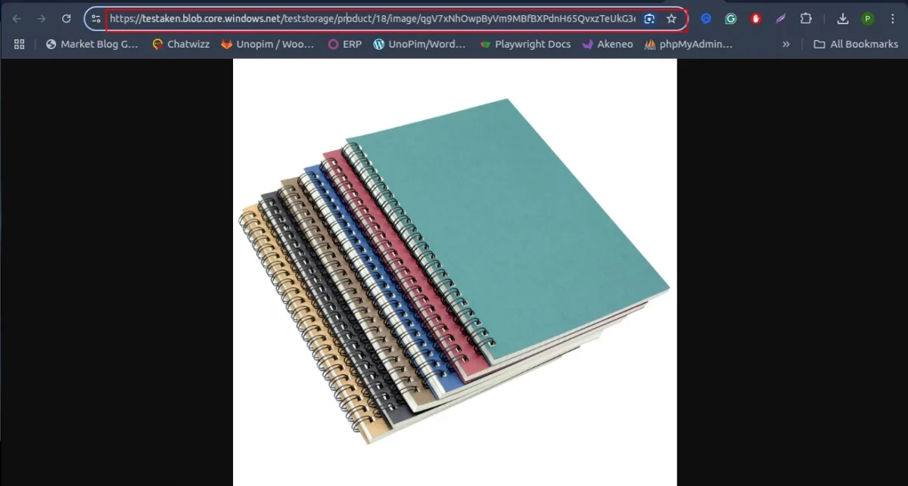
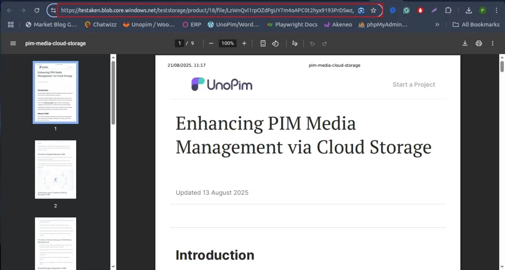

# Creating Products with Azure Media

Once your Azure integration is set up and enabled, any media you attach to a product — images or PDFs — will automatically be uploaded to Azure Blob Storage. Here's how to create a product and attach media to it.

---

## Step 1 — Create a New Product

Go to **Catalog → Products** and click the **Create Product** button.

Fill in the following fields:

| Field | What to enter |
|---|---|
| **Product Type** | Select **Simple** for a standard product, or **Configurable** for a product with variants |
| **Family** | A family named `Default` is already available — select it or choose another if you've created custom families |
| **SKU** | Enter a unique identifier for the product |

> **Note:** The SKU must be unique across all products. No two products can share the same SKU.

Click **Save Product** to continue.

---

## Step 2 — Fill in the Product Details

After saving, you'll be taken to the product edit page. Complete the following fields:

| Field | Notes |
|---|---|
| **SKU** | Auto-filled from the previous step |
| **Name** | Enter the product name manually |
| **URL Key** | Auto-filled based on the product name |
| **Short Description** | Enter a brief summary of the product |
| **Description** | Enter the full product description |
| **Price** | Enter the product price manually |

---

## Step 3 — Add an Image

In the **Image attribute field**, click to select and upload a product image. Once uploaded, the image will be stored directly in your Azure Blob container and the product page will display its Azure Blob URL.

---

## Step 4 — Add a PDF File

In the **File attribute field**, select a PDF file to attach to the product.

> **Note:** Before you can attach a PDF, you need to first create a **File type attribute**. See the section below for how to do this.

---

## Creating a File Type Attribute

If you haven't already created a file attribute, follow these steps:

1. Go to **Catalog → Attributes** and click **Create Attribute**.
2. Fill in the following:
   - **Code** — enter a unique code for the attribute (e.g., `product_pdf`)
   - **Type** — select **File** from the dropdown
   - **Label / Name** — enter a display name for the attribute (e.g., `Product PDF`)
3. Click **Save Attribute**.

> **Note:** The File type attribute in UnoPim currently supports **PDF files only**.

Once created, this attribute will appear on the product edit page under the file attribute section, ready for you to attach PDFs to your products.

---

## Step 5 — Save the Product

Once all fields are filled in and your media is attached, click **Save Product** at the top of the page.

After saving, both the image and the PDF file will show an **Azure Blob Storage URL** — confirming they have been successfully uploaded to Azure and are being served from the cloud.

