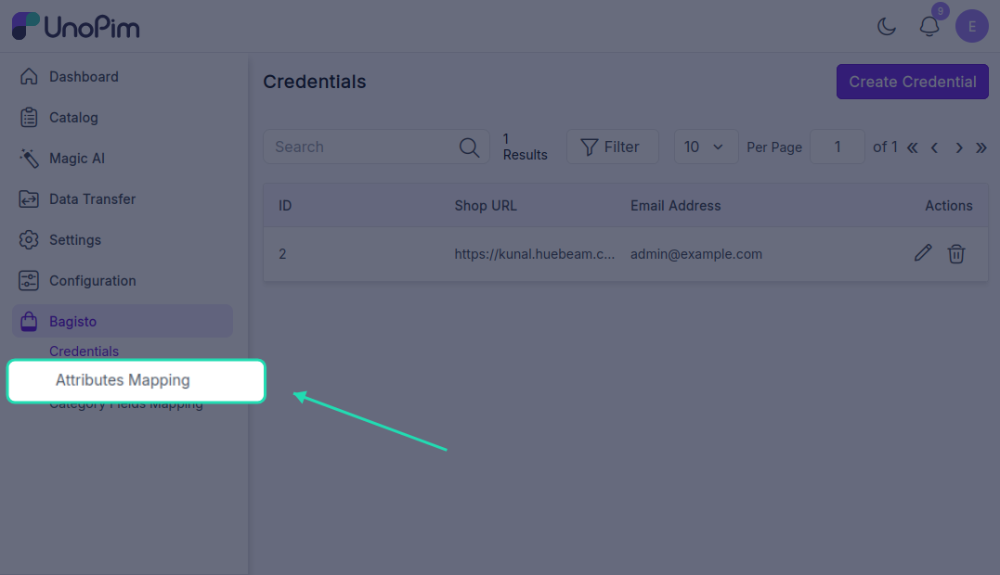
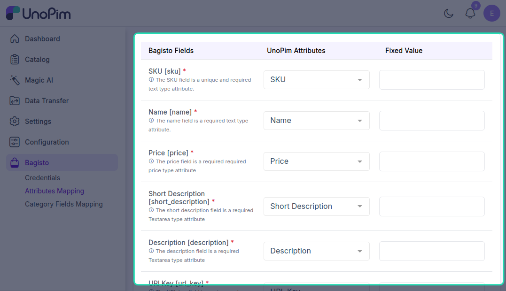
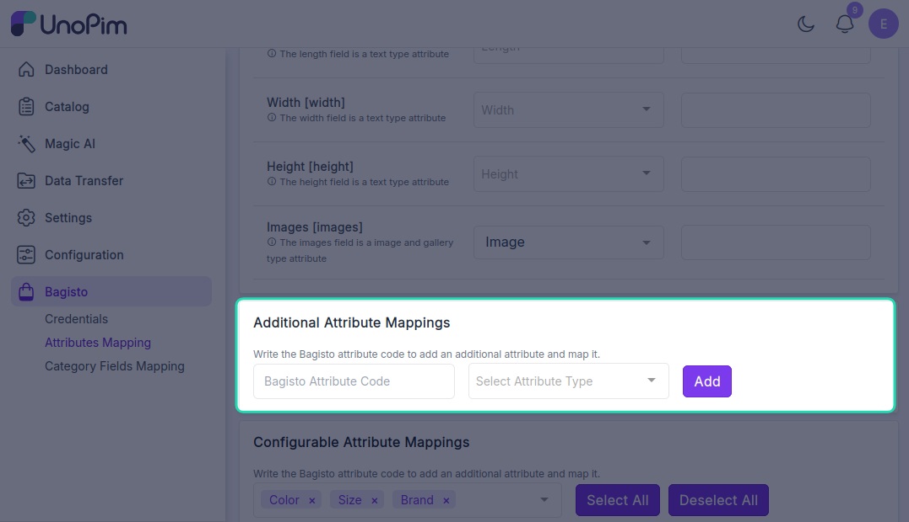
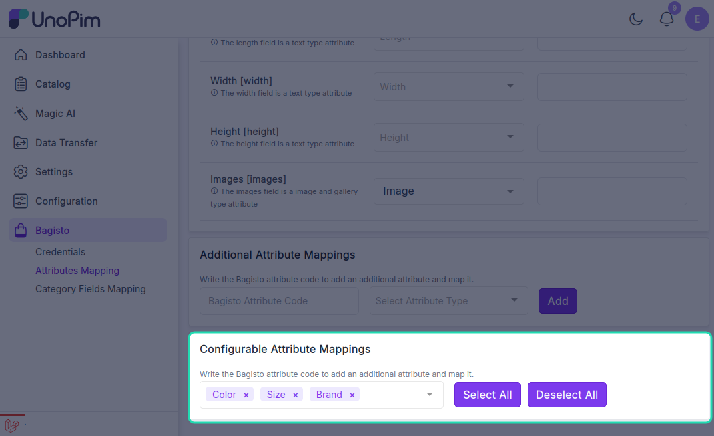

# Mapping Templates

Users can create multiple mapping templates in this connector. They can then edit these templates to set specific attribute mappings as needed. For this, they tap on **Attribute Mapping**.

## Attribute Template Page

To view and edit an attribute template, users click on the template name. This redirects them to the **Attribute Template** page where they can manage the following:

### Attribute Fields

Map the Bagisto Fields with UnoPim Attributes. Users can also set a **Fixed Value** for the mappings.

### Additional Attribute Mappings

Users can perform **Additional Attribute Mappings** by writing and selecting the Bagisto attribute code to add and map an additional attribute.

### Configurable Attribute Mappings

Users can also perform **Configurable Attribute Mappings** by selecting and mapping the Bagisto configurable attributes.

## Category Fields Mapping

This section enables users to map category fields. By selecting **Category Field Mapping**, users can link the following Bagisto fields to the corresponding UnoPim category fields:

- Name
- Description
- Display Mode
- Position
- Visible in Menu
- Slug
- Meta Title
- Meta Keywords
- Meta Description
- Logo
- Banner

To save the Attribute Template, they tap on the **Save** button and it will be added into the list of templates. Users can further proceed to edit the templates to perform the attribute mapping or delete templates.
