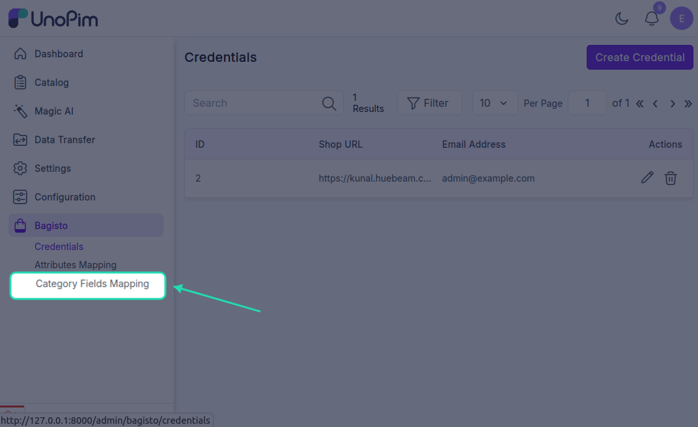
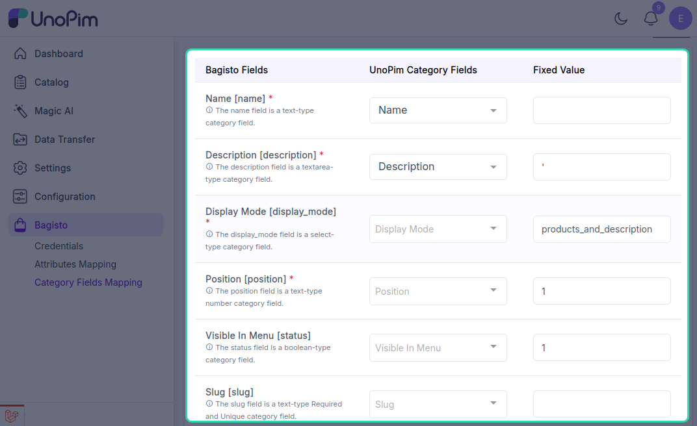
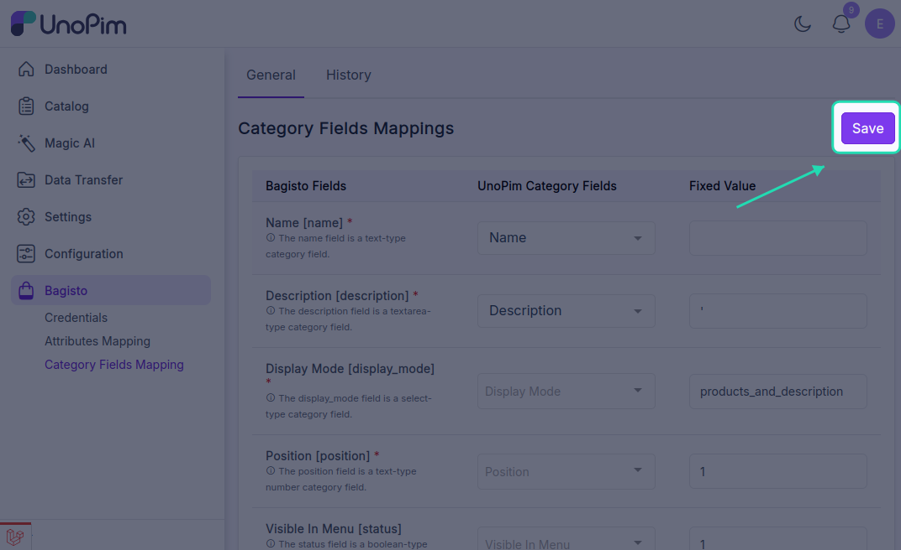

# Category Field Mapping

The Category Field Mapping feature enables users to establish mappings between Bagisto category fields and UnoPim category attributes. This allows for seamless synchronization of category data between the two systems.

## Overview

By selecting **Category Field Mapping**, users can link Bagisto category fields to their corresponding UnoPim category fields. This mapping ensures that category information is properly transferred and synchronized.

## Mappable Fields

The following Bagisto category fields can be mapped to UnoPim:

- **Name** - Category name
- **Description** - Category description
- **Display Mode** - How the category is displayed
- **Position** - Category ordering position
- **Visible in Menu** - Menu visibility setting
- **Slug** - URL-friendly category identifier
- **Meta Title** - SEO meta title
- **Meta Keywords** - SEO meta keywords
- **Meta Description** - SEO meta description
- **Logo** - Category logo image
- **Banner** - Category banner image

## Saving the Mapping

After configuring the category field mappings, users can click the **Save** button to store the mapping configuration. This ensures that the defined mappings are applied during category synchronization between Bagisto and UnoPim.

