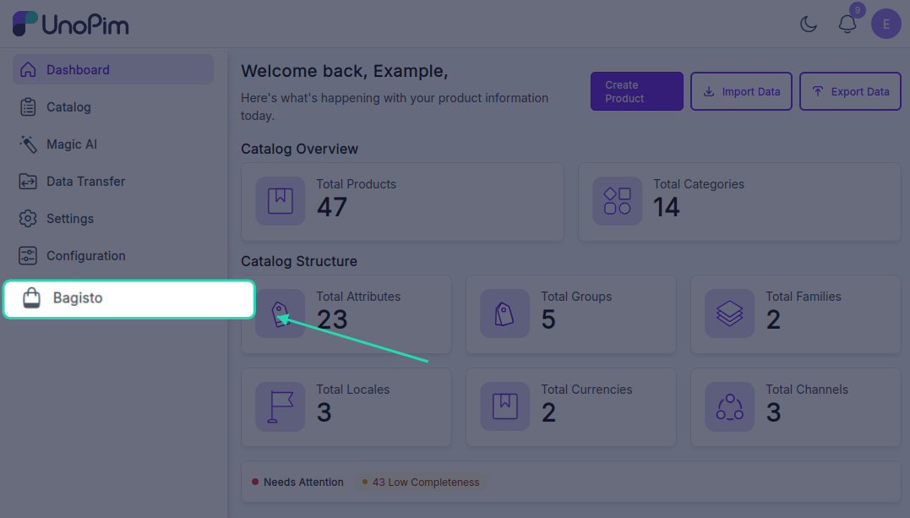
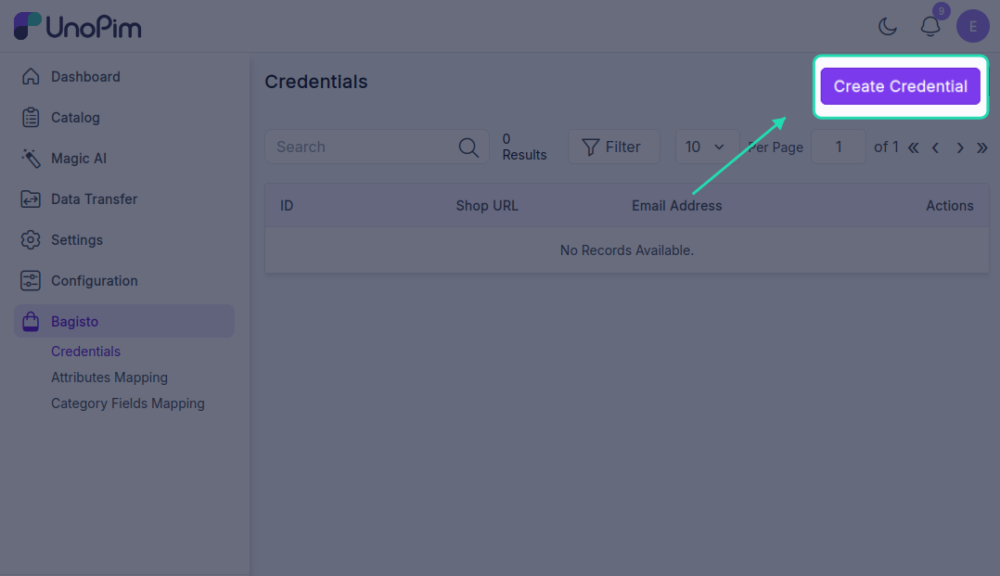
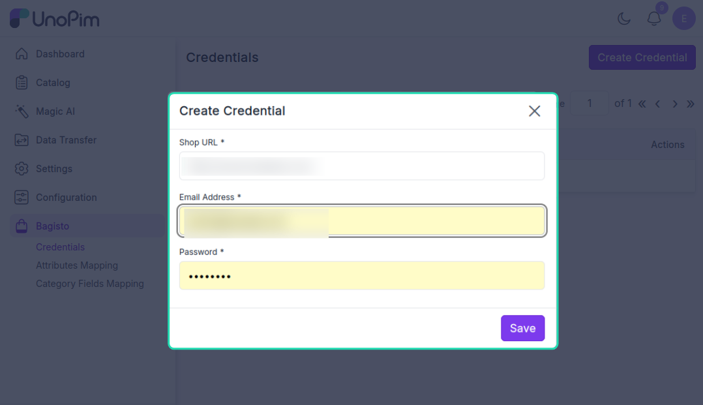

# Configuration & Credentials Setup

After installing the UnoPim Bagisto Connector, you need to configure it with your Bagisto store credentials. This guide walks you through setting up and managing connector credentials, attribute mappings, and channel/locale configurations.

## Accessing the Bagisto Connector

Once the UnoPim Bagisto Connector is installed, it appears in the left sidebar of your UnoPim dashboard.

### Step 1 - Open the Connector

1. Log in to your UnoPim dashboard
2. Navigate to the left sidebar
3. Click on **Bagisto** to access the connector

## Setting Up Store Credentials

### Step 1 - Navigate to Credentials

From the Bagisto section, navigate to:

**Bagisto > Credentials > Create Credentials**

### Step 2 - Enter Bagisto Store Details

Fill in the following information to connect your Bagisto store:

| Field | Description | Example |
|---|---|---|
| **Bagisto Shop URL** | The base URL of your Bagisto store | `https://shop.example.com` |
| **Email Address** | Administrator email for authentication | `admin@example.com` |
| **Password** | Administrator password for authentication | `••••••••` |

### Step 3 - Save Credentials

Click the **Save** button to add the credential to UnoPim.

### Multiple Store Support

The UnoPim Bagisto Connector supports managing multiple Bagisto stores. You can:
- Add credentials for different Bagisto store instances
- Manage separate product catalogs per store
- Maintain independent export configurations for each store

Simply repeat the steps above to add additional store credentials as needed.

## Managing Credentials

### View All Credentials

Once credentials are saved successfully, they appear in the **Credentials** section. Here you can see:
- List of all connected Bagisto stores
- Connection status
- Quick actions (Edit, Delete)

### Edit Credentials

To modify existing credentials:

1. Click the **Edit** button next to the credential you want to update
2. You'll be redirected to the credential edit page
3. Update any of the following:
   - Bagisto Shop URL
   - Email Address
   - Password
4. Click **Save** to apply changes

### Delete Credentials

To remove a credential:

1. Click the **Delete** button next to the credential
2. Confirm the deletion
3. The credential and all associated mappings will be removed

> **Note:** Deleting credentials will stop all product exports to that Bagisto store. Proceed with caution.

---
