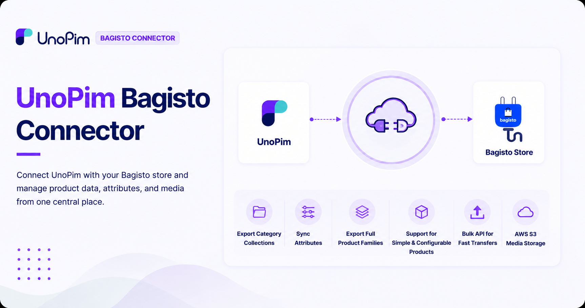

# UnoPim Bagisto Connector

Store Link: [View on Webkul Store](https://store.webkul.com/unopim-bagisto-connector.html)

## Overview

The UnoPim Bagisto Connector seamlessly integrates your UnoPim product information management system with your Bagisto e-commerce store. This powerful extension enables you to efficiently manage and synchronize product data, categories, attributes, and media files all from a centralized location.

  

With this connector, you can keep your Bagisto store up-to-date with the latest product information from UnoPim without switching between multiple platforms.

## What You Can Do

### Centralized Product Management
- **Export Categories** – Transfer your UnoPim categories directly to Bagisto collections
- **Sync Attributes** – Seamlessly map and export UnoPim attributes to Bagisto
- **Manage Product Families** – Export complete product families from UnoPim to Bagisto
- **Support for All Product Types** – Work with both simple and configurable products

### High-Performance Data Transfer
The connector features bulk API capabilities, allowing you to export large batches of products quickly and efficiently. This means less time spent on manual updates and more time growing your business.

### Secure Media Management
All your product images and videos are automatically synchronized from UnoPim to Bagisto. With built-in AWS S3 support, your media files are securely stored in the cloud and loaded rapidly, ensuring optimal performance for your store.

## Key Features

- Export UnoPim categories directly to Bagisto collections  
- Seamlessly export UnoPim attributes into Bagisto  
- Export UnoPim families into Bagisto  
- Export both simple and configurable products  
- Utilize bulk API for rapid large-scale product exports  
- Synchronize all product images and videos  
- Full AWS S3 compatibility for secure media storage and retrieval  

## Requirements

- **UnoPim**: 2.0.x
- **PHP**: 8.3+
- **Bagisto with REST API installed**: 2.x.x

## Getting Started

Ready to connect your UnoPim with Bagisto? Check out the [Installation Guide](./installation.md) to get started.

