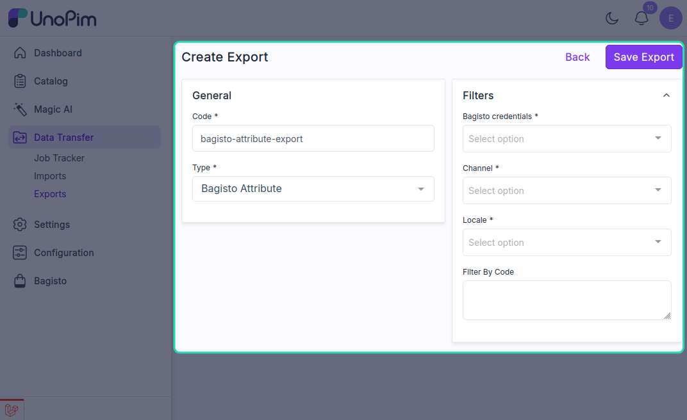
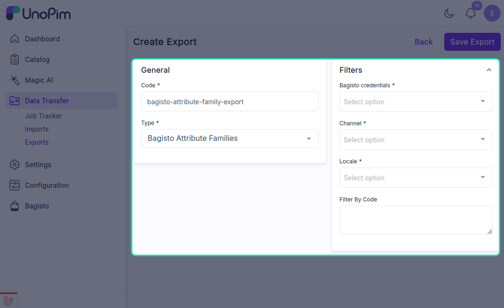
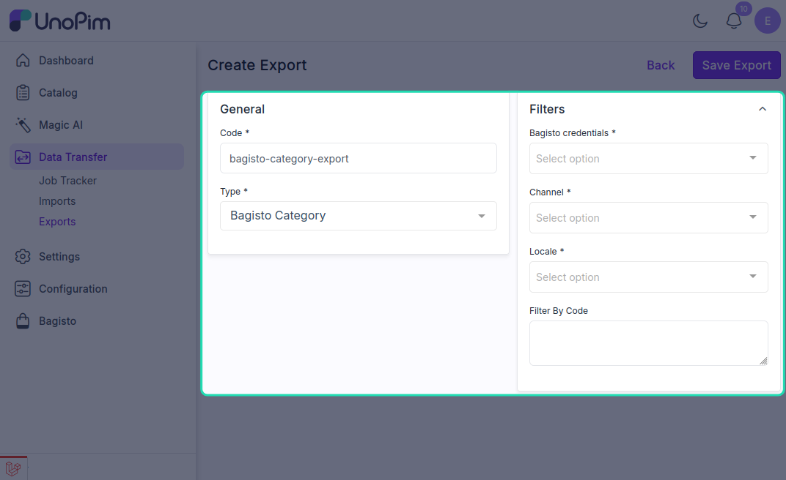

# Other Export Types

In addition to product exports, the UnoPim Bagisto Connector supports several other export job types to synchronize different types of catalog data.

## Bagisto Attribute Export

The Bagisto Attribute export allows you to export attribute configurations from UnoPim to your Bagisto store.

This export type enables you to:
- Sync attribute definitions and properties
- Update attribute settings in your Bagisto store
- Maintain consistency between UnoPim and Bagisto attributes

## Bagisto Attribute Family Export

The Bagisto Attribute Family export facilitates the export of attribute family configurations.

This export type is useful for:
- Exporting complete attribute family structures
- Syncing attribute group associations
- Managing attribute family configurations across systems

## Bagisto Category Export

The Bagisto Category export enables you to export category data and hierarchies from UnoPim to your Bagisto store.

This export type allows you to:
- Export category hierarchies and structures
- Sync category meta information (name, description, SEO data)
- Update category assignments and positioning
- Export category-associated media (logos, banners)

## Configuration Steps

For any of these export types:

1. Navigate to **Data Transfer > Exports**
2. Click **Create Export**
3. Enter a unique **Export Job Code**
4. Select the desired **Type of Export Job** from the dropdown
5. Configure the necessary filters and settings for your export type
6. Click **Save Export** to save the configuration
7. Run the export job and monitor progress in the **Job Tracker**

Each export type may have different filter options available based on the specific data being exported. Configure these filters according to your requirements before running the export job.
