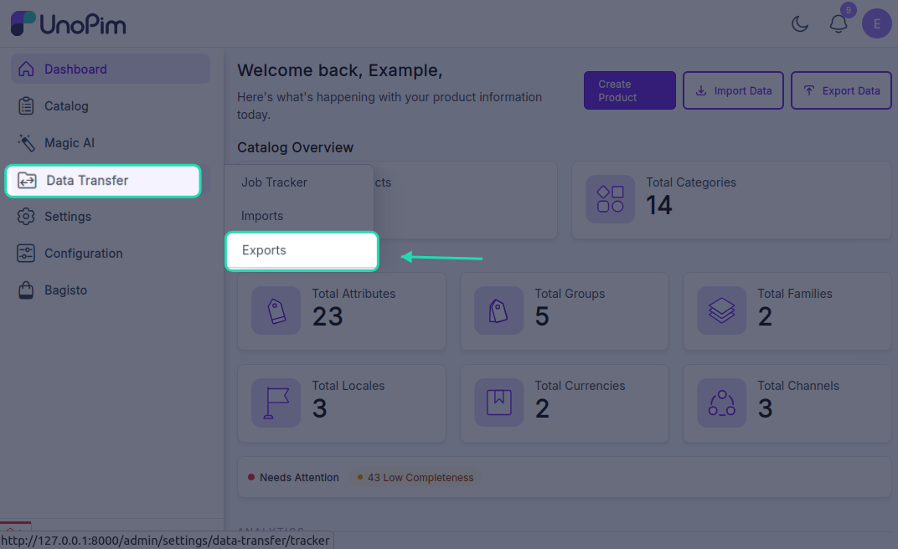
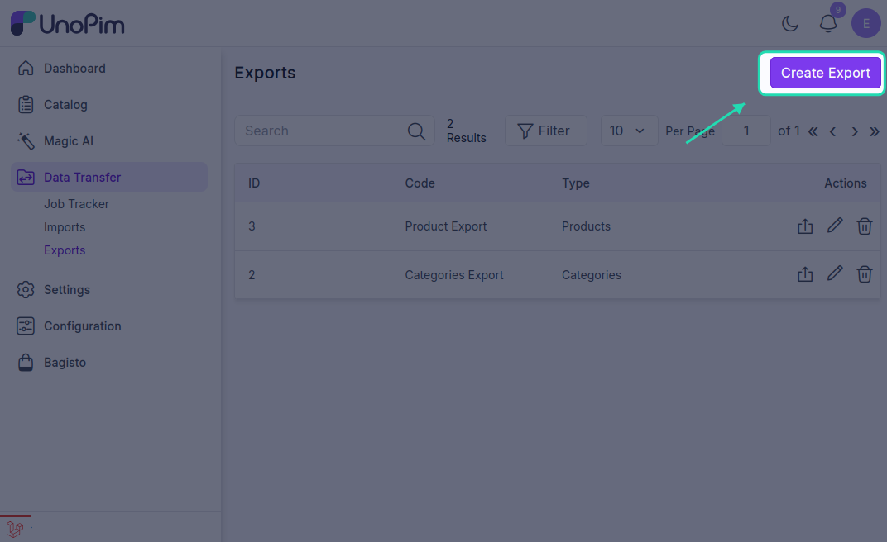
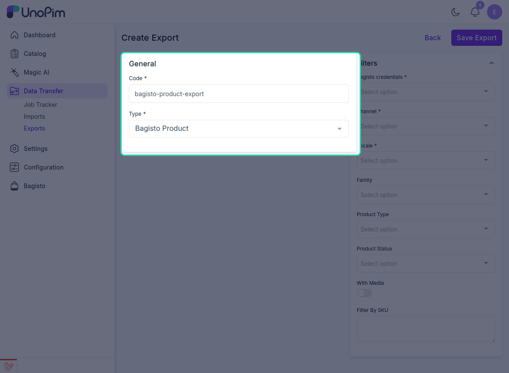
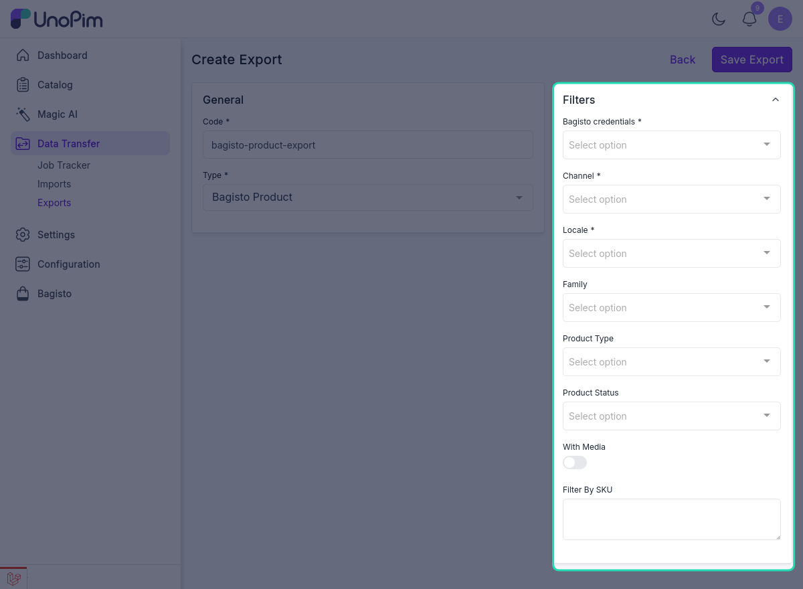
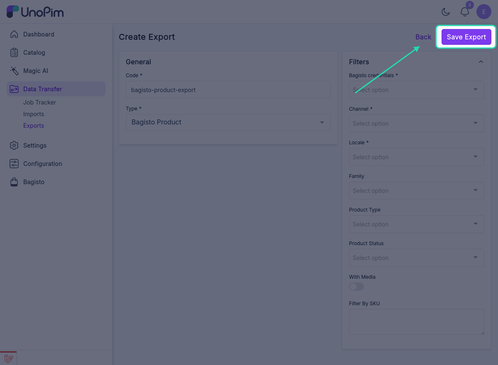
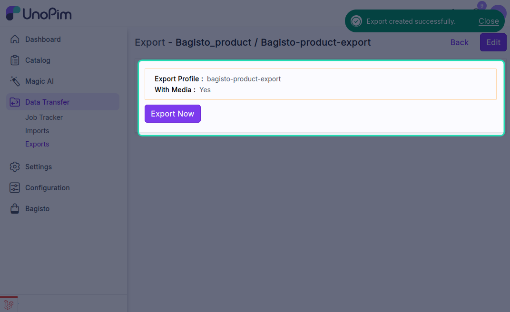
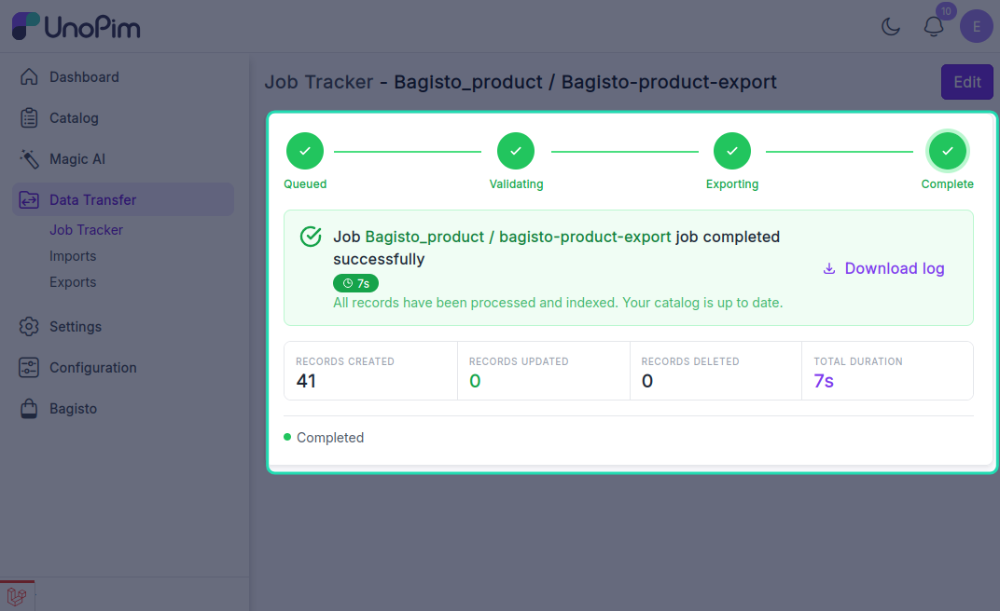

# Exporting Data

The UnoPim Bagisto Connector provides comprehensive export functionality, allowing users to seamlessly export mapped data from UnoPim to their Bagisto store through dedicated export jobs.

## Available Export Types

The connector supports the following export job types:
- **Bagisto Product Export** - Export products with advanced filtering options
- **Bagisto Attribute Export** - Export attribute configurations
- **Bagisto Attribute Family Export** - Export attribute family structures
- **Bagisto Category Export** - Export category hierarchies and meta information
## Setting Up Export Jobs

To configure an export job:

1. Navigate to **Data Transfer > Exports**

2. Click on the **Create Export** button
3. You'll be redirected to the export job creation page

## Export Job Configuration

### Basic Information

- **Export Job Code** - Enter a unique identifier for your export job
- **Type of Export Job** - Select the export type from the dropdown menu

### Bagisto Product Export

The Bagisto Product export allows you to export products from UnoPim to your Bagisto store with advanced filtering options.

#### Available Filters

Configure the following filters to customize your product export:

- **Bagisto Credentials** - Select the Bagisto store credential to export to
- **Select Mapping Template** - Choose the mapping template for attribute mapping
- **Channel** - Select the required sales channel
- **Locale** - Choose the necessary locale/language
- **Family** - Select the product family or leave blank for all families
- **Product Type** - Specify the type of products to export
- **Product Status** - Filter by product status (active, inactive, draft, etc.)
- **With Media** - Enable or disable media export (images, attachments, etc.)
- **Filter by SKU** - Search and filter products by specific SKU(s)
- **Start Page** - Specify the starting page number for pagination
- **End Page** - Specify the ending page number for pagination

## Saving and Running the Export Job

1. Click the **Save Export** button to save the export job configuration

2. Run the export job by clicking the **Run** button

3. Monitor the export progress in the **Job Tracker**

The Job Tracker provides real-time visibility into the export process, including progress percentage, status updates, and any errors encountered during execution.
