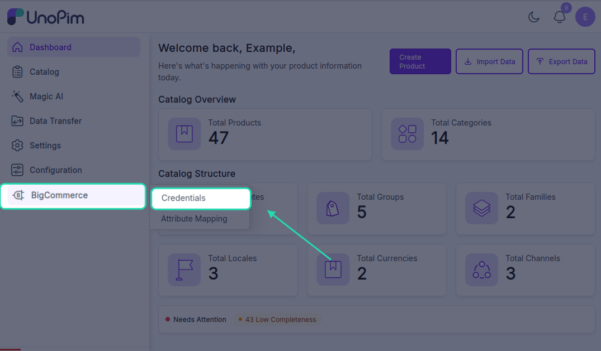
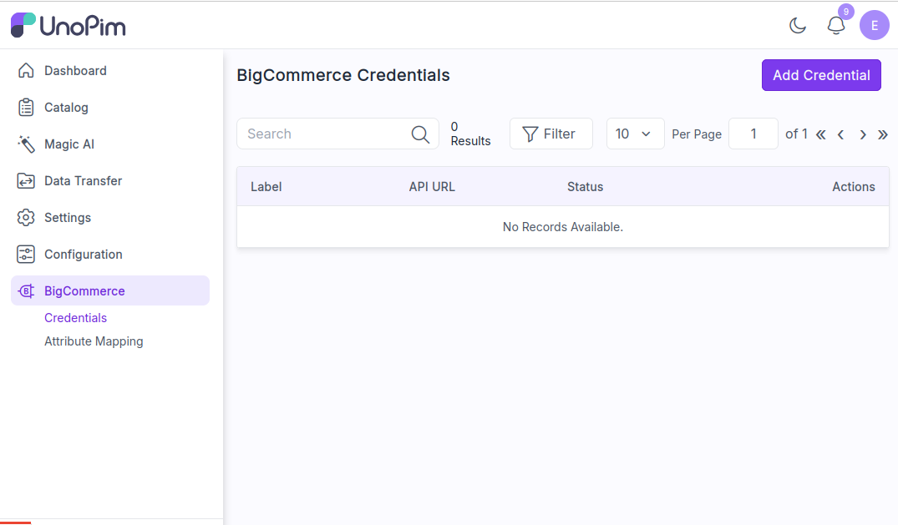
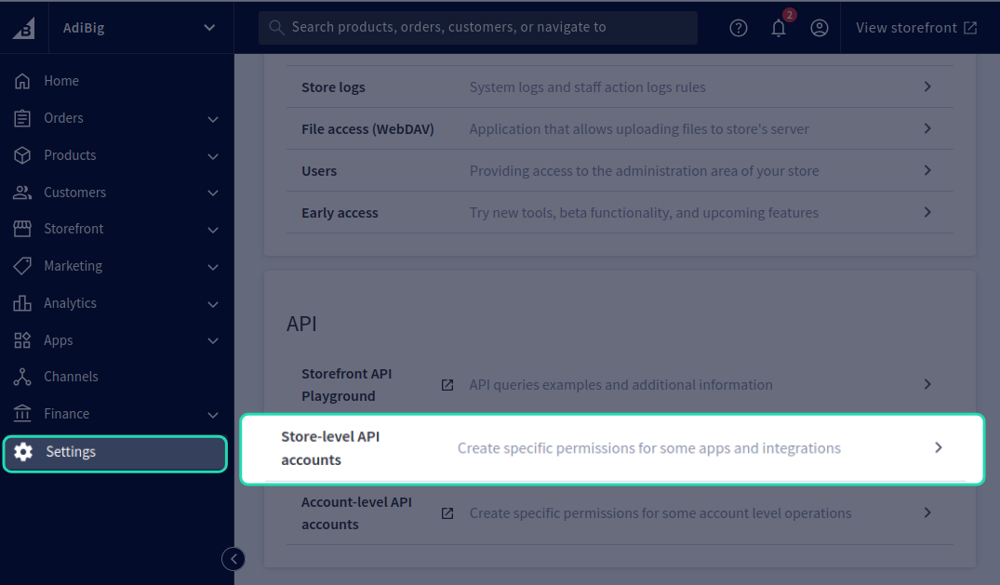
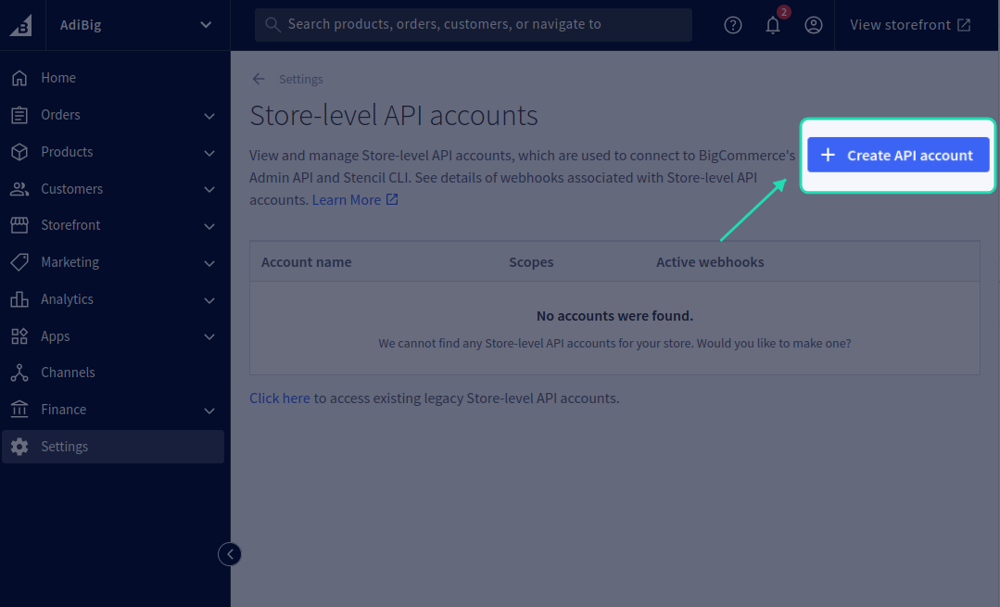
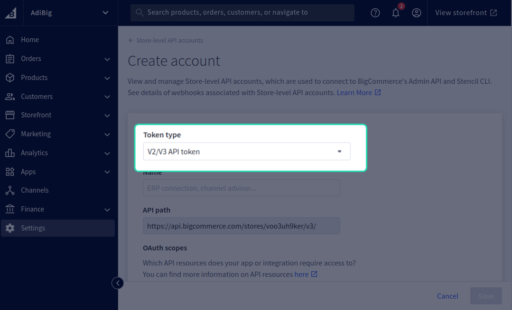
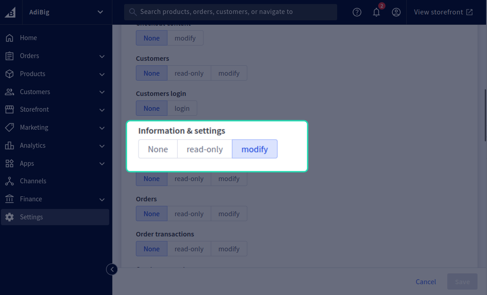
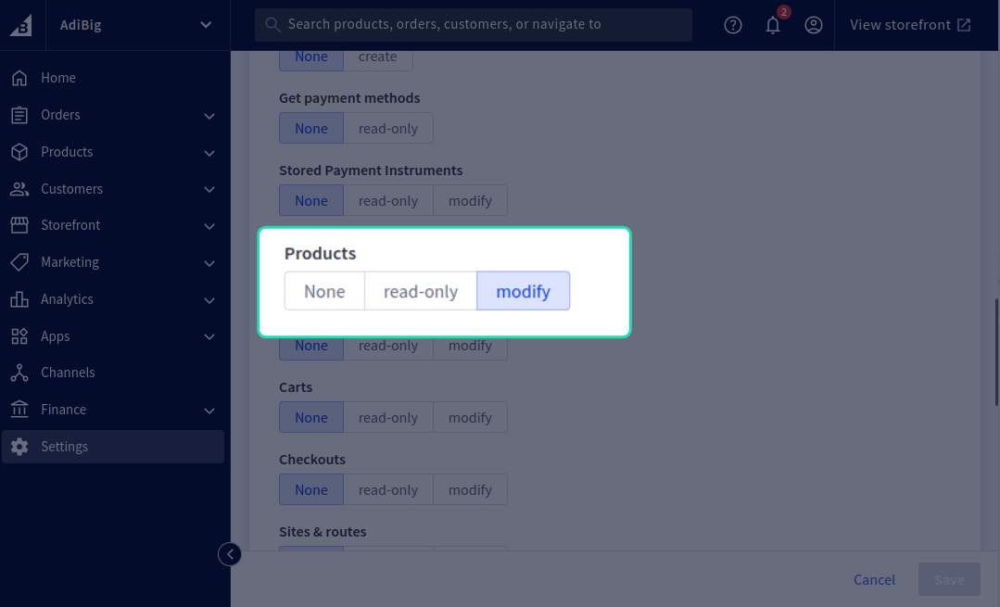
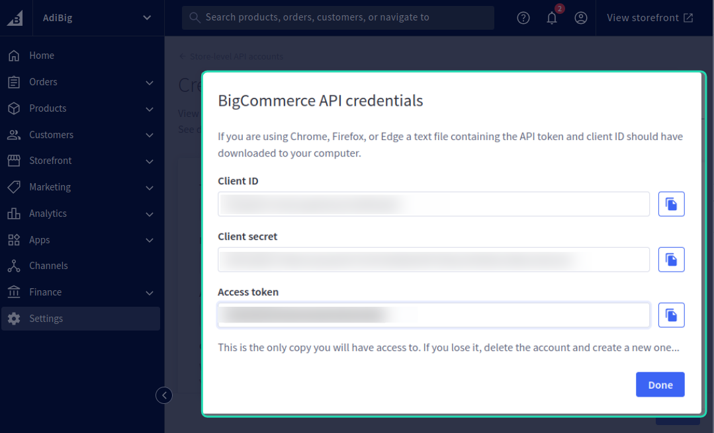
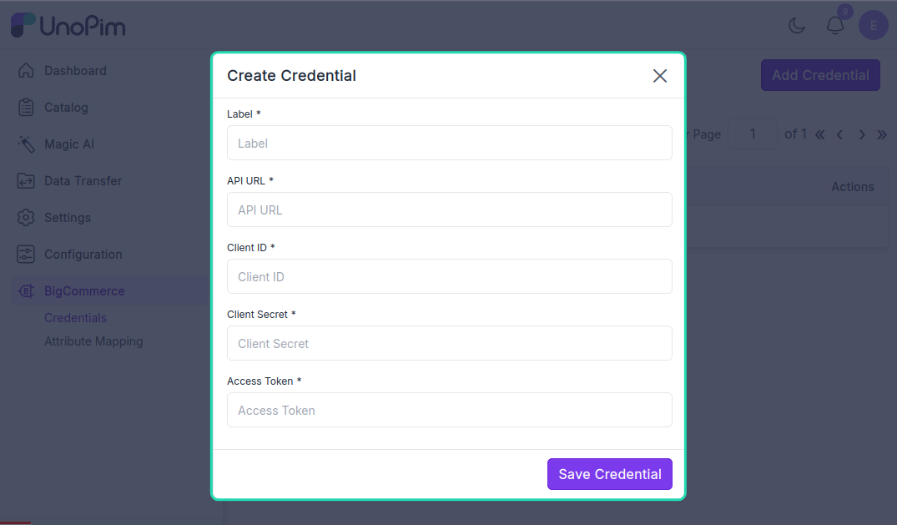
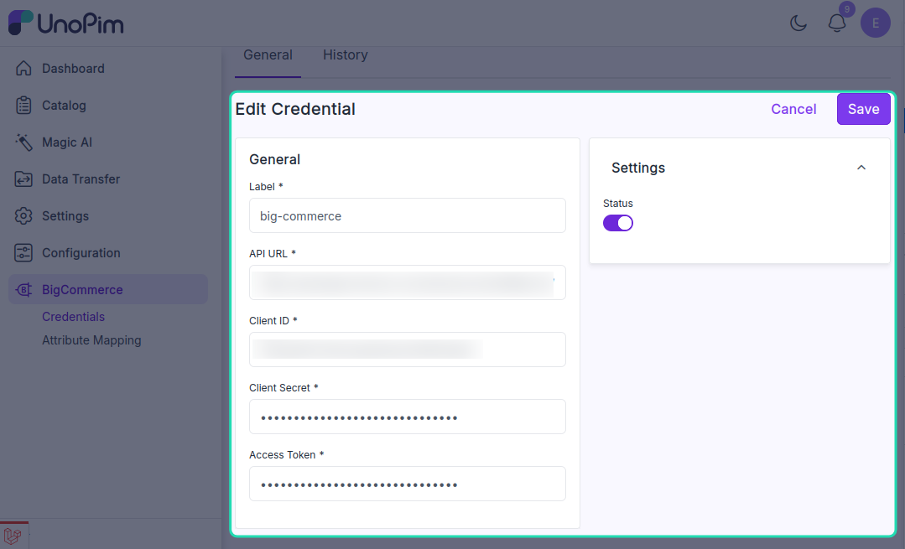

# Add BigCommerce credentials

This is where you store the API connection for your BigCommerce store. Add at least one credential before you can import or export anything.

**Open it from:** *BigCommerce → Credentials*

## The credentials page

Each row in the list shows one credential:

- **Label** — the name you gave it.
- **API URL** — the BigCommerce API endpoint.
- **Status** — whether the credential is active.

You can search by label, sort columns, or click **Filter** to narrow the list. The pencil icon edits a row, the trash icon deletes it.

---

## Generate the API account in BigCommerce

Before adding a credential in UnoPim, create an **API account** in BigCommerce:

1. Log into your BigCommerce admin.
2. Go to **Settings → API → Store-level API accounts**.

3. Click **Create API account**.

4. Pick the **Store API V2/V3 token** type.

5. Give it a name (e.g. *UnoPim Connector*) and set scopes:
   - **Products** — Modify (for export) or Read-only (import only).
   - **Information & Settings** — Read-only / Modify.

   

   

6. Save the account. BigCommerce shows the **Client ID**, **Client Secret**, **Access Token**, and **API path** **once** — copy them now.

You'll paste these into UnoPim next.

---

## Add a credential

In UnoPim, click **+ Create Credential** in the top-right corner.

<!-- TODO: capture screenshot — bigcommerce-add-credential.png — Create BigCommerce credential form -->

Fill in:

| Field | What goes here |
|--|--|
| **Label** | Any name you want, e.g. *Production Store*. Used to identify this credential everywhere. |
| **API URL** | The BigCommerce API path, e.g. `https://api.bigcommerce.com/stores/<store-hash>/`. Copy this from the BigCommerce API account screen. |
| **Client ID** | Client ID from the API account. |
| **Client Secret** | Client Secret from the API account. |
| **Access Token** | Access Token from the API account. |
| **Status** | Active / Inactive. Inactive credentials are hidden from the import / export filter dropdowns. |

Click **Save Credential**.

> The connector verifies the credentials against BigCommerce before saving. If anything is wrong you see a clear error and nothing is stored.

After saving, you land on the edit page where you can adjust the credential settings, locale mapping, and currency mapping.

---

## Edit a credential

Click the pencil icon on any row.

<!-- TODO: capture screenshot — bigcommerce-credential-edit.png — Edit BigCommerce credential page -->

You can:

- Change any of the values you set when creating.
- Leave **Access Token** and **Client Secret** blank (or as `**********`) to keep the current values — type a new value to replace.
- Set the **Default Currency** and **Default Locale** that BigCommerce expects when a product doesn't carry a locale-specific value.
- Configure the **Locale Mapping** — match each UnoPim locale to a BigCommerce locale.
- Configure the **Currency Mapping** — match each UnoPim currency to a BigCommerce currency.

Click **Update** when done.

---

## Delete a credential

Click the trash icon on a row and confirm.

> [!CAUTION]
> Deleting a credential does **not** delete the products / categories already pushed to BigCommerce. It only stops future imports / exports from running through it.

