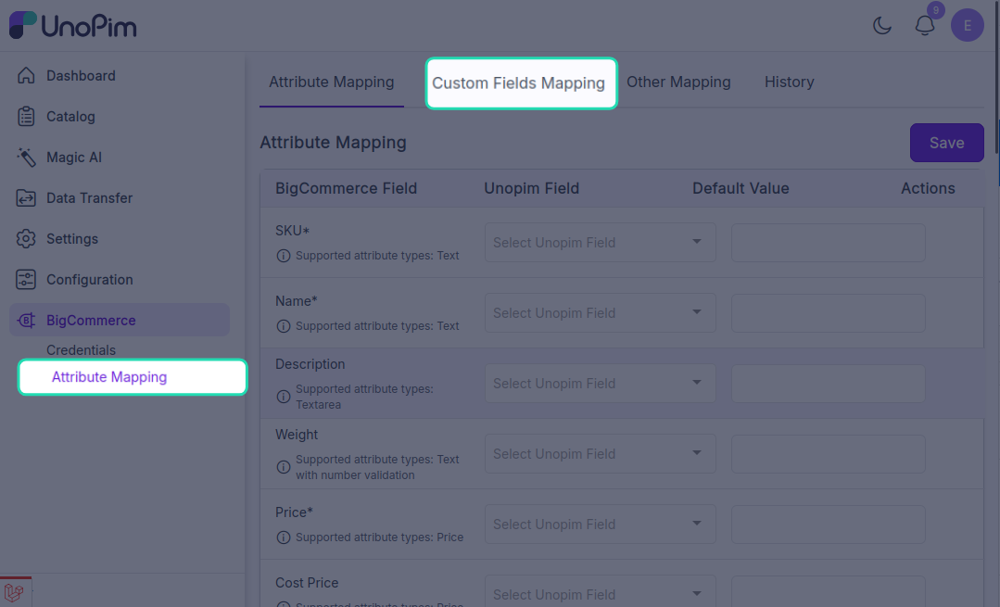
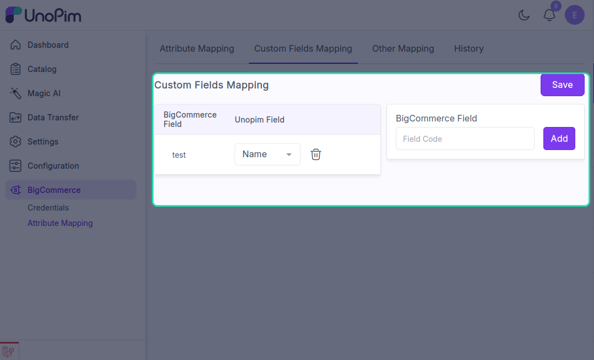

# Custom mapping

BigCommerce **custom fields** are key/value pairs you can attach to any product to store extra information (warranty period, technical specs, fit guides — anything that doesn't fit a standard field). The **Custom Mapping** page tells the connector which UnoPim attributes get pushed as BigCommerce custom fields.

**Open it from:** *BigCommerce → Attribute Mappings → Custom Mappings*

<!-- TODO: capture screenshot — bigcommerce-custom-mapping.png — Custom Mappings page -->

## What you'll see

The page lists every UnoPim attribute you've chosen to map and the BigCommerce custom-field **name** they'll be sent as.

Each row has two columns:

| Column | What it means |
|--|--|
| **UnoPim Attribute** | Pick the attribute whose value will become a custom field on the BigCommerce product. |
| **Custom Field Name** | The name the field will appear under on the BigCommerce product. Defaults to the attribute code — change it to whatever label you want shown in BigCommerce. |

Mappings are saved **per credential** — different stores can have different sets of custom fields.

---

## Add a custom field

1. Click **+ Add Custom Mapping**.
2. **UnoPim Attribute** — pick the source attribute.
3. **Custom Field Name** — type the label the field should have in BigCommerce.
4. Click **Save**.

The custom field appears on every exported product that has a value for the source attribute. Products with an empty value for that attribute don't get the custom field at all.

---

## Remove a custom field

Click the trash icon next to a row.

> Removing a custom mapping does **not** delete custom fields already on BigCommerce products. Those need to be cleaned up in BigCommerce directly or via the BigCommerce API.

---

## When to use a custom field vs. a standard field

| Use a **standard field** when… | Use a **custom field** when… |
|--|--|
| BigCommerce has a built-in slot for it (name, sku, weight, etc.) | The information doesn't fit any standard slot. |
| You want the value to drive storefront features (search, filters, comparison). | You just want the data visible on the product page or in the API. |
| The value is **per product**, not per locale. | The data is informational rather than functional. |

> [!TIP]
> Don't use custom fields to duplicate something that already has a built-in slot. Standard product fields are indexed and searchable; custom fields aren't. If there's a real built-in equivalent, map it on [Attribute mapping](./standard-mapping) instead.

---

## Limits

- BigCommerce allows up to **200 custom fields per product** on most plans.
- Each custom field has a **name limit of 250 characters** and a **value limit of 65,535 characters**.
- The export trims values to BigCommerce's limits — you'll see a warning entry in the tracker for any row that got trimmed.
