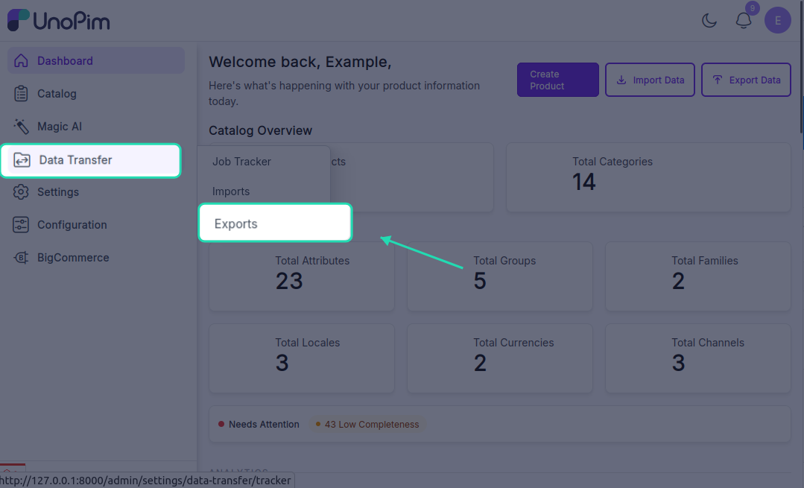
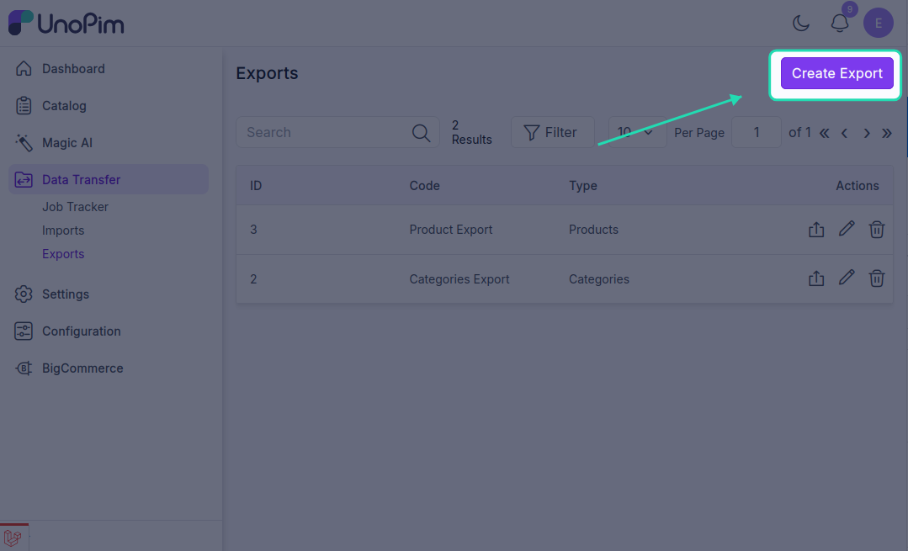
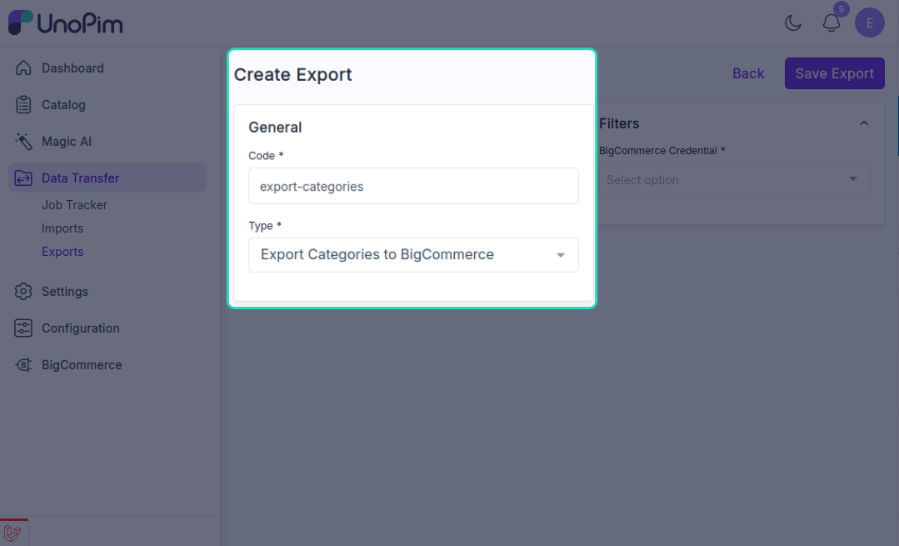
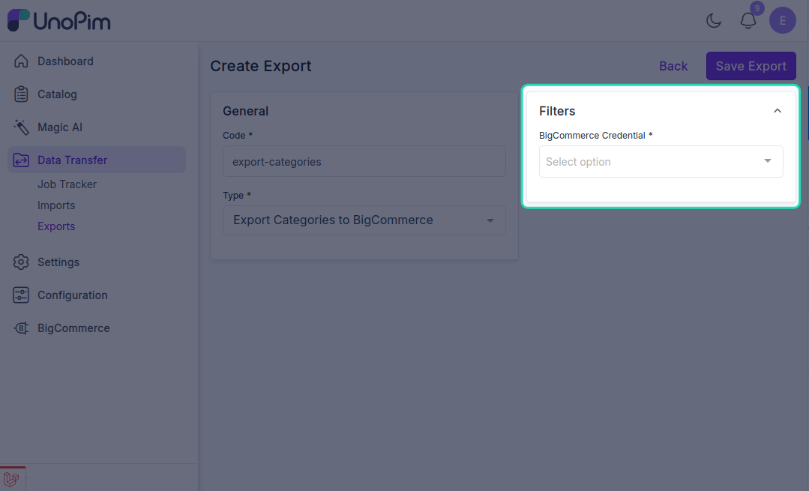
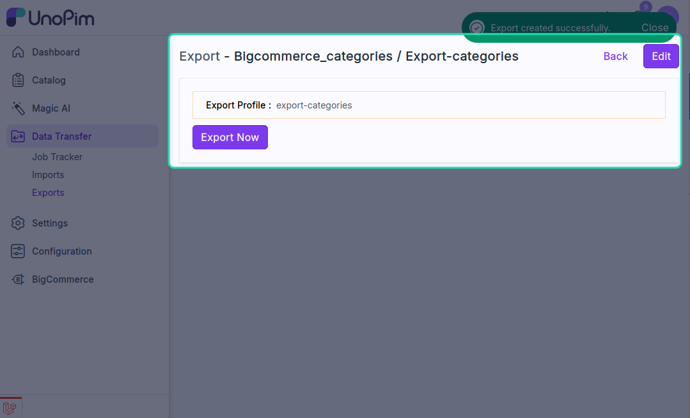
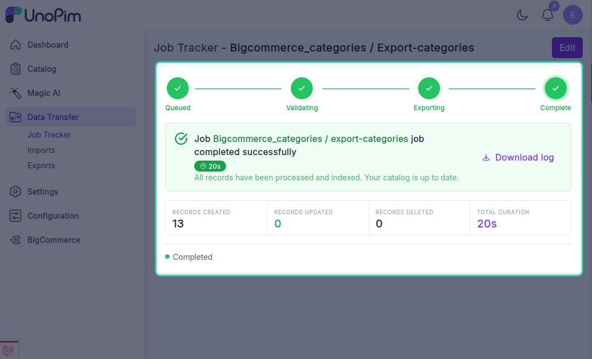

# Export categories

Push your UnoPim category tree to BigCommerce, keeping the parent / child hierarchy intact.

> **Before you start.** Add a [BigCommerce credential](./credentials) and review [Other mapping](./other-mapping) if your category-related export settings need adjustment.

**Open it from:** *Data Transfer → Export*

## Steps

### 1. Create the profile

1. Open **Data Transfer → Export → + Create Export**.

2. **Type** - pick **Export Categories to BigCommerce** , **Code** - any short identifier, e.g. `bigcommerce_categories`.

3. **Fill the filter**

| Filter | Required | What it does |
|--|--|--|
| **Credential** | ✓ | Pick the BigCommerce credential to export to. Only **active** credentials appear in the dropdown. |

There are no other filters - the job pushes every UnoPim category visible to the user.

Click **Save**.

 4. **Run it**

Open the profile and click **Start Export**.

The job is queued. Watch progress in the Data Transfer Tracker.

