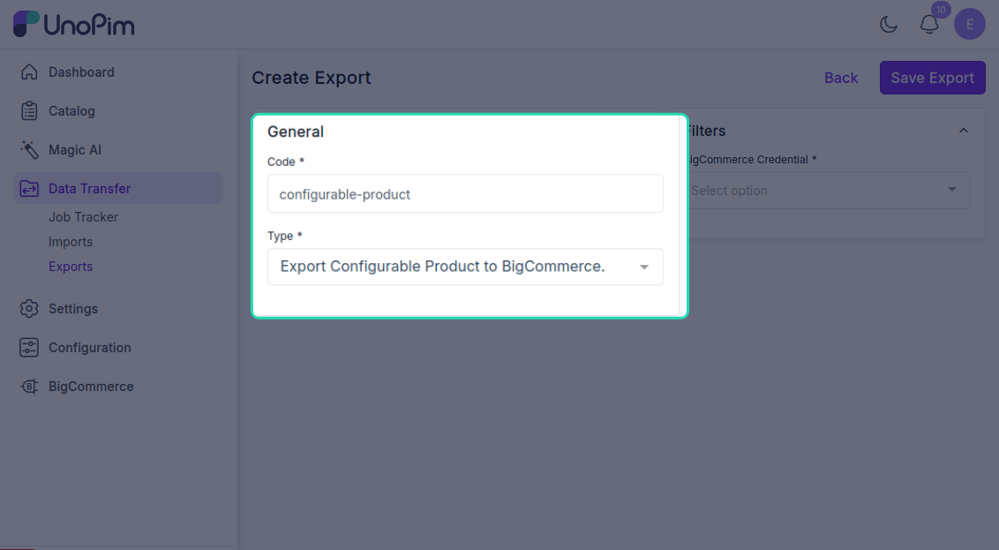
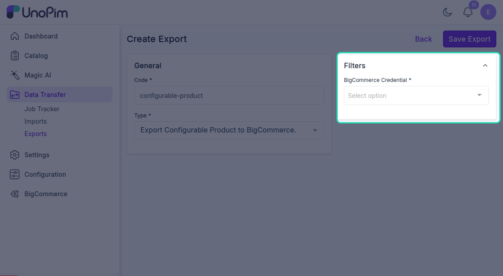
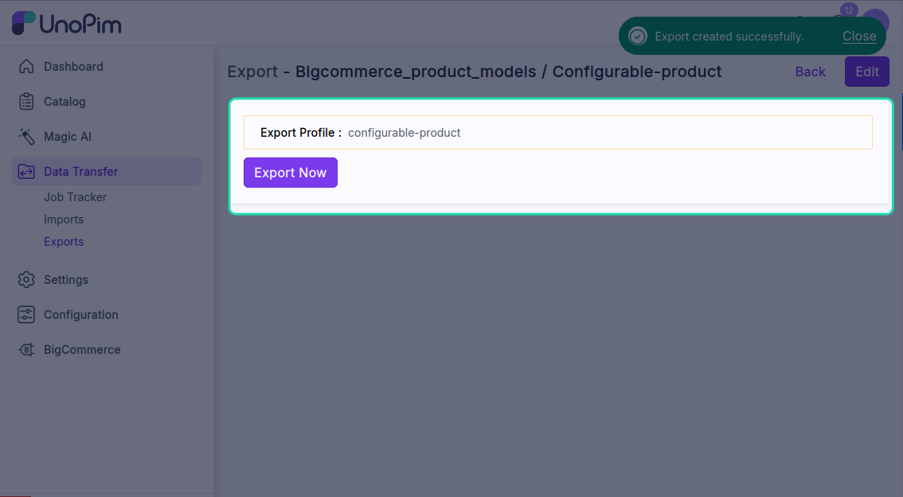
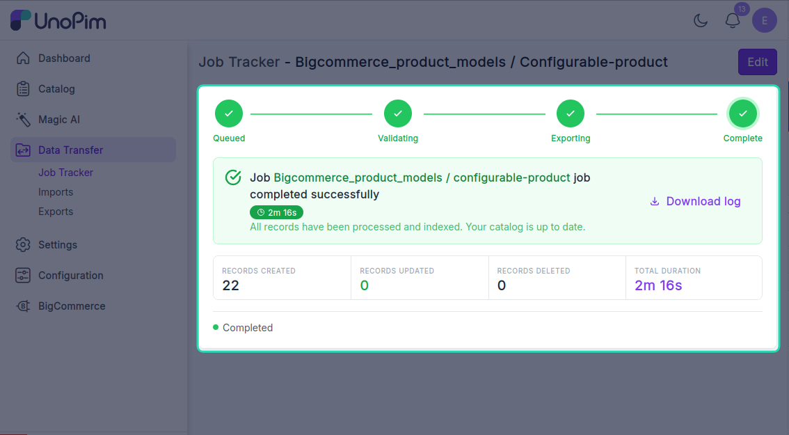

# Export configurable products

Push **configurable products** (one parent + multiple variants) from UnoPim to BigCommerce. The connector creates a BigCommerce **variable product** with one option per variation axis (e.g. *size* + *color*) and one SKU per variant combination.

For non-configurable products, use [Export products](./export-products) instead.

> **Before you start.** Add a [BigCommerce credential](./credentials), configure [Attribute mapping](./standard-mapping), and review [Other mapping](./other-mapping) before exporting configurable products.

**Open it from:** *Data Transfer → Export*

## Steps

### 1. Create the profile

1. Open **Data Transfer → Export → + Create Export**.

2. **Type** - pick **Export Configurable Product to BigCommerce**, **Code** - any short identifier, e.g. `bigcommerce_configurable_products`.

3. **Fill the filter**

| Filter | Required | What it does |
|--|--|--|
| **Credential** | ✓ | Pick the BigCommerce credential. Only **active** credentials appear. |

There are no other filters - the job pushes every eligible configurable product visible to the user.

Click **Save**.

4. **Run it**

Open the profile and click **Export Now**.

The job is queued. Watch progress in the Data Transfer Tracker.

