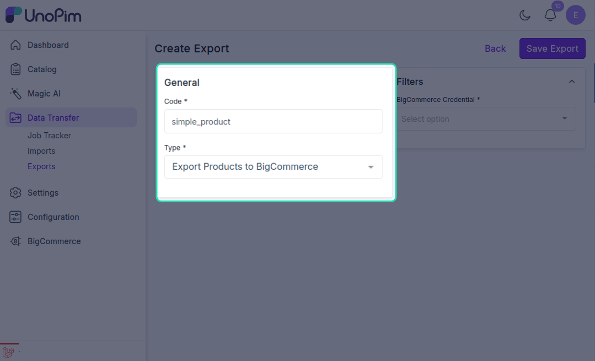
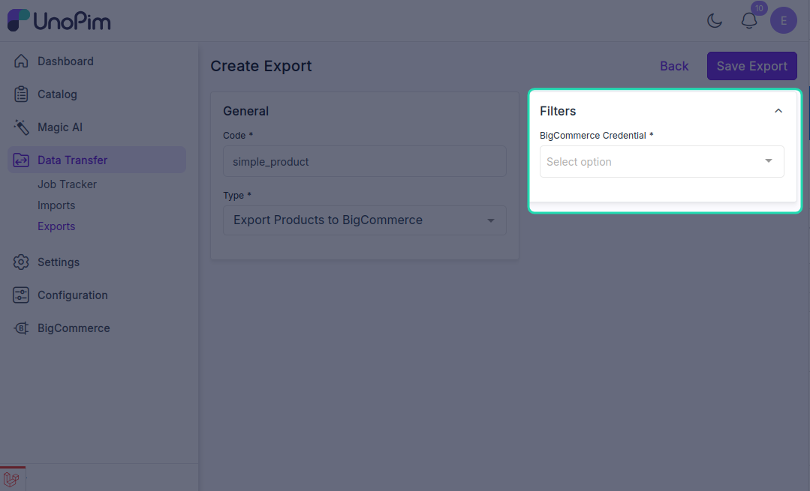
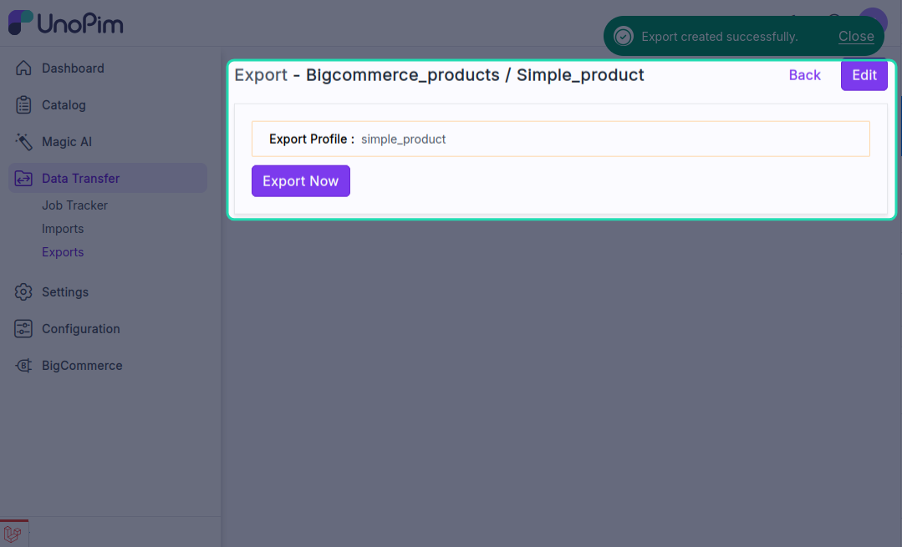
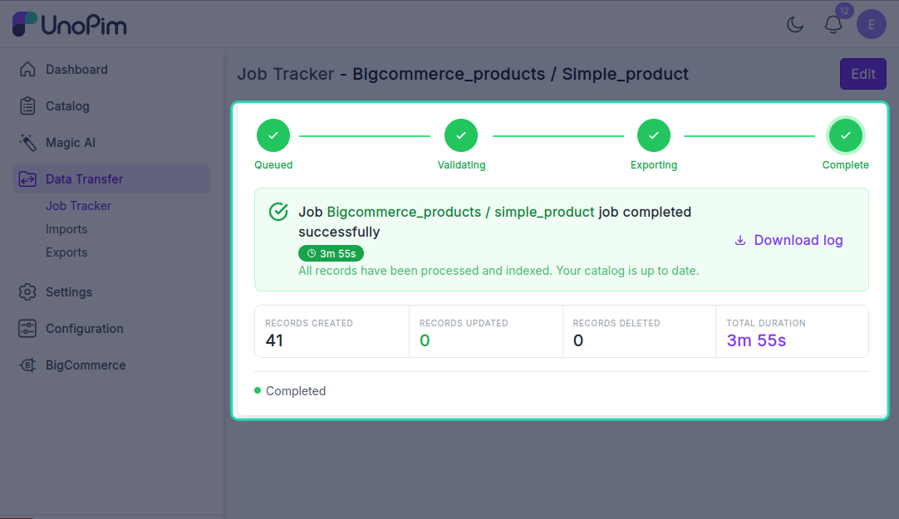

# Export products

Push **simple products** from UnoPim to BigCommerce — with attribute values, prices, stock, statuses, custom fields, and images.

For configurable products with variants, use [Export configurable products](./export-product-models).

> **Before you start.** Add a [BigCommerce credential](./credentials), configure [Attribute mapping](./standard-mapping), and run [Export categories](./export-categories) so the categories the products reference already exist in BigCommerce.

**Open it from:** *Data Transfer → Export*

## Steps

### 1. Create the profile

1. Open **Data Transfer → Export → + Create Export**.

2. **Type** — pick **Export Products to BigCommerce**, **Code** — any short identifier, e.g. `bigcommerce_products`.

3. **Fill the filter**

| Filter | Required | What it does |
|--|--|--|
| **Credential** | ✓ | Which BigCommerce store to push to. Only **active** credentials appear. |

There are no other filters — the job pushes every eligible simple product visible to the user.

Click **Save**.

4. **Run it**

Open the profile and click **Export Now**.

The job is queued. Watch progress in the Data Transfer Tracker.

