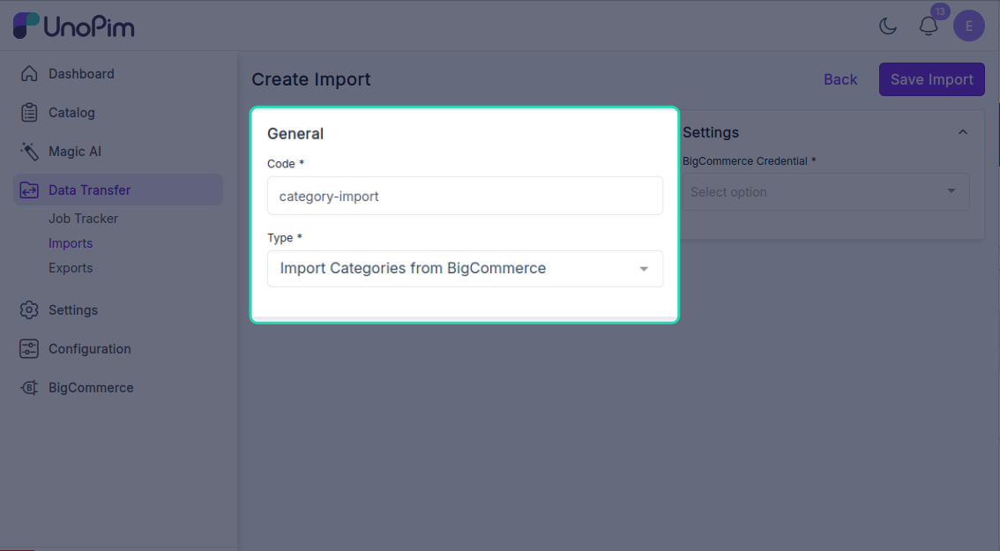
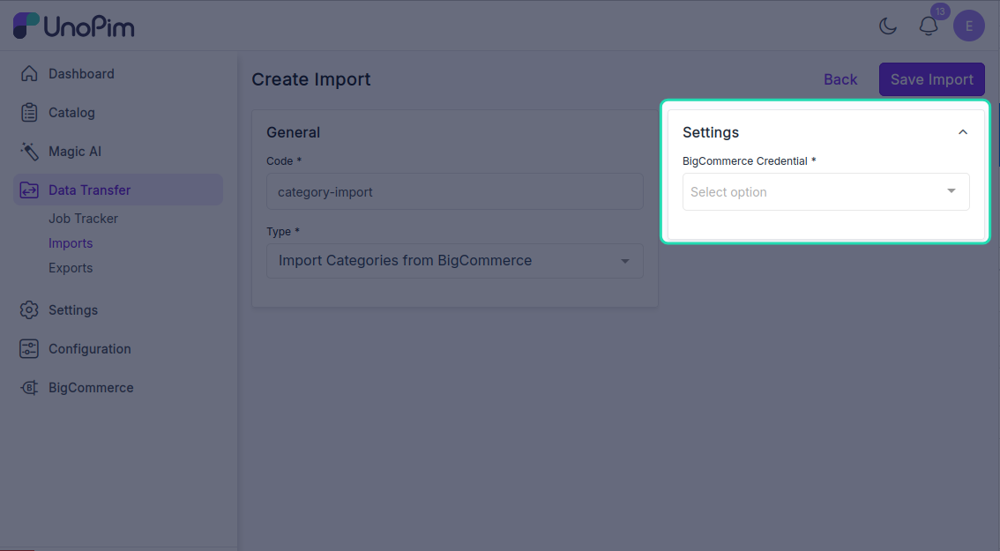
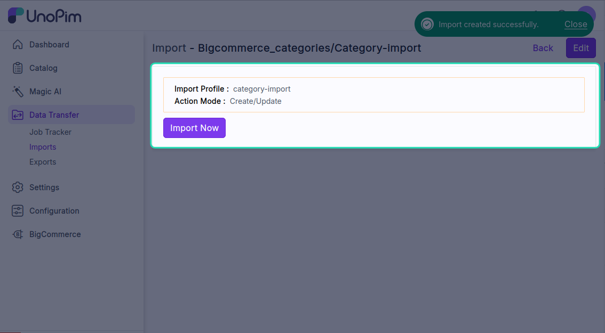
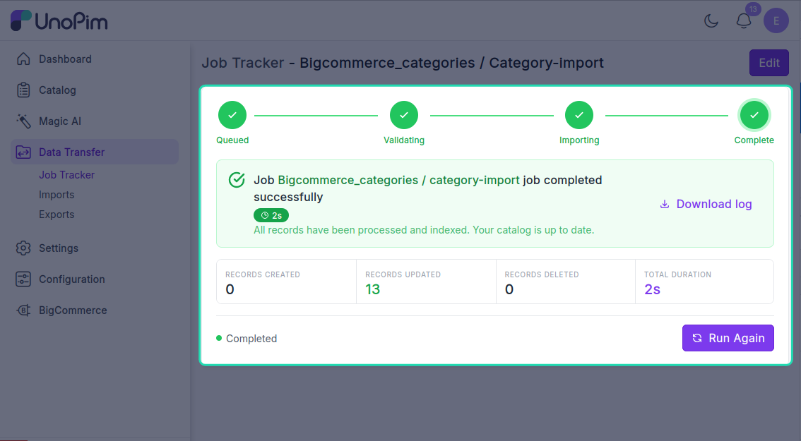

# Import categories

Pull your BigCommerce category tree into UnoPim, keeping the parent / child hierarchy intact.

> **Before you start.** Add a [BigCommerce credential](./credentials).

**Open it from:** *Data Transfer → Import*

## Steps

### 1. Create the profile

1. Open **Data Transfer → Import → + Create Import**.

2. **Type** — pick **Import Categories from BigCommerce**, **Code** — any short identifier, e.g. `bigcommerce_categories_import`.

3. **Fill the filter**

| Filter | Required | What it does |
|--|--|--|
| **Credential** | ✓ | Which BigCommerce store to pull from. Only **active** credentials appear. |

There are no other filters — the job pulls every available category from the selected BigCommerce store.

Click **Save**.

4. **Run it**

Open the profile and click **Start Import**.

The job is queued. Watch progress in the Data Transfer Tracker.

