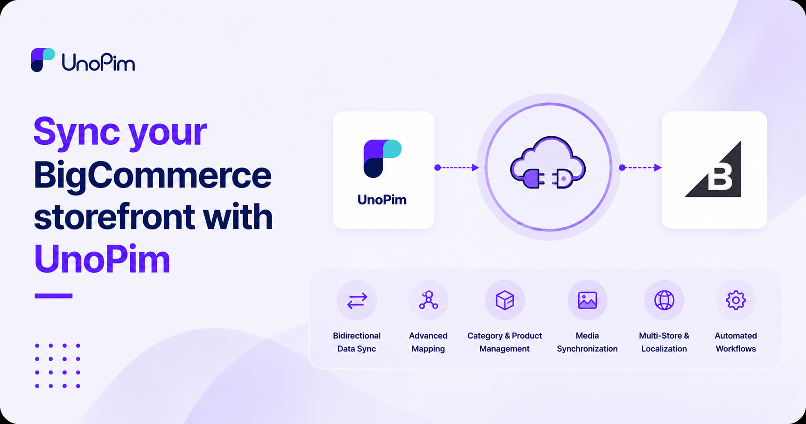

# BigCommerce Connector

Sync your **BigCommerce** storefront with UnoPim. Push enriched products and categories out, or pull existing catalog data in to enrich it in UnoPim.

 

  

  

## What you can do

- **Manage multiple stores** — store any number of BigCommerce credentials and switch between them per export / import.
- **Export to BigCommerce** — push UnoPim **categories**, **simple products**, and **configurable products** (with variants) into your store.
- **Import from BigCommerce** — pull existing **categories**, **simple products**, and **configurable products** into UnoPim.
- **Three mapping modes**:
  - **Attribute mapping** — wire UnoPim attributes to BigCommerce product fields.
  - **Custom mapping** — map UnoPim attributes to BigCommerce **custom fields**.
  - **Other mapping** — variant axes, category mappings, and modifier configuration.
- **Per-credential locale + currency mapping** — drive multi-storefront catalogs from a single UnoPim instance.
- **Mapping history** — every change to a mapping is logged.
- **Job tracker** — every export / import shows up live in the Data Transfer Tracker.

## Before you start

You need:

1. A working **UnoPim 2.0+** installation.
2. A **BigCommerce** store on the **v3 Storefront / Catalog API** with API access.
3. A BigCommerce **API account** — go to *Settings → API → API accounts → Create API account* in your BigCommerce admin and create one with at least *Products* and *Information & Settings* scopes. You'll need the **API URL**, **Client ID**, **Client Secret**, and **Access Token**.
4. The **BigCommerce Connector** extension installed — see [Installation](./installation).
5. A running **queue worker** — every export and import is a background job.
