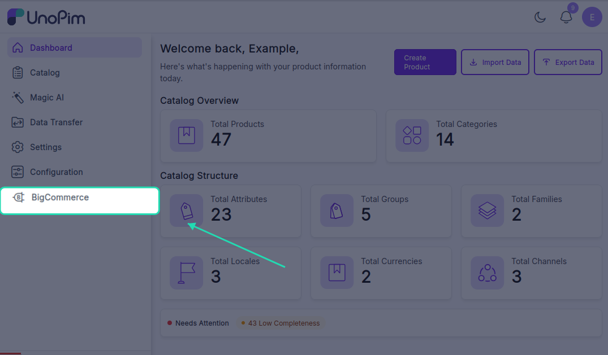

# Installation

This page is for installing the extension. Once it's installed, see [Add BigCommerce credentials](./credentials) to start using it.

## You need

- **UnoPim 2.0+**.
- **PHP 8.3+**.
- A BigCommerce **API account** with *Products* and *Information & Settings* scopes (read or read/write depending on whether you're importing only or also exporting).

## Steps

### 1. Drop the package in place

Unzip the extension and move the package folder into your UnoPim project:

```
packages/Webkul/BigCommerce/
```

### 2. Add it to composer.json

In your project's root `composer.json`:

```json
"autoload": {
    "psr-4": {
        "Webkul\\BigCommerce\\": "packages/Webkul/BigCommerce/src/"
    }
}
```

### 3. Register the provider

In `bootstrap/providers.php`:

```php
use Webkul\BigCommerce\Providers\BigCommerceServiceProvider;

return [
    // ...
    BigCommerceServiceProvider::class,
];
```

> [!TIP]
> **For UnoPim < 2.0**, add the provider to the `providers` array in `config/app.php` instead.

### 4. Run the install command

```bash
composer dump-autoload
php artisan bigcommerce:install
php artisan optimize:clear
php artisan queue:restart
```

This publishes assets, runs the three migrations (`credentials`, `configurations`, `data_mapping`), and clears caches.

### 5. Keep a queue worker running

```bash
php artisan queue:work
```

In production use Supervisor / systemd / Horizon. Every export and import is a background job — without a worker, nothing actually moves.

### 6. Give your role permission

Open **Settings → Roles**, edit the role, and tick the BigCommerce permissions you want them to have:

- **Credentials** — create, edit, delete BigCommerce credentials.
- **Attribute Mapping** — open and update the product attribute mapping.
- **Custom Mapping** — open and update the BigCommerce custom-fields mapping.
- **Other Mapping** — variant axes and category mappings.
- **Mapping History** — view the change history.

<!-- TODO: capture screenshot — bigcommerce-acl.png — BigCommerce permissions in Settings → Roles -->

Without these the menu and buttons stay hidden.

## Check it worked

1. **Menu shows up.** Open the admin panel — a **BigCommerce** menu appears in the sidebar with **Credentials** and **Export Mappings** under it.



2. **Add a credential works.** Open **BigCommerce → Credentials → Create Credential**, fill the form, and save. If the API URL or access token is wrong, you see a clear error.
3. **Export profile shows up.** Open **Data Transfer → Export → Create Export Profile** — *Export Categories to BigCommerce*, *Export Products to BigCommerce*, and *Export Configurable Product to BigCommerce* appear in the type dropdown.
4. **Import profile shows up.** Open **Data Transfer → Import → Create Import Profile** — *Import Categories from BigCommerce* and *Import Products from BigCommerce* appear in the type dropdown.

If any of these don't work, check your credential, queue worker, and BigCommerce configuration again.
