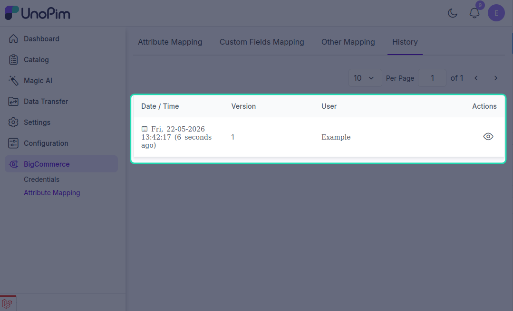

# Mapping history

Every change made to [attribute](./standard-mapping), [custom](./custom-mapping), or [other](./other-mapping) mapping is recorded automatically. Use the history page to see *who changed what, when*, and which mapping the change applied to.

**Open it from:** *BigCommerce → Attribute Mappings → History*

<!-- TODO: capture screenshot - bigcommerce-mapping-history.png - Mapping history grid -->

## What the grid shows

Each row in the list is one change to a mapping:

| Column | What it means |
|--|--|
| **Credential** | The BigCommerce credential whose mappings were changed. |
| **Mapping Type** | `standard`, `custom`, or `other`. |
| **Changed By** | The admin user that made the change. |
| **Action** | `created`, `updated`, or `deleted`. |
| **Changed At** | Timestamp of the change. |

Click into a row to see the full **before / after** state of the mapping - which attributes were added, removed, or repointed.

You can search, filter by credential or by mapping type, and sort columns. The eye icon opens the detail view.

---

## What's recorded

For each change the history captures:

- The complete **before** snapshot of the mapping.
- The complete **after** snapshot.
- Which **specific fields** changed (added, removed, or repointed to a different attribute).

That way you can answer questions like *"who repointed the `weight` field last Tuesday?"* without reading the audit log.

---

## What's not recorded

- Changes to a **credential's connection settings** (label, API URL, tokens, status). Those are tracked separately on the credential edit page's history tab.
- Changes to **products / categories** themselves - the connector doesn't audit your catalog, only the mappings.
- Job runs (imports / exports). Those live in the **Data Transfer Tracker**.

---

## Use history to debug an export

If yesterday's export sent products with the wrong values, the history is the first place to look:

1. Open *BigCommerce → Attribute Mappings → History*.
2. Filter by **Credential** to the one that ran the export.
3. Sort by **Changed At** descending - look for changes around the time before yesterday's run.
4. Open the detail view of any suspicious change and confirm which field moved.

This narrows down whether the problem is a mapping issue (recent change → fix here) or a catalog issue (no mapping changes → check the source data).
