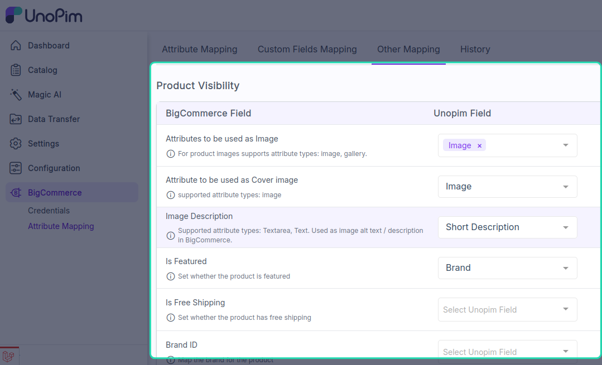

# Other mapping

You can use the **Other Mapping** section to configure additional BigCommerce product fields that are not covered under Attribute Mapping.

**Open it from:** *BigCommerce → Attribute Mappings → Other Mapping*

## Other mapping fields

You can configure the following fields under Other Mapping:

- `Attributes to be used as Image`
- `Attribute to be used as Cover Image`
- `Image Description`
- `Is Featured`
- `Is Free Shipping`
- `Brand Id`

## What this section does

These mappings help the connector send extra product details from UnoPim to BigCommerce during product export.

- `Attributes to be used as Image` lets you choose the attribute whose value should be used as the product image.
- `Attribute to be used as Cover Image` lets you choose the attribute used as the main or cover image.
- `Image Description` maps the attribute used for image description text.
- `Is Featured` maps the value used to mark the product as featured in BigCommerce.
- `Is Free Shipping` maps the value used to control free shipping for the product.
- `Brand Id` maps the attribute used to assign the product to a BigCommerce brand.

## Save the mapping

After configuring the fields, click **Save**. The updated mapping is used in the next product export run.
