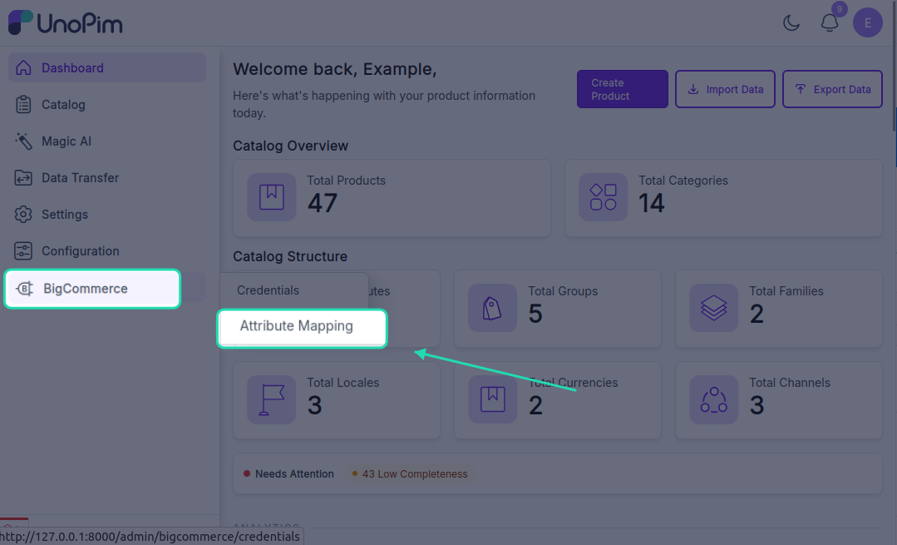
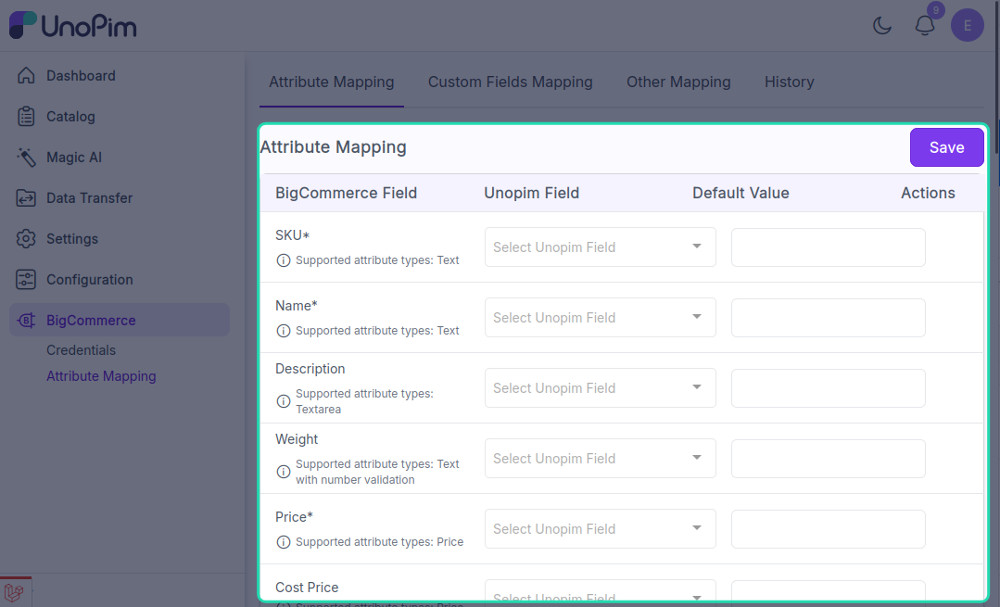
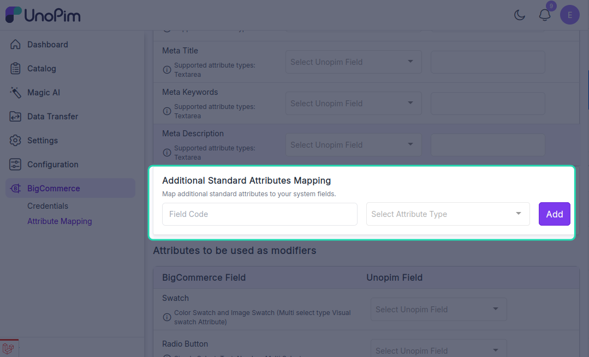

# Attribute mapping

You need to map UnoPim attributes with BigCommerce product fields before exporting products to your BigCommerce store.

While exporting products from UnoPim to BigCommerce, the connector sends product information based on the attribute mapping you configure for that credential.

**Open it from:** *BigCommerce → Attribute Mapping*

## Attribute mapping fields

You can map the following BigCommerce product fields with UnoPim attributes:

- `SKU`
- `Name`
- `Description`
- `Weight`
- `Price`
- `Cost Price`
- `Model Price`
- `Product Type`
- `Meta Title`
- `Meta Keywords`
- `Meta Description`

## Other mapping fields

You can also configure the following fields under Other Mapping:

- `Attributes to be used as Image`
- `Attribute to be used as Cover Image`
- `Image Description`
- `Is Featured`
- `Is Free Shipping`
- `Brand Id`

## What you'll see

The page lists BigCommerce product fields with three columns:

| Column | What it means |
|--|--|
| **BigCommerce Field** | The built-in BigCommerce field you're mapping into. Hover the info icon for what the field accepts. |
| **UnoPim Attribute** | Pick the UnoPim attribute whose value populates this field. |
| **Supported Types** | The UnoPim attribute types the field accepts (e.g. *Text* only, or *Text / Textarea*). The dropdown filters to those types. |

The page is **per credential** - pick the credential first, then the mapping shown belongs to that store. Different stores can have different mappings.

## Required mappings

At minimum, map these to run a product export:

| BigCommerce Field | Typical UnoPim attribute |
|--|--|
| **Name** | `name` |
| **SKU** | `sku` |
| **Price** | `price` |
| **Weight** | `weight` (or fixed value `0`) |
| **Type** | `physical` or `digital` - usually a fixed value attribute. |

The rest are optional. BigCommerce uses default values for any unmapped optional field.

## Add an additional attribute

Some BigCommerce stores need a few extra product fields that are not shown by default. Use **+ Add Additional Attribute** at the bottom of the page to expose them:

1. Click **+ Add Additional Attribute**.
2. Pick the BigCommerce field from the dropdown.
3. Pick the matching UnoPim attribute.

Click the trash icon next to a row to remove an additional attribute.

## Save the mapping

Click **Save** at the top. You'll see a success message.

