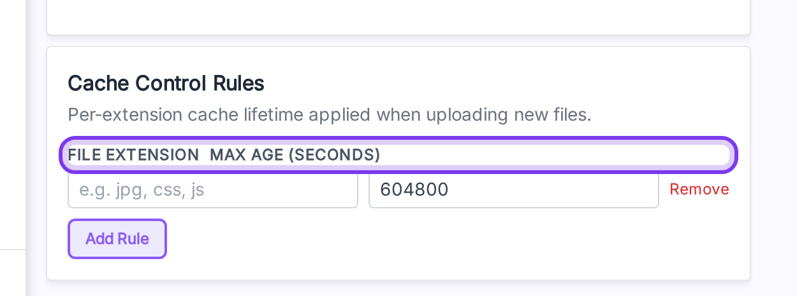

# Cache Control Rules

Set a per-extension `Cache-Control: max-age` on objects you upload to R2.

**Open it from:** *Cloudflare R2 → Credential → Cache Control Rules* (left column, bottom).

## Defaults

With no rules, every uploaded object gets `max-age=604800` (7 days).

## Add a rule

1. Click **Add Rule**.
2. Fill the **Extension** (e.g. `webp`, no leading dot — it's stripped automatically).
3. Fill the **Max Age** in seconds (max `31_536_000` = 1 year).
4. Repeat for each extension.
5. Click **Save** at the top.

| Extension | Max Age | Result |
|---|---|---|
| `jpg` | `2592000` | 30 days |
| `png` | `2592000` | 30 days |
| `pdf` | `86400` | 1 day |

## Notes

- Rules apply to **new** uploads. To re-apply rules to existing files, run **Synchronize Media** again.
- Use the **Remove** link next to a row to delete it.
- Extensions are normalized to lowercase. `.JPG`, `JPG`, and `jpg` all match the `jpg` rule.
