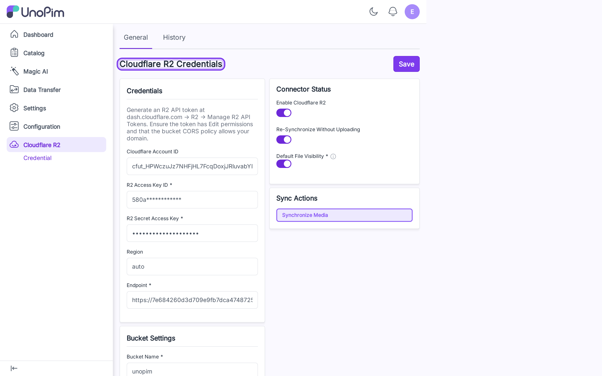
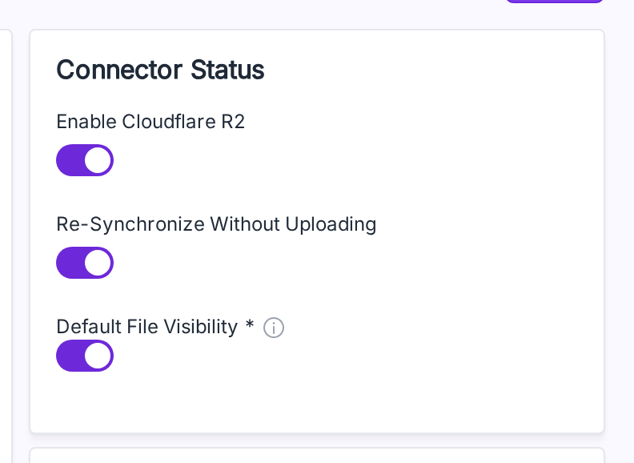

# Configure R2 Keys

Store your Cloudflare R2 API token here. Add a credential before you can use anything else.

**Open it from:** *Cloudflare R2 → Credential*

---

## The credential page

The page is one form with two columns:

- **Left** — Credentials, Bucket Settings, Cache Control Rules.
- **Right** — Connector Status (toggles) and Sync Actions.

A **General** tab and a **History** tab sit at the top. **Save** is in the top-right corner.

---

## Get an R2 API token

1. Sign in to the [Cloudflare dashboard](https://dash.cloudflare.com/).
2. Go to **R2 → Manage R2 API Tokens**.
3. Create a token with **Edit** permission for your bucket.
4. Copy the **Account ID**, **Access Key ID**, and **Secret Access Key**.

> Make sure your bucket's **CORS** policy allows requests from your UnoPim domain — otherwise images won't render in the admin.

---

## Fill in the form

### Credentials

| Field | What it is |
|---|---|
| **Cloudflare Account ID** | Your account ID. The endpoint is auto-derived from this when **Endpoint** is empty. |
| **R2 Access Key ID** | The token's access key. Required on first save; leave blank later to keep the saved one. |
| **R2 Secret Access Key** | The token's secret. Hidden after saving — leave blank to keep the saved one. |
| **Region** | Defaults to `auto` for R2. |
| **Endpoint** | Required. Auto-filled to `https://<account_id>.r2.cloudflarestorage.com` if you leave it blank but provide an **Account ID**. |

### Bucket Settings

| Field | What it is |
|---|---|
| **Bucket Name** | The bucket you created. Required. |
| **Bucket URL** | Public CDN URL or custom domain. Required for **public** buckets. |
| **Environment Update Time** | Optional `YYYY-MM-DD HH:MM:SS` — bumps the cache key when you swap buckets. |

### Connector Status (right column)

| Toggle | What it does |
|---|---|
| **Enable Cloudflare R2** | Master switch. New uploads go to R2 only when this is on. |
| **Re-Synchronize Without Uploading** | Skip the upload step on **Synchronize Media** — only verifies the file exists on R2 and writes the mapping row. Use this when files are already on R2. |
| **Default File Visibility** | On = **Public** (CDN URL). Off = **Private** (short-lived presigned URLs). |

### Cache Control Rules

Per-extension `max-age` for newly uploaded objects. With no rules, a default 7-day cache is used.

| Extension | Max age (seconds) | Effect |
|---|---|---|
| `jpg` | `2592000` | 30 days |
| `png` | `2592000` | 30 days |
| `pdf` | `86400` | 1 day |

Click **Add Rule** to add one, fill the extension and seconds, click **Save**. Rules apply to **new** uploads — change a rule and re-sync to apply it to old files.

---

## Save = test + save

Click **Save**. The form runs a live `ListObjects` against your bucket first. If the credentials work, the form is saved. If not, you see the error and nothing is stored.

> [!TIP]
> No separate **Test Connection** step exists — Save *is* the test. Bad keys never reach the database.

---

## Edit later

The next time you open the page:

- **Access Key** shows masked (`580a************`).
- **Secret Key** shows fully masked (`********************`).

Leave both blank to keep the stored values. Type a new value to replace one.

---

## Change history

Click the **History** tab to see every change made to the credential — toggles flipped, fields edited, rules added.

> Access keys and secret keys are **never** written to history.
