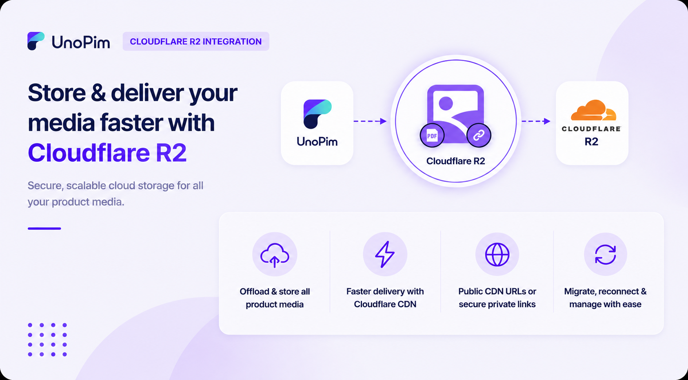

# Cloudflare R2 Integration

Store and deliver your UnoPim media faster with secure, scalable Cloudflare R2 cloud storage.

 

  

  

## Why use Cloudflare R2 with UnoPim?

* Offload product images, category banners, documents, galleries, and asset files from your local server.
* Improve media delivery speed using Cloudflare’s global CDN.
* Reduce server storage costs and simplify media management.
* Serve files publicly through CDN URLs or securely with expiring private links.
* Migrate existing local media to R2 in a single click or via CLI.
* Reconnect previously uploaded R2 files without uploading them again.
* Configure smart cache rules for different file types like JPG, PNG, WEBP, PDF, and more.
* Track every credential and configuration change with built-in history logs.

## Requirements

| Requirement | Details |
|---|---|
| **UnoPim** | 2.0.0 or higher |
| **PHP** | 8.2 or higher |
| **Cloudflare R2** | Active R2 bucket and an R2 API token (Access Key + Secret Key) |
    

## Before You Start

Make sure you have:

1. A working UnoPim 2.0 installation.
2. An active Cloudflare account with R2 enabled.
3. An R2 bucket created in your Cloudflare dashboard.
4. An R2 API token with **Edit** access to the bucket.
5. The Cloudflare R2 Integration extension installed. See [Installation](./installation).

