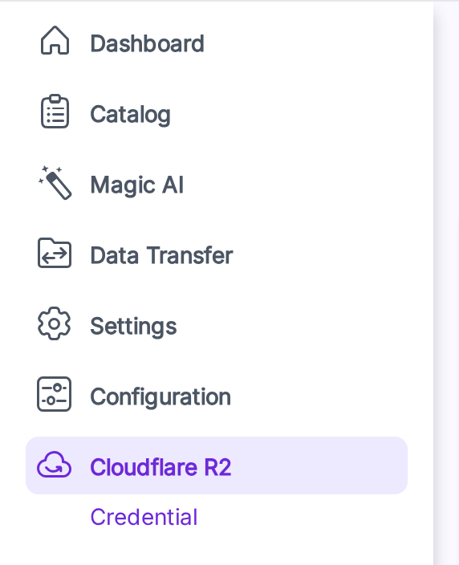

# Installation

This page covers installing the extension. Once it's installed, see [Configure R2 Keys](./credentials) to start using it.


## Steps

### 1. Drop the package in place

Place the unzipped extension at:

```
packages/Webkul/CloudflareR2Integration/
```

### 2. Add it to composer.json

In your project's root `composer.json`:

```json
"autoload": {
    "psr-4": {
        "Webkul\\CloudflareR2Integration\\": "packages/Webkul/CloudflareR2Integration/src"
    }
}
```

### 3. Register the provider

In `bootstrap/providers.php`:

```php
Webkul\CloudflareR2Integration\Providers\CloudflareR2IntegrationServiceProvider::class,
```

> [!NOTE]
> This registers `CloudflareR2IntegrationServiceProvider` in Laravel so the connector can bootstrap its services, routes, and package configuration during application startup.

### 4. Run the install command

```bash
composer dump-autoload
php artisan cloudflare-r2-package:install
```

The installer pulls in `league/flysystem-aws-s3-v3` + `aws/aws-sdk-php`, runs the migration, and publishes the assets.

| Command | Purpose |
|---|---|
| `composer dump-autoload` | Regenerates Composer's autoloader mapping to include the newly added namespace. |
| `php artisan cloudflare-r2-package:install` | Installs required package dependencies, runs migrations, and publishes assets/configuration. |

### 5. Keep a queue worker running

```bash
php artisan queue:work
```

| Command | Purpose |
|---|---|
| `php artisan queue:work` | Starts a queue worker to process Cloudflare R2 background jobs (like media sync). |

In production use Supervisor / systemd / Horizon. Sync Media is dispatched to the queue, so without a worker it will sit in *queued*.

### 6. Give your role permission

Open **Settings → Roles**, edit the role, and tick the Cloudflare R2 permissions:

- **Cloudflare R2** - master node, shows the menu.
- **Credential** - view the credential page.
- **Save Credential** - save credential changes.
- **Sync Media** - run the *Synchronize Media* button.

Without these the menu and buttons stay hidden.

## Check it worked

1. **Menu shows up.** Open the admin panel - a **Cloudflare R2** menu appears in the sidebar.

   

2. **Credential page opens.** Click **Cloudflare R2 → Credential**. You land on the credential form.
3. **Save validates.** Click **Save** with empty fields - the form blocks the submit and tells you what's missing.

If any of these don't work, see [Troubleshooting](./troubleshooting).
