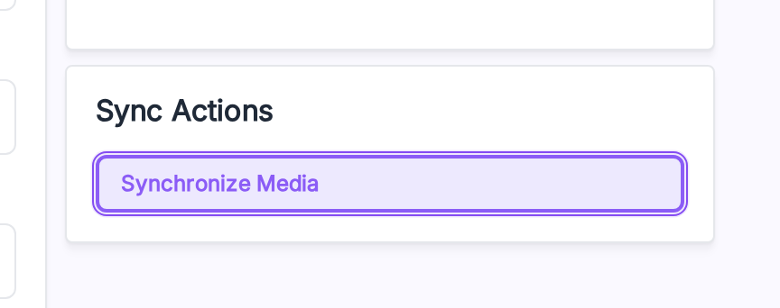

# Migrate Media

Move existing local product and category images to R2.

> **Before you start.** Save a working [credential](./credentials), turn **Enable Cloudflare R2** on, and have a queue worker running.

## From the admin

The fastest way — one button.

**Open it from:** *Cloudflare R2 → Credential*



1. Scroll to the **Sync Actions** card on the right.
2. Click **Synchronize Media**.
3. Confirm in the modal.

The job is dispatched to the queue. The button is disabled until **Enable Cloudflare R2** is on.

## Re-map without re-uploading

Already uploaded your files to R2 by hand or with another tool? Don't re-upload.

1. Turn on **Re-Synchronize Without Uploading** in the right column.
2. Click **Synchronize Media**.

The job runs a `HEAD` against each file on R2. If it's there, the mapping row is written without a re-upload.

## From the CLI

Same migration, no admin needed:

```bash
php artisan cloudflare_r2:move_existing_files
```

Useful flags:

| Flag | What it does |
|---|---|
| `--dry-run` | List files that would be uploaded — don't upload. |
| `--prefix=public/product/cat-1` | Limit the run to one local folder. |
| `--resume` | Resume from the last checkpoint. |
| `--metadata-only` | Write mapping rows without uploading (same as **Re-Synchronize Without Uploading**). |

See [CLI Commands](./cli) for the full list.

## Clean up local copies

After a successful migration:

```bash
php artisan cloudflare_r2:remove_media_files
```

It checks each file exists on R2 before deleting the local copy.

> [!CAUTION]
> Always back up your local media before running the cleanup.
