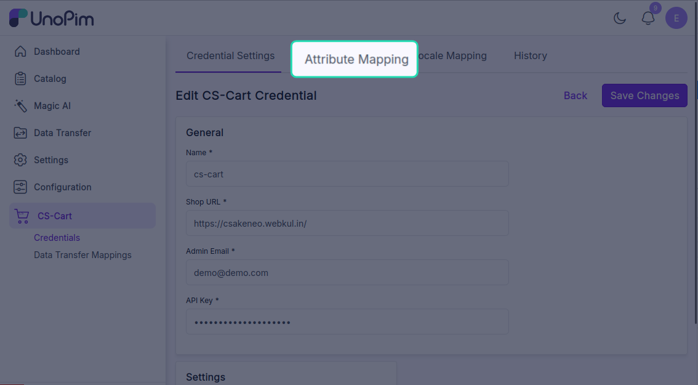
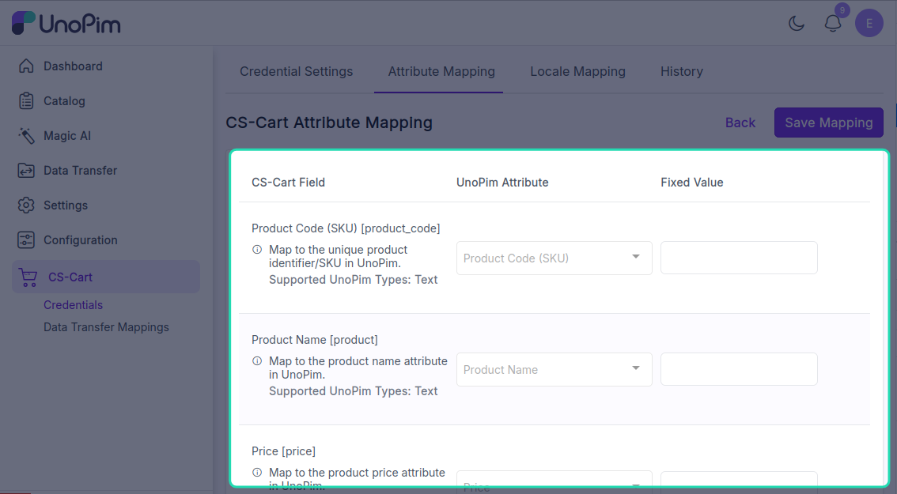

# Map attributes

CS-Cart products have a fixed set of system fields (`product_code`, `product`, `price`, `amount`, `full_description`, etc.) plus your store's **features**. The **Attribute Mapping** tab tells the connector which UnoPim attribute fills each CS-Cart field.

**Open it from:** *CS-Cart → Credentials → (edit a credential) → Attribute Mapping*

<!-- TODO: capture screenshot — cscart-attribute-mapping.png — Attribute Mapping tab -->

---

## What you'll see

The page lists every CS-Cart product field with three columns:

| Column | What it means |
|--|--|
| **CS-Cart Field** | The CS-Cart field you're mapping into. Hover the info icon for what the field does. |
| **UnoPim Attribute** | The UnoPim attribute that will supply the value. |
| **Fixed Value** *(some fields)* | Hard-code a value here instead of picking an attribute — e.g. set `status` to `A` for all exported products. |

A red **Required** badge marks the fields you **must** map for the export to succeed (e.g. *Product Code (SKU)*, *Product Name*, *Price*).

---

## Required mappings

At minimum, map these to run a product export:

| CS-Cart Field | Typical UnoPim attribute |
|--|--|
| **Product Code (SKU)** | `sku` |
| **Product Name** | `name` |
| **Price** | `price` |
| **Quantity Amount** | `quantity` (or fixed value `0`) |

The rest are optional. The connector skips any CS-Cart field that has neither an attribute nor a fixed value.

---

## Picking an attribute

The dropdown only shows **UnoPim attributes whose type matches the CS-Cart field**. For example, *Price* only lets you pick numeric / price attributes; *Full Description* only lets you pick text / textarea attributes.

You'll see the supported types listed on the row — e.g. *Supported UnoPim Types: text, textarea*.

> [!TIP]
> If the attribute you want isn't in the list, check its **type** in *Catalog → Attributes* — it probably doesn't match the CS-Cart field's expected data type.

---

## Add an extra attribute

Need to send a custom attribute that isn't a built-in CS-Cart field? Use **+ Add Additional Attribute** at the bottom of the page. You can:

- Pick any UnoPim attribute.
- Map it to a CS-Cart **feature** or custom field by ID.

Click the trash icon next to an extra row to remove it.

---

## Save the mapping

Click **Save Mapping** at the bottom. You'll see *Attribute mapping updated successfully.*

Mapping changes are picked up by the **next** export run — exports already in the queue keep the mapping that was in place when they were queued.

---

## How it's used

- **Product Export** reads each UnoPim product, transforms it through this mapping, and sends the result to CS-Cart.
- **Product Import** does the reverse — reads CS-Cart products and writes them back into the mapped UnoPim attributes.
- A missing **required** mapping makes the job validator block the run before it starts. You'll see *Required attribute mapping is missing.*
