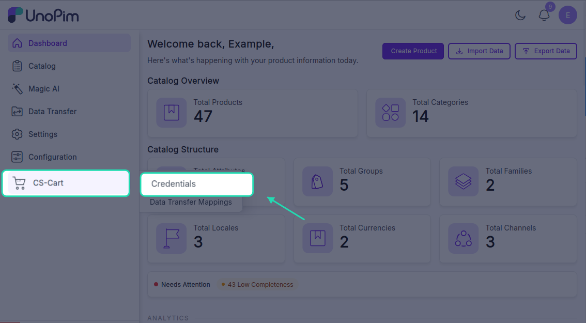
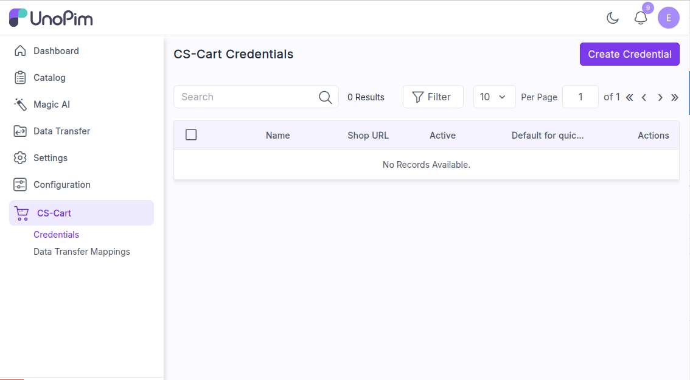
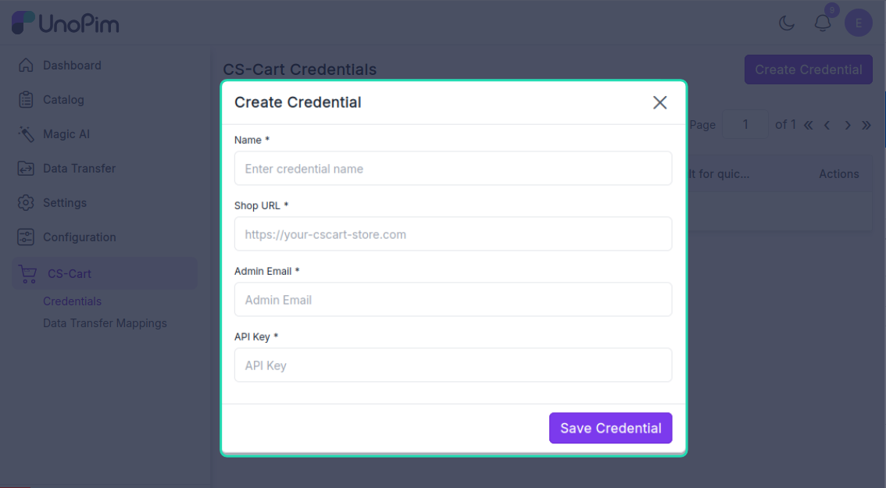
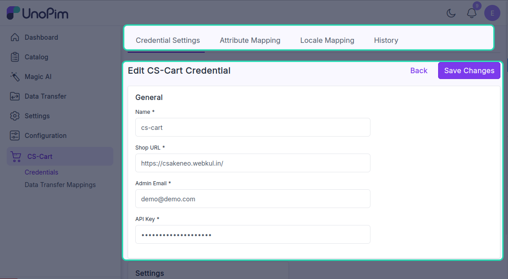
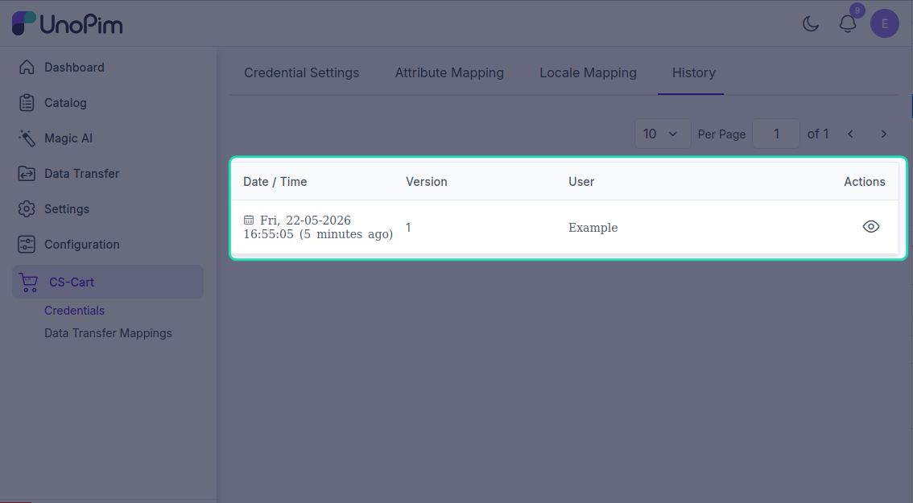

# Add CS-Cart credentials

This is where you store the connection details for your CS-Cart store. Add at least one credential before you can import or export anything.

**Open it from:** *CS-Cart → Credentials*

---

## The credentials page

<!-- TODO: capture screenshot — cscart-credentials-list.png — CS-Cart Credentials list grid -->

Each row in the list shows one credential:

- **Name** — the label you gave it.
- **Shop URL** — the CS-Cart store URL.
- **Active** — whether the credential is on or off.

You can search by name, sort columns, or click **Filter** to narrow the list. The pencil icon edits a row, the trash icon deletes it. Mass-update and mass-delete are available from the **Selected actions** menu.

---

## Add a credential

Click **+ Create Credential** in the top-right corner.

<!-- TODO: capture screenshot — cscart-add-credential.png — Create CS-Cart credential form -->

Fill in:

| Field | What goes here |
|--|--|
| **Name** | Any label you want, e.g. *Production Store*. Must be unique. |
| **Shop URL** | Your CS-Cart store URL, including `https://`. |
| **Admin Email** | The email of a CS-Cart admin with API access. |
| **API Key** | Paste the API key from CS-Cart *User Profile → API* tab. |

Click **Save Credential**.

> The extension calls the CS-Cart API with the credentials before saving. If anything is wrong you'll see *Unable to connect to CS-Cart. Please verify your Shop URL, Admin Email, and API Key are correct.* and nothing is stored.

After saving, you land on the edit page where you can map locales and attributes.

---

## Edit a credential

Click the pencil icon on any row.

<!-- TODO: capture screenshot — cscart-credential-edit.png — Edit CS-Cart credential page with tabs -->

The edit page has four tabs at the top:

| Tab | What it does |
|--|--|
| **Credential Settings** | Edit name / URL / API key, switch the credential on or off, set it as the default for quick export. |
| **Locale Mapping** | Map every UnoPim locale to a CS-Cart `lang_code` — see [Map locales](./locale-mapping). |
| **Attribute Mapping** | Map UnoPim attributes to CS-Cart product fields — see [Map attributes](./attribute-mapping). |
| **History** | Every change made to this credential is logged here. |

### Credential Settings

| Field | What it does |
|--|--|
| **Name / Shop URL / Admin Email / Company ID** | Edit any of the values you set when creating. |
| **API Key** | Leave blank to keep the current key. Type a new one to replace it. |
| **Active** | Turn the credential on or off. Inactive credentials are hidden from import / export profile dropdowns. |
| **Default for quick Export** | When on, this credential is used by **Quick Export** from the product list. Only one credential can be default. |

Click **Save Changes**.

---

## Delete a credential

Click the trash icon on a row and confirm. Or tick several rows and use **Selected actions → Delete**.

> Deleting a credential does **not** delete the data already pushed to CS-Cart. It only stops future imports / exports from running through it.

---

## See change history

The **History** tab on the edit page lists every change made to this credential — name edits, URL changes, active flips, locale and attribute mapping changes. Your API key itself is never shown there.

