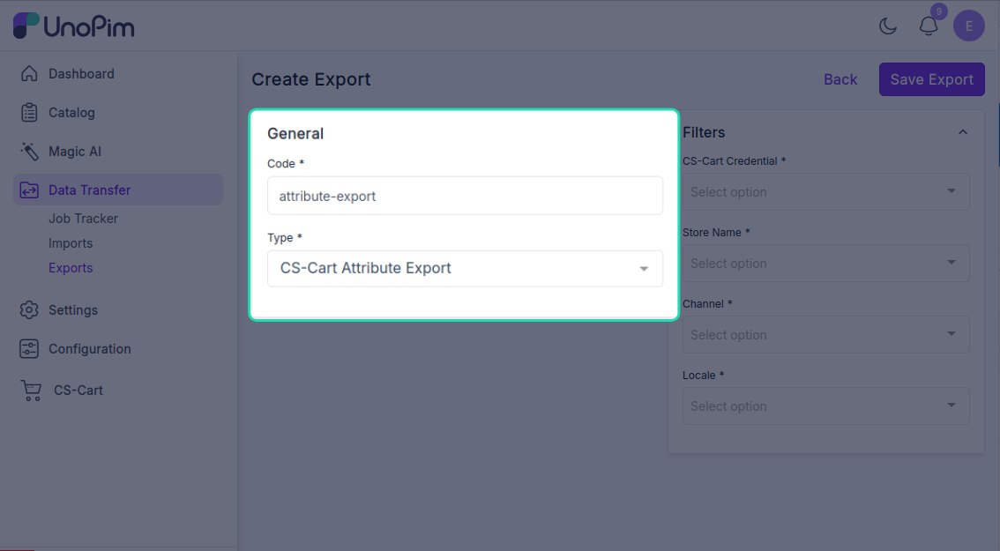
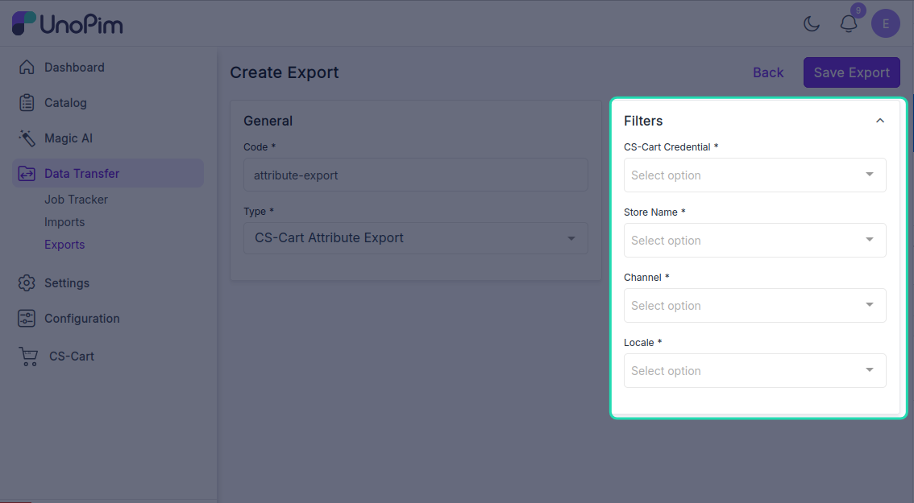
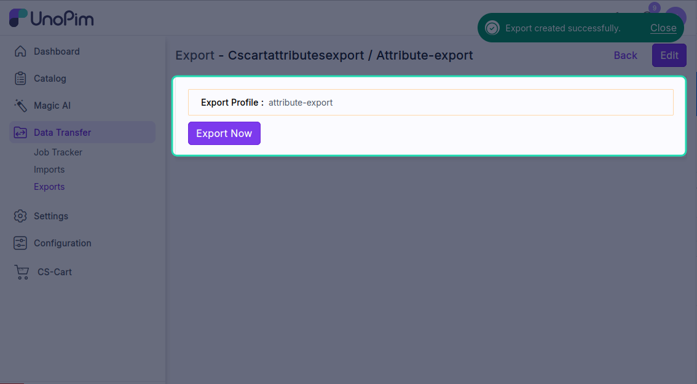
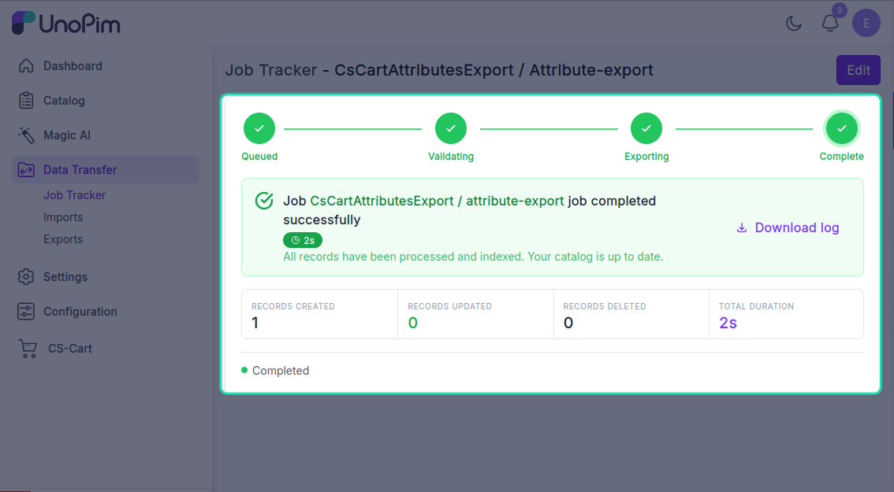

# Export attributes

Push UnoPim attributes to CS-Cart as **features**. Run this once before exporting products that use those attributes — otherwise CS-Cart has no field to store the values in.

> **Before you start.** Add a [CS-Cart credential](./credentials) and map every locale you plan to export — see [Map locales](./locale-mapping).

**Open it from:** *Data Transfer → Export*

<!-- TODO: capture screenshot — cscart-export-attributes-profile.png — Create export profile for attributes -->

## Steps

### 1. Create the profile

1. Open **Data Transfer → Export → + Create Export**.

2. **Type** — pick **CsCart Attributes Export**.
3. **Code** — any short identifier, e.g. `cscart_attributes_daily`.

### 2. Fill the filters

The export needs:

| Filter | What it does |
|--|--|
| **Credential** | Which CS-Cart store to export to. |
| **Store** | Which CS-Cart storefront inside that store. *(Multi-Vendor / multi-storefront only.)* |
| **Channel** | The UnoPim channel whose attribute values you're exporting. |
| **Locale** | One or more UnoPim locales to push translations for. **Each must be mapped** — see [Map locales](./locale-mapping). |

Click **Save**.

### 3. Run it

Open the profile and click **Export Now**.

The job is queued. Watch it on **Settings → Data Transfer → Tracker**.

