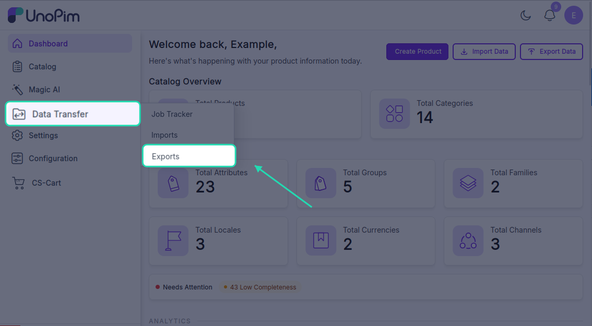
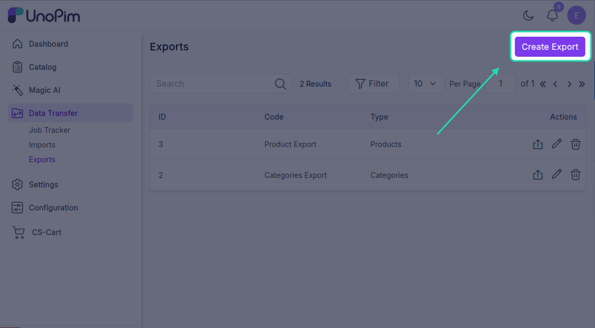
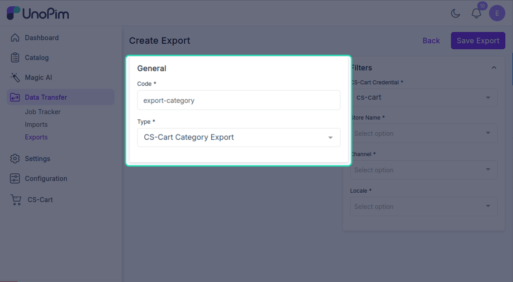
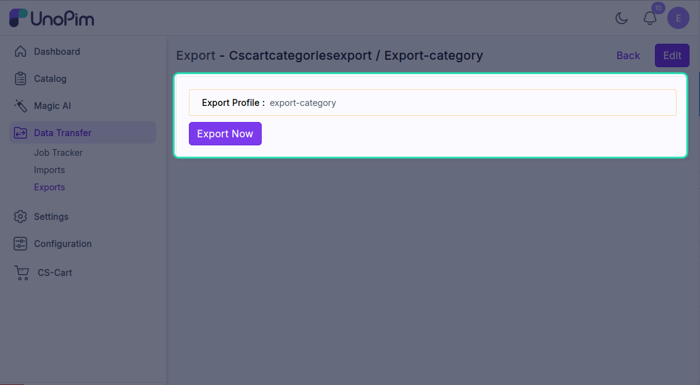
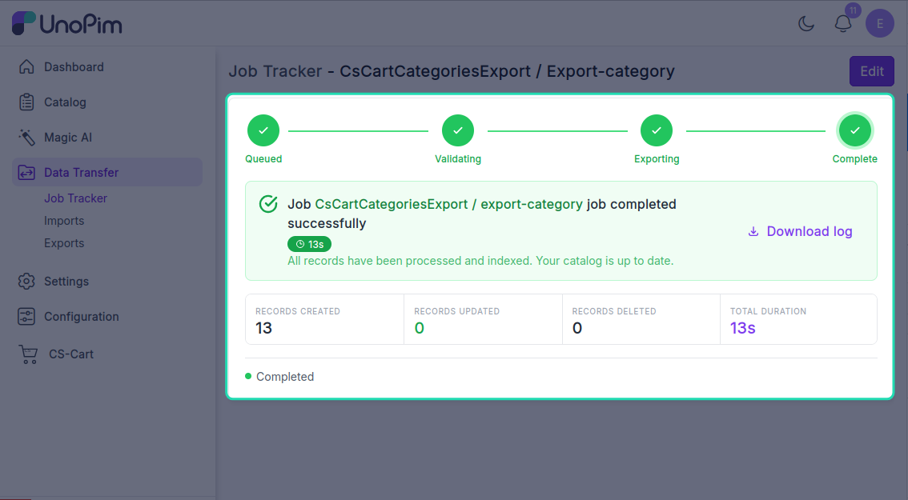

# Export categories

Push your UnoPim category tree to CS-Cart, keeping the parent / child hierarchy intact.

> **Before you start.** Add a [CS-Cart credential](./credentials), [map your locales](./locale-mapping), and ideally run [Export attributes](./export-attributes) first if any of your categories carry custom attributes.

**Open it from:** *Data Transfer → Export*

## Steps

### 1. Create the profile

1. Open **Data Transfer → Export → + Create Export**.

2. **Type** - pick **CsCart Categories Export**, **Code** - any short identifier, e.g. `cscart_categories`.

3. **Fill the filter**

| Filter | Required | What it does |
|--|--|--|
| **Credential** | ✓ | Which CS-Cart store to export to. |
| **Store** | ✓ | The target CS-Cart storefront. |
| **Channel** | ✓ | The UnoPim channel whose category tree you are exporting. |
| **Locale** | ✓ | One or more UnoPim locales to push category names and descriptions for. |

Click **Save**.

4. **Run it**

Open the profile and click **Start Export**.

The job is queued. Watch progress in the Data Transfer Tracker.

