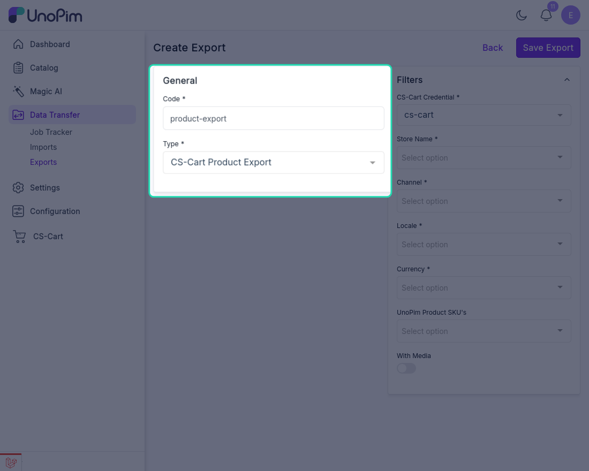
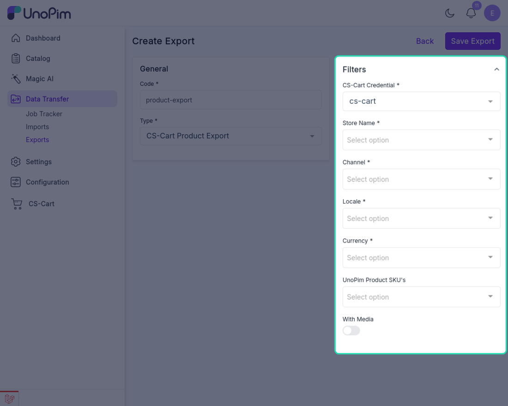
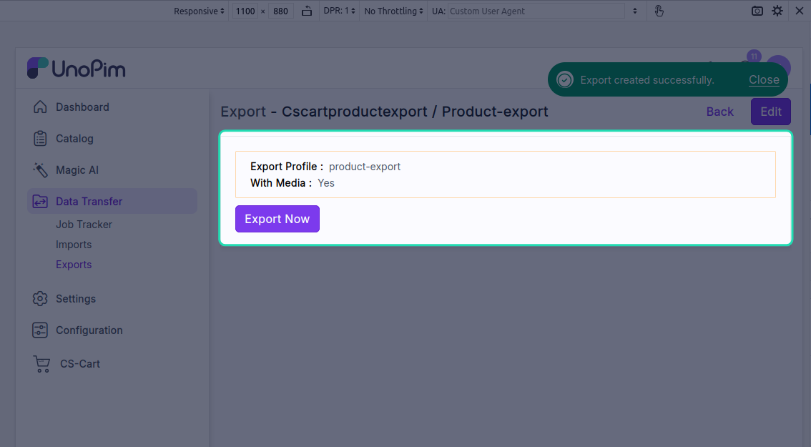
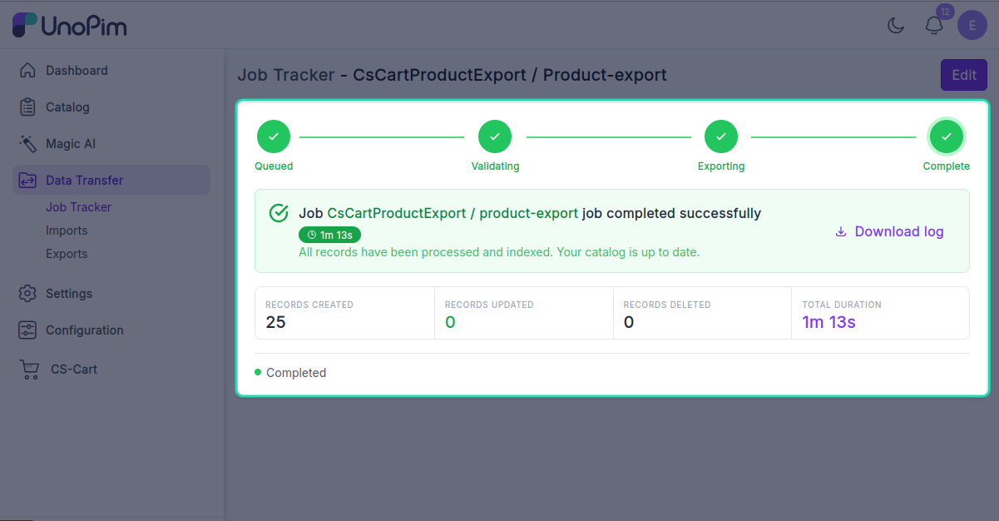

# Export products

Push UnoPim products — with attribute values, prices, stock, statuses, and images — to CS-Cart.

> **Before you start.** Add a [CS-Cart credential](./credentials), [map locales](./locale-mapping), [map attributes](./attribute-mapping), and run [Export attributes](./export-attributes) and [Export categories](./export-categories) at least once so CS-Cart has the features and categories the products reference.

**Open it from:** *Data Transfer → Export*

## Steps

### 1. Create the profile

1. Open **Data Transfer → Export → + Create Export**.

2. **Type** — pick **CsCart Product Export**, **Code** — any short identifier, e.g. `cscart_products`.

3. **Fill the filter**

| Filter | Required | What it does |
|--|--|--|
| **Credential** | ✓ | Which CS-Cart store to export to. |
| **Store** | ✓ | The target CS-Cart storefront. |
| **Channel** | ✓ | UnoPim channel whose product values are exported. |
| **Locale** | ✓ | One or more UnoPim locales — must all be mapped. |
| **Currency** | ✓ | Which UnoPim currency the price is read from. |
| **Product SKU** | — | Optional. Pick specific SKUs to export. Leave empty to export everything in the channel. |
| **With media** | — | When on, product images are pushed to CS-Cart too. |

Click **Save**.

4. **Run it**

Open the profile and click **Start Export**.

The job is queued. Watch progress in the Data Transfer Tracker.

