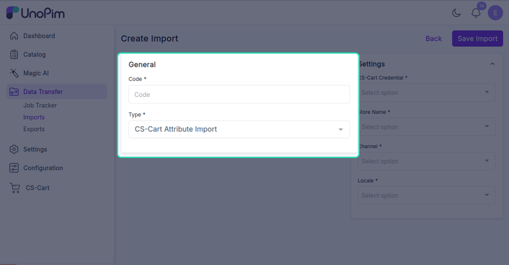
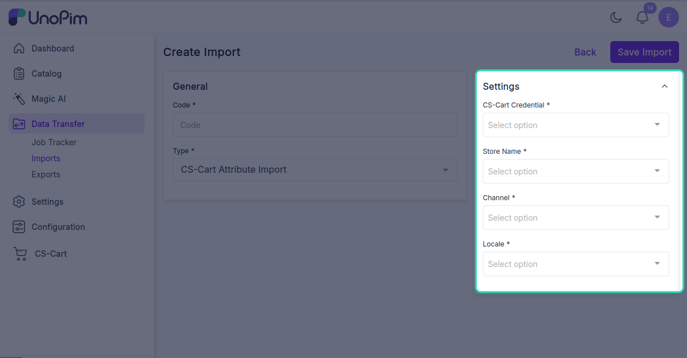
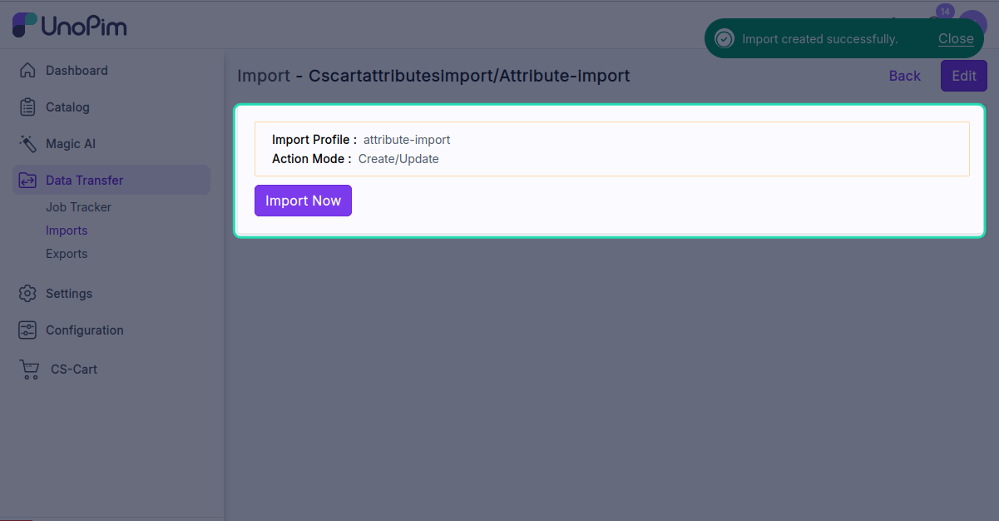
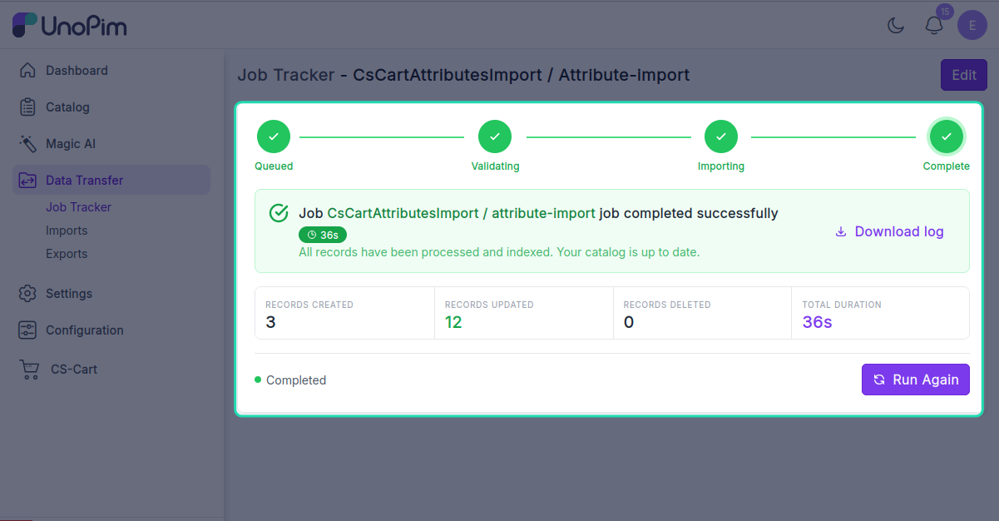

# Import attributes

Pull CS-Cart **features** into UnoPim as attributes, so you can enrich them in UnoPim and push them back out later.

> **Before you start.** Add a [CS-Cart credential](./credentials) and [map locales](./locale-mapping).

**Open it from:** *Data Transfer → Import*

## Steps

### 1. Create the profile

1. Open **Data Transfer → Import → + Create Import**.

2. **Type** — pick **CsCart Attributes Import**, **Code** — any short identifier, e.g. `cscart_attributes_import`.

3. **Fill the filter**

| Filter | Required | What it does |
|--|--|--|
| **Credential** | ✓ | Which CS-Cart store to pull from. |
| **Store** | ✓ | The source CS-Cart storefront. |
| **Channel** | ✓ | The UnoPim channel to write imported attributes into. |
| **Locale** | ✓ | One or more UnoPim locales to import translations for. |

Click **Save**.

4. **Run it**

Open the profile and click **Start Import**.

The job is queued. Watch progress in the Data Transfer Tracker.

