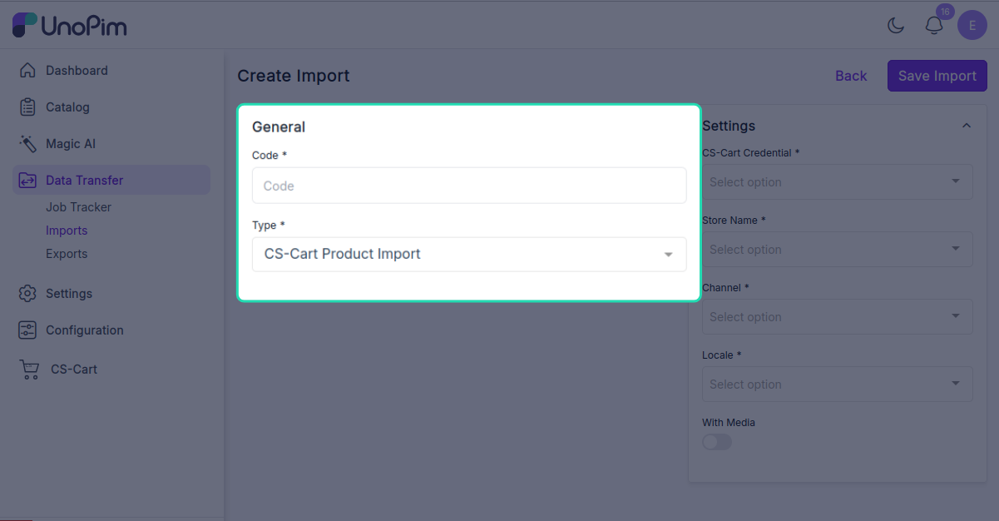
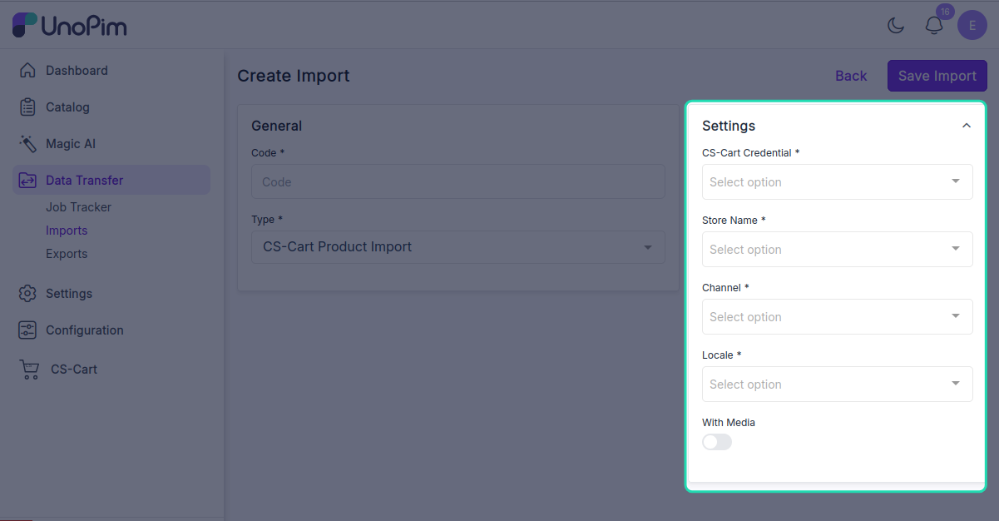
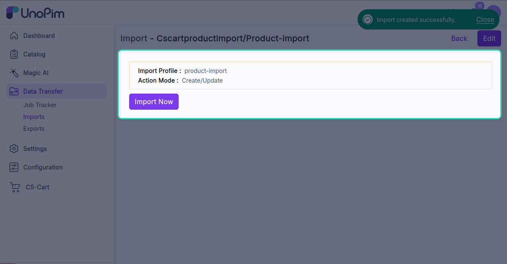
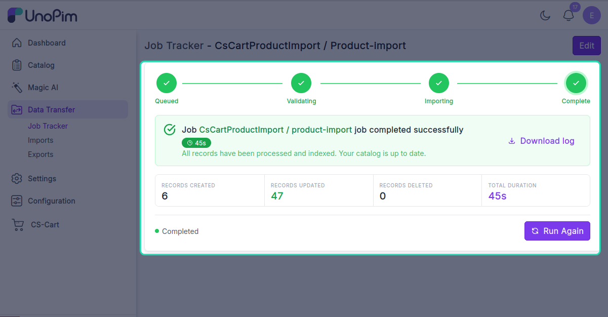

# Import products

Pull CS-Cart products into UnoPim so you can enrich them — better descriptions, more locales, richer attributes — and push them back out later.

> **Before you start.** Add a [CS-Cart credential](./credentials), [map locales](./locale-mapping), [map attributes](./attribute-mapping), and ideally run [Import attributes](./import-attributes) and [Import categories](./import-categories) first so the products land with all their features and category links intact.

**Open it from:** *Data Transfer → Import*

## Steps

### 1. Create the profile

1. Open **Data Transfer → Import → + Create Import**.

2. **Type** — pick **CsCart Product Import**, **Code** — any short identifier, e.g. `cscart_products_import`.

3. **Fill the filter**

| Filter | Required | What it does |
|--|--|--|
| **Credential** | ✓ | Which CS-Cart store to pull from. |
| **Store** | ✓ | The source CS-Cart storefront. |
| **Channel** | ✓ | UnoPim channel the products will belong to. |
| **Locale** | ✓ | One or more UnoPim locales — must all be mapped. |
| **With media** | — | When on, downloads product images from CS-Cart into UnoPim. |

Click **Save**.

4. **Run it**

Open the profile and click **Start Import**.

The job is queued. Watch progress in the Data Transfer Tracker.

