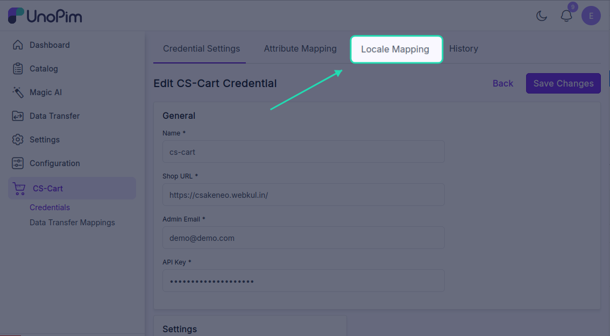
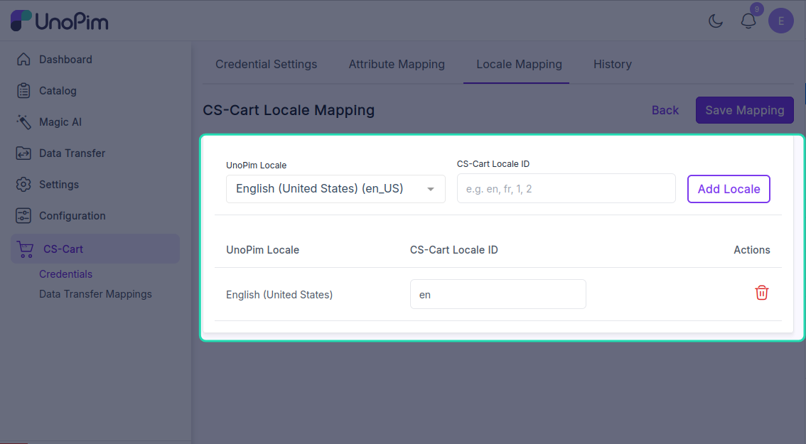
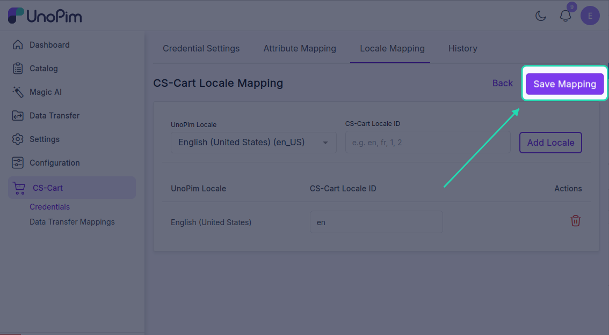

# Map locales

CS-Cart uses two-letter language codes (e.g. `en`, `fr`, `de`) while UnoPim uses full locale codes (e.g. `en_US`, `fr_FR`, `de_DE`). The **Locale Mapping** tab tells the connector which CS-Cart language each UnoPim locale should write to and read from.

**Open it from:** *CS-Cart → Credentials → (edit a credential) → Locale Mapping*

<!-- TODO: capture screenshot — cscart-locale-mapping.png — Locale Mapping tab -->

## Steps

1. Open the credential edit page.

2. Click the **Locale Mapping** tab.

3. For each UnoPim locale on the left, pick the matching CS-Cart `lang_code` on the right.

4. Click **Save Mapping**.

You'll see *Locale mapping updated successfully.*

## What gets mapped

The CS-Cart `lang_code` dropdown is fetched live from your CS-Cart store, so it only shows languages that are actually installed on that store.

For example:

| UnoPim locale | CS-Cart `lang_code` |
|--|--|
| `en_US` | `en` |
| `fr_FR` | `fr` |
| `de_DE` | `de` |
| `es_ES` | `es` |

## Notes

- **Every UnoPim locale you intend to export or import must be mapped.** Unmapped locales are skipped silently — the export still runs, but those translations never reach CS-Cart.
- Export and import job validators will refuse to start if a required locale isn't mapped. You'll see *Locale mapping is missing for the selected locale.*
- If a CS-Cart language is missing from the dropdown, install it in CS-Cart first (*Administration → Languages*), then reopen the mapping tab — the new language appears.
