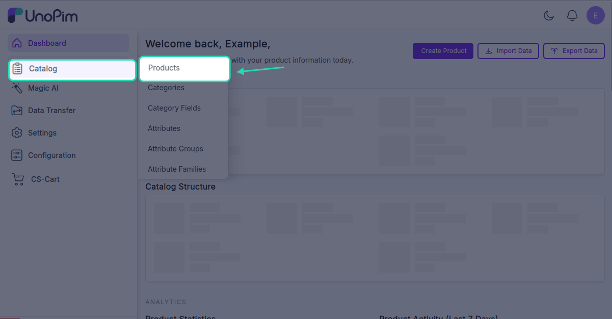
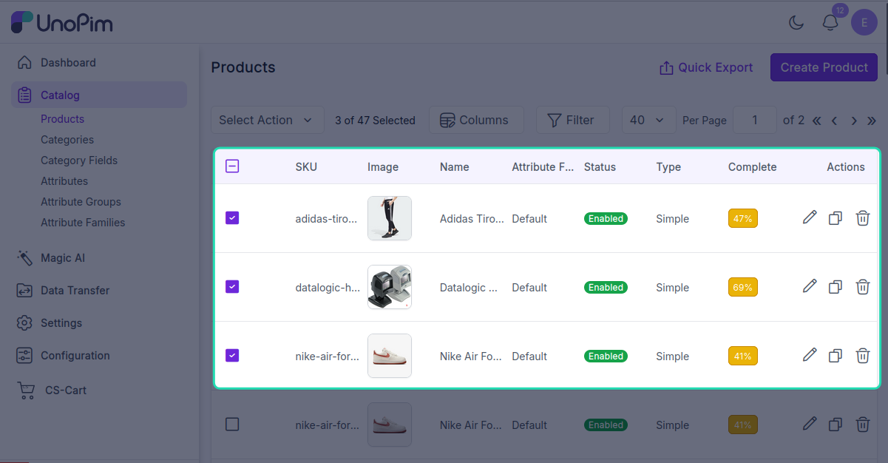
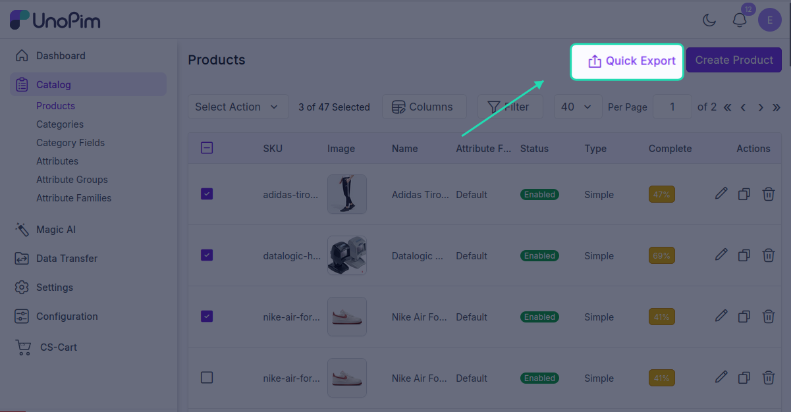
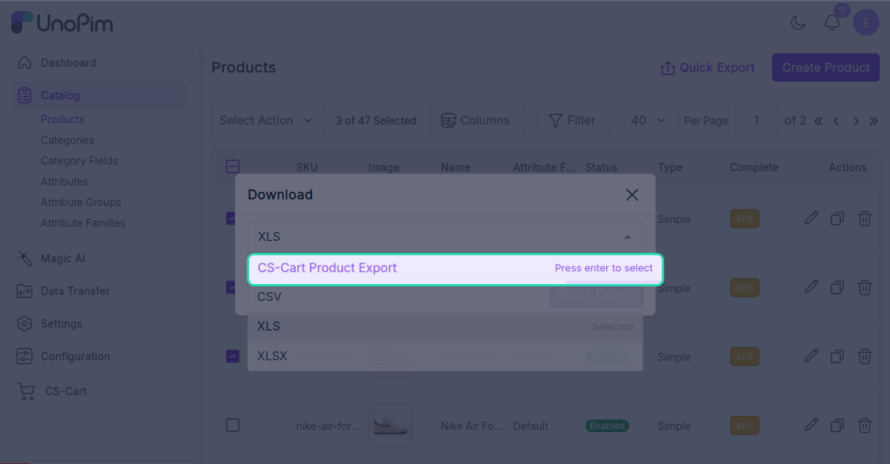
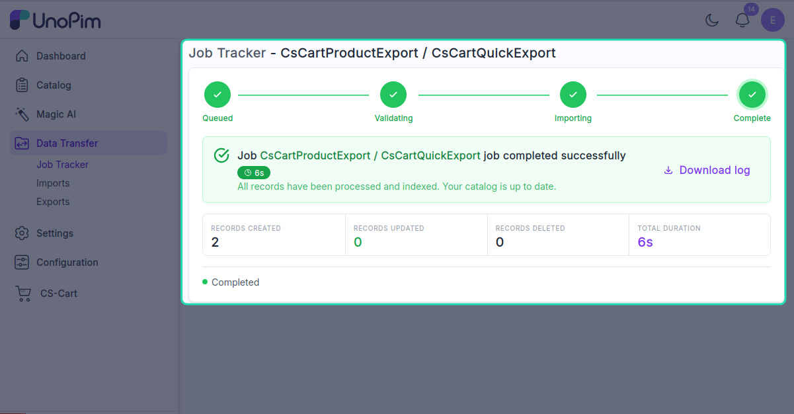

# Quick export

Push a few selected products to CS-Cart straight from the product list - no need to create an export profile.

> **Before you start.** Add a [CS-Cart credential](./credentials) and tick **Default for quick Export** on it in *Credential Settings*. The connector uses **the default credential** for every quick export. [Map locales](./locale-mapping) and [Map attributes](./attribute-mapping) on that credential too.

**Open it from:** *Catalog → Products*

<!-- TODO: capture screenshot - cscart-quick-export-action.png - Quick export action in the products list -->

## Steps

1. Open **Catalog → Products**.

2. Tick one or more rows.

3. Click **Quick Export → CS-Cart Quick Export**.

The selected products are queued straight to CS-Cart. You'll see *Products queued for CS-Cart export.*

Watch the job in the Data Transfer Tracker.

## What it uses

| Setting | Where it comes from |
|--|--|
| **CS-Cart credential** | The one marked **Default for quick Export**. |
| **Store** | The default store on that credential. |
| **Channel / Locale / Currency** | The active channel / locale / currency in your admin session. |
| **Attribute mapping** | The default credential's [Attribute Mapping](./attribute-mapping). |
| **With media** | On by default. |

If you need finer control (specific locales, a non-default credential, a different channel), use a full [export profile](./export-products) instead.

## If the action doesn't appear

1. No credential is marked **Default for quick Export** - open *CS-Cart → Credentials → edit → Credential Settings* and turn it on.
2. Your role doesn't have **Export to CS-Cart** permission. See [Installation → Give your role permission](./installation#_6-give-your-role-permission).
3. Refresh the page - the action list is loaded once when the page opens.
