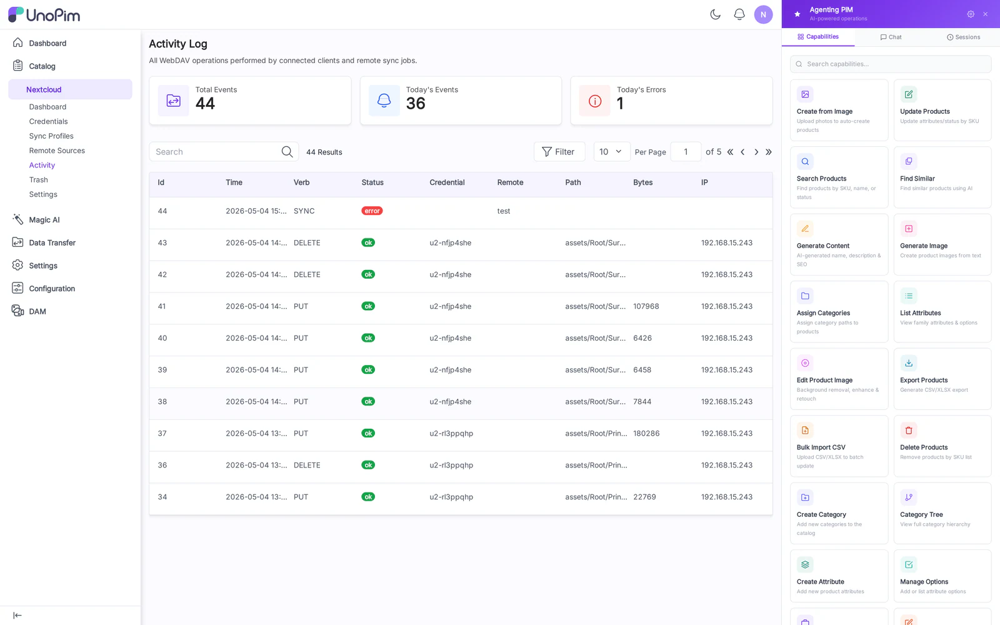

# Activity

The Activity log records every sync event: pushes, pulls, conflicts, errors, and remote-source polls. It is the first place to look when something behaves unexpectedly.

## Columns

- **Timestamp**
- **Profile** — Sync Profile or Remote Source the event belongs to.
- **Verb** — `PUT`, `PROPFIND`, `DELETE`, `MOVE`, `COPY`, `MKCOL`, `LOCK`, `UNLOCK`, etc.
- **Path** — asset path inside the DAM directory.
- **Status** — `success`, `conflict`, `error`.
- **Bytes** — transferred bytes (0 for metadata-only events).
- **Error** — error message when status is `error` or `conflict`.

## Filters

- **Profile** dropdown — narrow to one Sync Profile.
- **Verb** chips — toggle PUT / DELETE / PROPFIND / etc.
- **Status** chips — toggle success / conflict / error.
- **Date range** — from/to.

## How to use

1. Open **Nextcloud → Activity**.
2. Apply filters to isolate the timeline you care about.
3. Click a row to expand the **Detail** panel — full request headers, response body, lock info.

## Tips

- A spike of conflict rows usually means two clients are racing on the same file. Check whether one of them is on **Two-way** when it should be **Push only**.
- Persistent `403` errors on push usually mean the credential is bound to a Pull-only profile.
