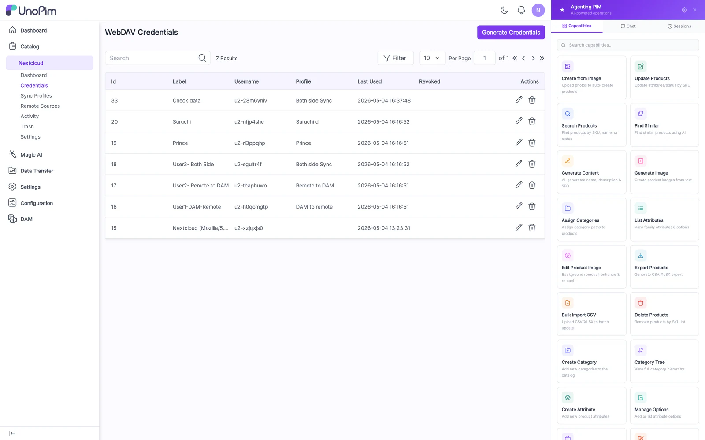
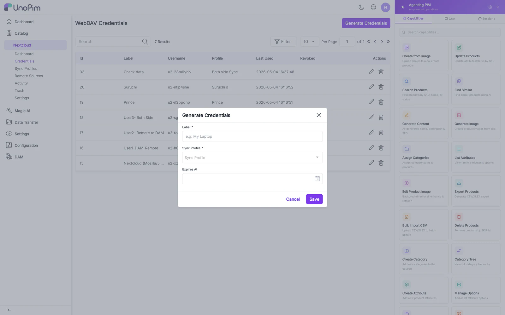
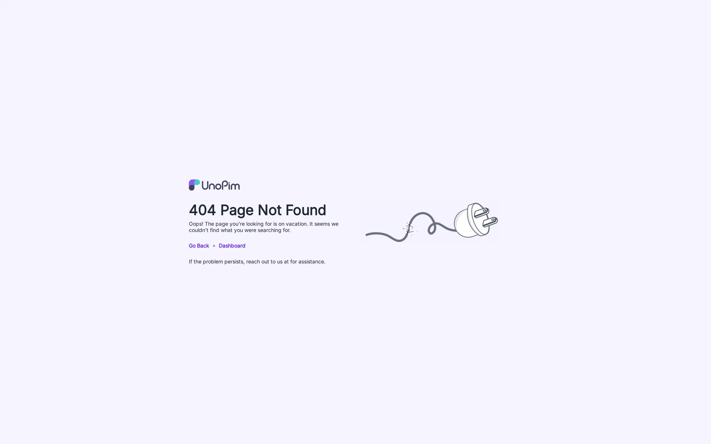

# Credentials

A **Credential** is a WebDAV user account: a username + password that desktop/mobile clients use to authenticate against UnoPim. Each credential maps to exactly one **Sync Profile** that decides which DAM directory it syncs to.

## List

Columns:

- **Label** — human-readable name (e.g., "Studio iMac").
- **Username** — the WebDAV username the client signs in with.
- **Profile** — the Sync Profile bound to this credential, if any.
- **Last Used** — last successful authentication timestamp.
- **Status** — Active / Disabled.
- **Actions** — Edit, Delete.

## Create

Fields:

- **Label** — display name. Required.
- **Username** — must be unique. Used in the Nextcloud-style URL: `/remote.php/dav/files/<username>/`. Required.
- **Password** — strong password. Stored hashed; cannot be re-displayed after save.
- **Status** — toggle Active off to revoke access without deleting.

## Edit, Mount URLs & QR code

The edit page shows:

- All fields above (Password is blank — leave blank to keep the existing password).
- **Server URL** with a copy button — the Nextcloud server URL the user enters in their client.
- A **QR code** that encodes the Nextcloud login-flow URL — scanning it from Nextcloud iOS / Android opens the in-browser grant page automatically.

## How to use

1. Click **Add Credential**.
2. Enter Label, Username, Password.
3. Save — you're returned to the list.
4. Open the credential's **Edit** page.
5. Either copy the Server URL into Nextcloud Desktop, or scan the QR code from Nextcloud iOS / Android.
6. Bind it to a Sync Profile in [Sync Profiles](./sync-profiles) — until you do, no folder is reachable.

## Tips

- One credential per device, not per user. If the same person uses Nextcloud Desktop + Nextcloud mobile, give each device its own credential so revocation is granular.
- Disabling a credential immediately invalidates active locks; clients will see `401` on the next sync tick.
