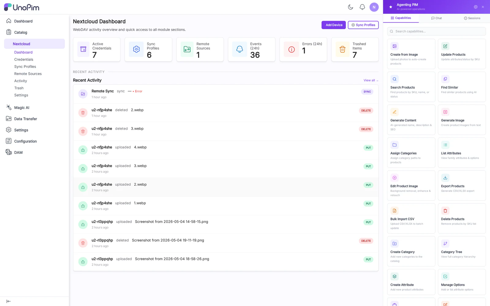

# Dashboard

The Dashboard is the home page for the DAM NextCloud module. It summarizes connection health, recent sync activity, and trash backlog at a glance.

## Cards

- **Active Credentials** — number of WebDAV users with at least one Sync Profile bound.
- **Sync Profiles** — total profiles, plus how many are currently enabled.
- **Remote Sources** — total external sources and last-poll status.
- **Today's Events** — count of push/pull/conflict events in the last 24 hours.
- **Trash size** — number of soft-deleted assets and how many are eligible for purge today.

## Recent Activity widget

Shows the latest 10 sync events with profile, direction, asset path, and result icon (success / conflict / error). Click an entry to jump straight to the [Activity](./activity) page filtered to that profile.

## How to use

1. After installing the module, open **Nextcloud → Dashboard** from the admin sidebar.
2. Confirm at least one **Active Credential** card is non-zero — if not, create one in [Credentials](./credentials).
3. Watch **Today's Events** rise as clients sync; if it stays at zero, check the [Activity](./activity) log for errors.
